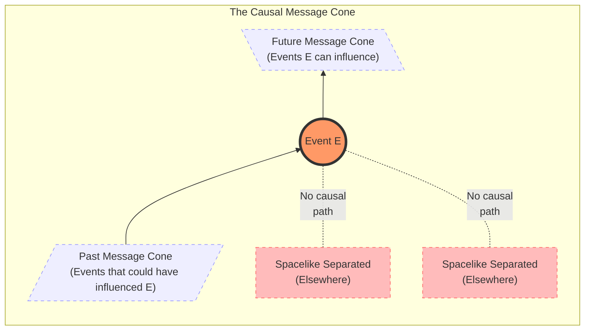
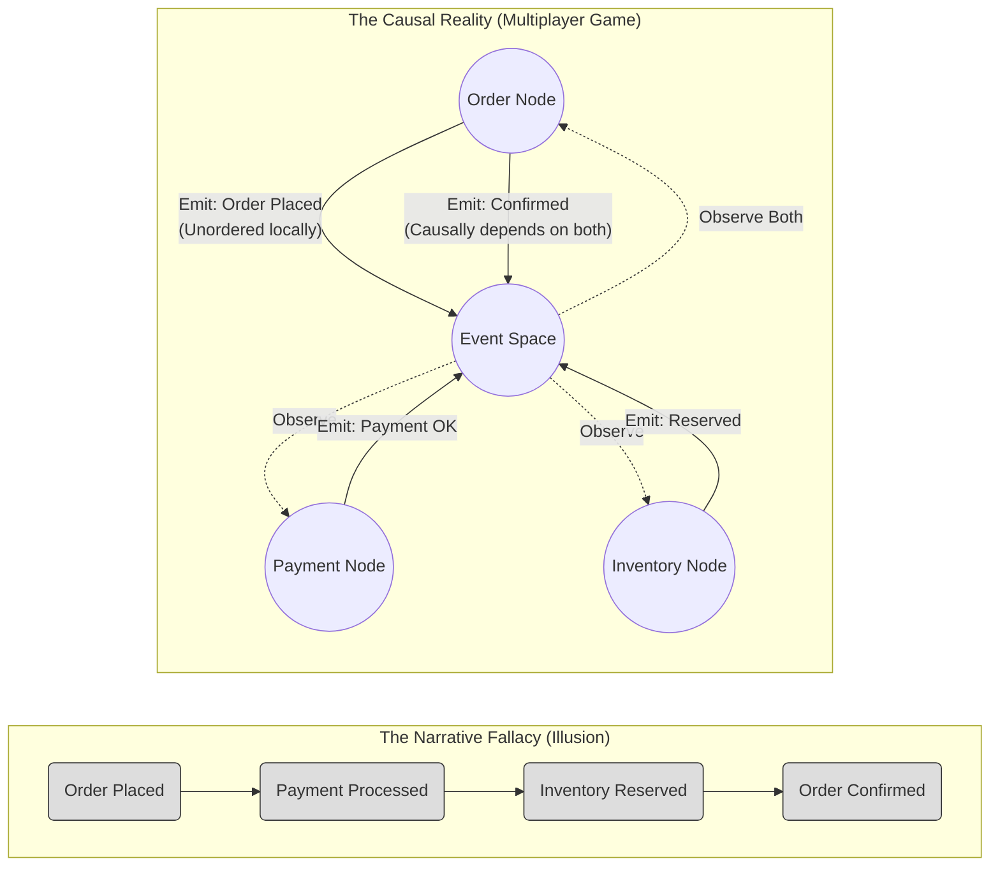
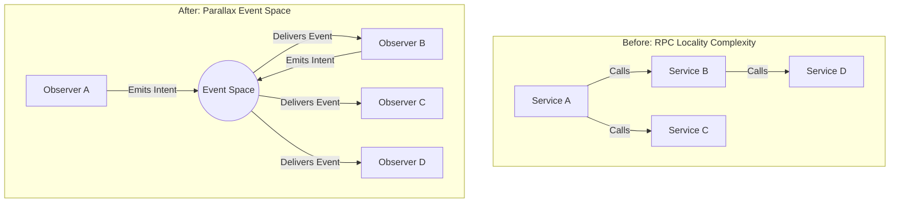
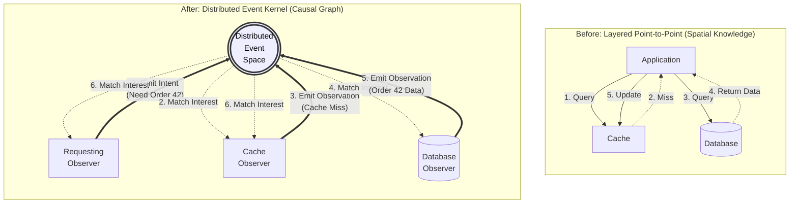

<div align="center">
  
  <h1>Parallax: Toward Causally Aligned Distributed Systems</h1>
  <h3>A Theory of Time, Causality, and Knowledge in Distributed Software</h3>
</div>

---

## Preface

This document is a comprehensive theoretical foundation for designing distributed systems that do not violate the realities of time, causality, and knowledge. It draws on established results in physics, mathematics, information theory, and computer science to ground its claims in the observable structure of reality -- not in opinion, convention, or architectural fashion.

The framework is called **Parallax** — named for the astronomical technique of determining truth by embracing the difference between two observation points. In astronomy, parallax measures the distance to a star by observing it from two positions and using the shift in apparent position as the measurement itself. This is the framework's central insight applied to distributed systems: different observers seeing different things is not a defect to be papered over — it is the fundamental structure from which knowledge is constructed.

It is intentionally long-form and rigorous. Any shorter expression -- slides, one-pagers, pattern catalogs, manifestos -- should be *derived from this*, not edited alongside it. This is the source of truth from which all derivative documents inherit.

The document is structured in five parts:

- **Part I: Scientific Foundations** establishes what physics, mathematics, and epistemology reveal about time, causality, and knowledge.
- **Part II: The Theory** defines causal alignment, its axioms, and the violations endemic in current practice.
- **Part III: The Formal Framework** provides the mathematical and programming structures needed to build causally aligned systems.
- **Part IV: Practice and Adoption** addresses comparative analysis, incremental migration, and evaluation.
- **Part V: Conclusion and References** summarizes the argument and provides scholarly grounding.

### Reading Modes

This document is comprehensive. Not every reader needs to read it linearly. The following paths are curated entry points based on reader intent:

**Theory-first** (for researchers, architects, skeptics): Sections 1 → 2 → 3 → 5 → 10 → 12. Establishes the scientific foundations, then the formal framework. Read the rest for application.

**Implementation-first** (for engineers building systems): Sections 10 → 12 → 14 → 17 → 21. Axioms, primitives, programming model, reference architecture, adoption path. Return to Part I to understand *why* these constraints exist.

**Ops-first** (for SRE, platform, and operations teams): Sections 17 → 21 → 22 → 24. Reference architecture, adoption phases, ROI, benchmarks. Section 14.4 (liveness and escalation) is directly relevant to operational concerns.

**Executive summary** (for decision-makers evaluating adoption): Sections 6 → 8 → 22 → 21 (Phase 0). The problem, the design goal, the ROI case, and the pilot playbook. The worked example in Section 14.7 provides a concrete before/after comparison — compare the misaligned version (linear RPC chain with cascading failure modes) to the aligned version (concurrent observers with declarative temporal conditions).

---

# Part I: Scientific Foundations

---

## 1. Why Scientific Foundations Matter

The claim of this document is not that distributed systems should be *inspired by* physics. The claim is that distributed systems *are* physical systems -- they run on physical hardware, their messages are electromagnetic signals, their processors are thermodynamic engines, their state changes are physical state changes. These are not metaphors.

Because distributed systems are physical systems, the causal structure of spacetime establishes a **lower bound** on the difficulty of distributed computation. No abstraction can escape the constraints physics imposes: the finite speed of information propagation, the observer-dependence of simultaneity, the irreversibility of thermodynamic processes.

But distributed systems are strictly **harder** than the spacetime physics alone would suggest. Networks lose, duplicate, and corrupt messages -- spacetime does not drop signals along causal paths. Message propagation speed varies by orders of magnitude -- the speed of light is an invariant constant. Network topology changes dynamically -- the causal structure of spacetime is fixed. Distributed systems support event replay -- spacetime has no such concept. These additional failure modes mean that even if an abstraction respects the physical lower bound, it may still be misaligned with the actual operating conditions of distributed computation (see Section 2.7).

Designing abstractions that assume instantaneous global knowledge, total ordering of independent events, or synchronous completion across spatial separation is not making simplifying assumptions -- it is asserting things that are physically false. And the actual operating environment is harder still.

---

## 2. The Physics of Time

### 2.1 The Death of Absolute Simultaneity

In 1905, Einstein's special theory of relativity demonstrated that simultaneity is not absolute [Einstein 1905]. Two events that are simultaneous for one observer are not necessarily simultaneous for another observer in relative motion. This is not a perceptual illusion or a measurement limitation -- it is a structural property of spacetime itself.

The key insight: if two events are *spacelike separated* (no signal traveling at or below the speed of light could connect them), then there exists no fact of the matter about which happened first. Different observers, all equally valid, will disagree on their temporal ordering. The ordering is not unknown; it is *undefined*.

This directly constrains any distributed system spanning spatial extent. Two events occurring at different nodes, with no causal connection between them, have no inherent temporal order. Any system that assigns one is fabricating information.

### 2.2 Light Cones and the Causal Structure of Spacetime

Special relativity introduces the *light cone* as the fundamental structure governing what can influence what. For any event *e* in spacetime:

- The **future light cone** of *e* contains all events that *e* could possibly influence (reachable by signals at or below the speed of light).
- The **past light cone** of *e* contains all events that could possibly have influenced *e*.
- The **elsewhere** of *e* -- everything outside both cones -- contains events that are causally disconnected from *e*. No ordering between *e* and any event in its elsewhere is physically meaningful.

This structure is invariant. All observers agree on the contents of each light cone, even if they disagree on coordinate times. The causal structure -- the partial order of events connected by possible signal propagation -- is the objective content of spacetime.

In Minkowski spacetime, the spacetime interval between two events is:

> ds² = -c²dt² + dx² + dy² + dz²

When ds² < 0, the events are *timelike separated* -- causally connectable, with an observer-independent ordering. When ds² > 0, they are *spacelike separated* -- causally disconnected, with no invariant ordering. When ds² = 0, they lie on each other's light cones.



For distributed systems, the structural correspondence is: the speed of light maps to the speed of message propagation, and the light cone maps to the *message cone* -- the set of events reachable from a given event by message passing. Events at different nodes that have exchanged no messages (directly or transitively) are the distributed equivalent of spacelike-separated events. Assigning them an order is logically unjustified.

The correspondence is structural, not exact. The speed of light is an invariant constant; message propagation speed is variable and unpredictable. The light cone is a fixed geometric structure; the message cone is elastic and mutable (see Section 2.7). But the core insight holds: events with no causal connection have no inherent ordering, and any system that assigns one is fabricating information.

### 2.3 General Relativity and the Locality of Time

General relativity (1915) deepens the lesson. In curved spacetime -- the spacetime of the actual universe -- there is in general no way to define a single global time coordinate that all observers agree upon [Einstein 1916, Misner et al. 1973]. Proper time (the time measured by a specific clock along its specific worldline) is the only physically unambiguous measure of time.

The existence of a *global time function* (a smooth function that increases along every future-directed causal curve) is not guaranteed for arbitrary spacetimes. It requires the spacetime to be *globally hyperbolic* -- a specific topological condition [Geroch 1970]. Many physically relevant spacetimes satisfy this condition, but the point remains: global time is not a given. It is a special property that must be established, not assumed.

For distributed systems, this maps precisely: each node has its own local clock, and there is no guaranteed mechanism to synchronize them into a single consistent global timeline. Protocols like NTP reduce drift but do not -- and cannot -- establish the kind of absolute simultaneity that most distributed system abstractions implicitly require.

### 2.4 The Arrow of Time and Entropy

The laws of fundamental physics are largely time-symmetric: the equations of motion work equally well forward and backward. Yet a definitive arrow of time is experienced. This arrow is thermodynamic in origin.

The second law of thermodynamics states that the entropy of an isolated system never decreases [Clausius 1865, Boltzmann 1877]. This is not a fundamental law in the same sense as conservation of energy; it is a statistical observation about overwhelmingly probable macroscopic behavior given the universe's low-entropy initial conditions (the "Past Hypothesis" [Albert 2000]).

The thermodynamic arrow gives time its directionality:

- Events are irreversible at the macroscopic level.
- Information about the past is encoded in the present (records, memories, traces).
- The future is thermodynamically open; the past is thermodynamically fixed.

For distributed systems: **events, once emitted, cannot be un-emitted.** An event log is a record of entropy-increasing state transitions. Append-only logs are not just a design choice -- they are aligned with the thermodynamic structure of reality. Any architecture that allows retroactive modification of event history is fighting thermodynamics.

### 2.5 Quantum Mechanics: Observation and Indeterminacy

Quantum mechanics introduces three observations relevant to distributed system design:

**Observation alters the system.** In quantum mechanics, measurement is not a passive read of pre-existing values. The act of measurement collapses the wave function, producing a definite outcome from a superposition of possibilities [von Neumann 1932, Zurek 2003]. While distributed systems are classical, the structural lesson applies: reading state in a distributed system is not free. It requires communication, which takes time, consumes resources, and may alter the system's behavior (triggering health checks, rebalancing, or backpressure).

**There are fundamental limits to simultaneous knowledge.** Heisenberg's uncertainty principle establishes that certain pairs of properties cannot both be known to arbitrary precision simultaneously [Heisenberg 1927]. This is not a measurement limitation but a structural property of quantum systems. In distributed systems, the CAP theorem [Brewer 2000, Gilbert & Lynch 2002] establishes a structurally analogous constraint: certain combinations of properties (consistency, availability, partition tolerance) cannot all be simultaneously guaranteed. The analogy is structural, not causal -- CAP follows from its own proof [Gilbert & Lynch 2002], not from quantum mechanics. But the pattern is the same: in both domains, the desire to have all desirable properties simultaneously runs into a fundamental impossibility that is not a limitation of current technology but a consequence of the system's structure.

**Entanglement does not enable superluminal communication.** Quantum entanglement creates correlations between spatially separated particles, but the no-communication theorem [Ghirardi et al. 1980, Peres & Terno 2004] proves that these correlations cannot transmit information faster than light. Causality is preserved. There is no mechanism in known physics for instantaneous knowledge transfer across spatial separation. Any abstraction implying instantaneous state synchronization asserts something physics forbids.

### 2.6 Causal Set Theory: Order as Fundamental

Causal set theory [Bombelli et al. 1987, Sorkin 2003] is an approach to quantum gravity proposing the causal order of events as the most fundamental structure of spacetime. The central thesis is captured in Sorkin's dictum: **"Order + Number = Geometry."** Given the causal ordering of events and the counting measure, the geometry of spacetime can be recovered. The continuous manifold of general relativity is an approximation emerging from a fundamentally discrete causal structure.

This is remarkable: at the deepest level currently theorized in physics, **reality is a partially ordered set of events.** Not a timeline. Not a sequence. A partial order. The same mathematical structure that Lamport identified as the correct model for distributed computation [Lamport 1978] is, according to this research program, the fundamental structure of the universe itself.

Whether causal set theory proves correct is open. But the convergence is notable: both physics and computer science arrive at partial orders of events as the foundational structure. The argument of this document does not depend on causal set theory. The constraints on distributed systems derived in Sections 2.1-2.5 follow from established, experimentally confirmed physics. Causal set theory is included because the structural parallel is striking, not because it is required.

### 2.7 Limits of the Physical Correspondence

The physical foundations in Sections 2.1-2.5 establish real constraints on distributed computation. But the correspondence between spacetime and distributed systems is not identity. Distributed systems are strictly **harder** than the physics alone would suggest, in at least four specific ways:

**1. Variable propagation speed.** The speed of light is an invariant constant -- the same for all observers, in all reference frames, always. Message propagation speed in distributed systems varies by orders of magnitude: microseconds on localhost, milliseconds across a data center, hundreds of milliseconds across continents, seconds through congested queues. There is no invariant "speed of message propagation." The light cone is a fixed geometric structure; the message cone is elastic, context-dependent, and unpredictable. Where the physics provides a clean, invariant bound, distributed systems provide a noisy, variable one.

**2. Mutable topology.** The causal structure of spacetime is fixed. The set of events that can causally influence a given event is determined by the geometry of spacetime, which does not change based on the events themselves (in the linearized regime relevant to any terrestrial system). In distributed systems, network topology changes dynamically: nodes join and leave, links fail and recover, routing paths shift. A node that was reachable one second ago may be unreachable now. The "message cone" is not just elastic -- it is mutable. The set of nodes that *can* communicate changes over time in ways that have no physical analogue.

**3. Message loss, duplication, and corruption.** In spacetime, signals propagate along causal paths without loss. A photon emitted toward a detector arrives (barring obstruction by matter, which is a different phenomenon). In distributed systems, messages can be silently dropped, delivered multiple times, or corrupted in transit. Causal dependencies can have gaps. An observer may never receive an event that causally preceded events it has already observed. This means the partial order of observations is not merely a subset of the partial order of emissions -- it can be an *inconsistent* subset, with holes that the observer cannot distinguish from events that never occurred (connecting back to Axiom 5).

**4. Replay.** Spacetime has no concept of "replaying" a causal history. Events happen once. Distributed systems explicitly support event replay for debugging, recovery, and state reconstruction (Law 3). Replay introduces a second temporal dimension -- the original causal time and the replay time -- that has no physical analogue. This is powerful (it enables the debugging-by-replay property), but it means the system's causal structure is not a simple partial order of unique events. It is a partial order that can be *re-traversed*, raising questions about wall-clock-dependent behavior during replay (see Section 12.3, Law 3).

**Why this matters:** These four properties mean that distributed systems are not merely *as hard as* spacetime -- they are harder. Every constraint the physics imposes is real, and distributed systems add failure modes on top. An abstraction that violates the physical lower bound (e.g., assuming global time) is certainly wrong. But an abstraction that respects the physics while ignoring message loss, variable latency, topology changes, or replay semantics is also wrong -- just in ways the physics alone does not reveal.

The correct framing is: **the physics establishes a floor, not a ceiling.** Causal alignment requires respecting both the physical constraints and the additional constraints specific to networked computation.

---

## 3. The Mathematics of Causality

### 3.1 Partial Orders

A **partial order** is a binary relation ≤ on a set *S* that is reflexive, antisymmetric, and transitive. It is distinguished from a total order by the fact that not all elements need be comparable. Two incomparable elements are called **concurrent.**

The distinction matters because a total order asserts a definitive sequence for all events -- appropriate within a single sequential process but physically incorrect across spatially separated processes. A partial order captures exactly the available information: some events are causally ordered, and some are not.

The set of events in a distributed system, ordered by Lamport's happened-before relation, forms a partial order. This is the mathematically accurate representation of the causal structure.

### 3.2 Lattices and Join-Semilattices

A **join-semilattice** is a partially ordered set in which every pair of elements has a *least upper bound* (join, ∨). This structure is important because it enables convergence: if two nodes have divergent states, and the state space forms a join-semilattice, there is always a unique way to merge them.

CRDTs (Conflict-free Replicated Data Types) [Shapiro et al. 2011] exploit this structure. A state-based CRDT defines its state space as a join-semilattice and its merge operation as the join. Because joins are commutative, associative, and idempotent, replicas converge regardless of the order in which updates are received.

This is the mathematical formalization of Axiom 9 (Agreement Emerges): convergence is guaranteed not by coordination but by the algebraic structure of the state space.

### 3.3 Lamport's Happened-Before Relation

In 1978, Leslie Lamport defined the **happened-before** relation (→) for distributed systems [Lamport 1978]:

1. If *a* and *b* are events in the same process, and *a* occurs before *b*, then *a* → *b*.
2. If *a* is the sending of a message and *b* is its receipt, then *a* → *b*.
3. Transitivity: if *a* → *b* and *b* → *c*, then *a* → *c*.

Two events where neither *a* → *b* nor *b* → *a* are **concurrent** (*a* || *b*).

Lamport explicitly noted the connection to special relativity in his original paper: the happened-before relation is the distributed systems analogue of causal precedence in spacetime. Concurrent events are the analogue of spacelike-separated events.

Lamport also introduced **logical clocks** -- monotonically increasing counters respecting happened-before. If *a* → *b*, then *C(a)* < *C(b)*. The converse does not hold. Logical clocks provide a total order consistent with causality but introduce artificial ordering among concurrent events. This is expedient but misaligned -- it asserts structure that does not exist.

### 3.4 Vector Clocks and Causal Histories

**Vector clocks** [Fidge 1988, Mattern 1988] fully capture the happened-before relation. Each process maintains a vector of counters, one per process:

- *V(a)* < *V(b)* if and only if *a* → *b*
- *V(a)* || *V(b)* (incomparable) if and only if *a* || *b*

Vector clocks are the *complete* representation of causal ordering -- the mathematical tool that makes explicit what Lamport clocks leave ambiguous. The cost is practical: they grow linearly with the number of processes. Optimizations exist (interval tree clocks [Almeida et al. 2008], Bloom clocks), but the trade-off between causal precision and metadata overhead is inherent.

### 3.5 The FLP Impossibility Result

The Fischer-Lynch-Paterson impossibility result [Fischer et al. 1985] proves that in an asynchronous distributed system, no deterministic consensus protocol can guarantee termination if even a single process may crash.

This is the formal expression of Axiom 5 (Absence Is Not Evidence) and Axiom 6 (Failure Is Temporal): in an asynchronous system, a process that has not responded is indistinguishable from one that is slow, partitioned, or dead.

FLP does not say consensus is impossible -- it says *deterministic, guaranteed-termination* consensus is impossible under asynchrony with crash failures. Randomized algorithms can circumvent the determinism restriction, achieving consensus with probability 1 [Ben-Or 1983]. Practical protocols (Paxos [Lamport 1998], Raft [Ongaro & Ousterhout 2014]) rely on eventual leader stability to make progress.

The architectural implication: any system that interprets a timeout as definitive failure determination is making a claim that FLP proves cannot be justified.

### 3.6 The CAP Theorem and PACELC

Brewer's CAP conjecture [Brewer 2000], formalized by Gilbert and Lynch [2002], states that a distributed data store cannot simultaneously provide Consistency, Availability, and Partition tolerance. Since partitions are physical reality, the practical choice is between consistency and availability during partitions.

The PACELC extension [Abadi 2012] observes that even without partitions, there is a fundamental trade-off between latency and consistency.

CAP and PACELC are not limitations of current technology. Within the asynchronous network model and the formal definitions of consistency (linearizability), availability (every non-failing node returns a response), and partition tolerance (the system continues operating despite message loss) as specified by Gilbert and Lynch [2002], CAP is a proven impossibility result. Technologies that change the underlying model assumptions (e.g., different consistency definitions, synchronous networks with bounded delay) could in principle operate outside its formal scope, but no such technology exists or is foreseeable for general-purpose distributed systems.

### 3.7 The CALM Theorem

The CALM theorem (Consistency As Logical Monotonicity) [Hellerstein & Alvaro 2020, Ameloot et al. 2013] establishes:

> A program has a consistent, coordination-free distributed implementation if and only if it is monotonic.

A monotonic program is one in which adding new information never invalidates previously derived conclusions. Implications:

- **Monotonic computations can be distributed without coordination.** They can run on any replica, process events in any order, and arrive at the same conclusions.
- **Non-monotonic computations require coordination.** They need synchronization to ensure all relevant information has arrived before drawing conclusions.
- **The boundary between monotonic and non-monotonic reasoning is the boundary between what can be safely distributed and what requires coordination.**

CALM is the formal analogue of Axiom 4 (Knowledge Is Local and Provisional): local knowledge supports monotonic conclusions without coordination, but non-monotonic conclusions require waiting for knowledge that may never arrive.

---

## 4. Information Theory and Physical Reality

### 4.1 Information Is Physical

Rolf Landauer argued in 1961 that information is a physical entity subject to physical law [Landauer 1961]. His principle: erasing one bit of information necessarily dissipates at least *kT* ln 2 joules of energy as heat. This has been experimentally verified [Bérut et al. 2012].

Implications for distributed systems:

- Message transmission has energy costs proportional to information content.
- Information cannot be copied without physical cost (quantum information cannot be copied at all -- the no-cloning theorem [Wootters & Zurek 1982]).
- The destruction of information (overwriting state, garbage collection, log compaction) is irreversible.

### 4.2 Shannon's Channel Capacity

Shannon's noisy channel coding theorem [Shannon 1948] establishes that every communication channel has a maximum rate of reliable information transmission. Above this rate, errors are unavoidable regardless of encoding.

This means there are fundamental limits to how much state can be synchronized between nodes per unit time. The dream of "replicate everything everywhere in real time" faces not only practical but theoretical limits.

### 4.3 Wheeler's "It from Bit"

John Archibald Wheeler proposed that information is the most fundamental substance of reality [Wheeler 1990]. His phrase "it from bit" encapsulates the idea that the physical world is, at bottom, informational.

The methodological implication: if information is physical, then the rules governing information in distributed systems are constrained by physical law. Causal alignment is not an aesthetic preference. It is alignment with physical law.

---

## 5. Epistemology: What Can Be Known

### 5.1 Observer-Relative Knowledge

Both special relativity and quantum mechanics establish that knowledge is observer-relative. Different observers disagree on simultaneity, lengths, and time intervals while agreeing on invariant quantities (spacetime intervals, causal ordering).

In distributed systems, each node is an observer with access only to its own local state, the messages it has received, and inferences from the above. No node has access to the "true" global state, because there is no single "true" global state -- just as there is no single "true" reference frame in relativity.

### 5.2 The Problem of Induction and Absence

David Hume identified that induction -- inference from past observations to future behavior -- cannot be logically justified [Hume 1739]. Karl Popper recast scientific knowledge as conjectural: theories are not proven true; they merely fail to be proven false [Popper 1959].

In distributed systems:

- A node that has responded 10,000 times in < 5ms may fail on the 10,001st request.
- A timeout that has never been exceeded may be exceeded tomorrow.
- An observer "up" for 18 months may be partitioned from the local node at any time.

Axiom 5 (Absence Is Not Evidence) is the distributed systems version of the problem of induction.

### 5.3 Bayesian Reasoning and Belief Revision

Bayesian epistemology provides a framework for reasoning under uncertainty more appropriate than binary true/false logic [Jaynes 2003]:

- Each proposition has a probability representing degree of belief.
- New evidence updates beliefs via Bayes' theorem.
- Beliefs are always provisional and subject to revision.

Most distributed systems encode state as binary (UP/DOWN, COMMITTED/ABORTED). A causally aligned system represents these as *beliefs with confidence* -- which is what failure detectors do in practice, even if the abstraction above them discards the nuance [Chandra & Toueg 1996].

### 5.4 The Frame Problem

The frame problem [McCarthy & Hayes 1969] asks: how does a reasoner determine what *hasn't* changed when an action is performed?

In distributed systems: a node receives a message that Observer B processed Order 42. What does this tell it about Orders 1-41? About Observer B's health 5 seconds from now? Nothing. But most designs implicitly assume that absence of information means the last known state persists.

This assumption -- that state persists until contradicted -- is a frame axiom. It is often correct but never guaranteed. A causally aligned system makes this assumption *explicit*.

---

# Part II: The Theory

---

## 6. The Problem

Modern distributed systems are designed using abstractions that contradict the fundamental nature of time, causality, and knowledge. Dominant abstractions -- RPC, synchronous request/response, service-oriented control structures, linear workflows -- create false guarantees about ordering, completion, and correctness.

In reality, distributed systems operate under conditions where:

- There is no global clock (Section 2.1, 2.3)
- Observation is partial and delayed (Section 2.2, 5.1)
- Events are concurrent and unordered (Section 2.1, 3.1, 3.3)
- Failures are indistinguishable from latency (Section 3.5)
- Knowledge is local, provisional, and revisable (Section 5.1, 5.3)

**The core problem is that dominant architectural abstractions violate the physical structure of reality.**

This is not a metaphor. The speed of message propagation is finite. The causal structure of distributed events is a partial order. Observation requires time and energy. These are physical facts, and abstractions that deny them will produce systems that fail in ways the abstractions cannot explain.

---

## 7. Root Cause: The Narrative Fallacy

Distributed systems are often designed as if observing a film — a pre-recorded, totally ordered narrative where every scene follows logically from the last, the director controls what happens, and the ending is determined before the first frame plays. In reality, operating a distributed system is like playing a multiplayer video game. An observer is one participant in a world where other participants are acting independently. Events are occurring that cannot be seen globally. Entire regions of the system are changing state while local attention is pointed elsewhere. No player has the complete picture. Each player's experience is a subjective slice of a larger reality that no single participant observes in full. And there is no director — the "story" is emergent, not scripted.

The film model feels natural because it matches how humans construct narratives (Section 7.1). But it is the wrong model. A film has a single camera, a single timeline, and a single authoritative cut. A multiplayer game has many players, many timelines, and no authoritative perspective — only the partial, local experience of each participant. Distributed systems are multiplayer games. They continue to be designed as films.



The narrative fallacy [Taleb 2007] is the human tendency to construct coherent stories from partial, ambiguous evidence and then mistake those stories for reality. In software engineering, this manifests as:

- **Sequence diagrams** that depict distributed interactions as if they proceed in a definitive sequence with deterministic outcomes.
- **Happy-path design** that treats successful, ordered completion as the default and handles deviations as "error handling."
- **Synchronous mental models** that lead developers to write `response = await service.call(request)` as if this were a local function call with a network cost, rather than a fundamentally different epistemic operation.
- **State machines** that model global system state as transitioning between well-defined states, as if all participants agree on the current state.

Most frameworks optimize for telling stories forward: *first A, then B, then C.* Reality only permits stories to be told backward: *C occurred; examining the evidence establishes that B preceded it, and A preceded B.* The causal graph is constructed retrospectively from observed evidence, not prospectively from a script.

This is directly analogous to the block universe interpretation in physics [Putnam 1967, Rietdijk 1966]: events of spacetime simply *exist* in their causal relations; the experience of a forward-moving "now" is an observer-dependent phenomenon. In a distributed system, the "forward story" is similarly an observer-dependent projection.

The narrative fallacy causes:

- **Cascading failures:** A calls B calls C calls D; D times out; the timeout propagates back. The linear narrative created the linear failure mode.
- **Distributed deadlocks:** Service A waits for B while B waits for A, because the synchronous model created mutual dependencies.
- **State inconsistency:** Two services each believe they have the "latest" state because the linear model assumes a total order that doesn't exist.
- **Debugging impossibility:** Logs from different services, assembled by wall-clock timestamp, produce a narrative that didn't happen.

### 7.1 Remembering the Future, Predicting the Past

The narrative fallacy described above is a symptom. The root cause is deeper: humans are bound inside time.

Because time is experienced from within, three cognitive habits are commonly carried into software design:

1. **The past is treated as settled.** In life, the past is remembered — it feels fixed, certain, known. This assumption is transferred to software: logs are records, databases are truth, event stores are history. But when the system was running at 3 AM and something went wrong, no human was observing it. The logs are partial traces left by observers that were present. The database is a snapshot of one observer's beliefs at one moment. The "history" is a reconstruction from fragmentary evidence — a forensic investigation, not a memory. Developers examining an incident are not remembering what happened. They are **predicting the past** — assembling incomplete evidence into the most probable explanation, exactly as a forensic investigator puts a bullet back in the gun. This is entropy working against the system. Reconstructing the past from scattered evidence is thermodynamically harder than recording it correctly as it happens — it is an attempt to reverse a process that has lost information at every step. Every log line that was not written, every event that was not captured, every causal relationship that was not recorded is information that is permanently gone. A system that captures causal reality as it unfolds — recording observations, beliefs, and their relationships — does not require this costly reconstruction. The past becomes something that was actually observed, not something that must be reverse-engineered. This is why debugging distributed systems is hard. Not because the bugs are complex, but because the developer's epistemic position relative to the past is weak — and it is weak because the system was not designed to preserve the information the developer now needs.

2. **The present is overemphasized.** In life, the present is the only moment directly experienced. This is transferred to software: code is reasoned about from a snapshot — "what is the current state of the system?" — as if the entire distributed system shares a single "now." But there is no shared present (Section 2.1). Each observer has its own present, defined by its own most recent observations. When a developer reads the current state of a database and reasons about what the system is "doing right now," they are projecting a subjective present onto a system that has no such thing.

3. **The future is treated as an execution path.** In life, the future feels open and uncertain — something to be predicted. This is transferred to software: the future is the code path that will execute next, a script to be followed. But in a properly modeled causal system, the future is not a single path — it is the complete set of declared temporal conditions. Every possible outcome has already been specified. When an event arrives, it does not create the future. It **eliminates the world lines that are no longer possible.** The developer is not predicting what will happen. They are watching possibility collapse into actuality. They already hold the knowledge of every possible outcome — they are just discovering which one applies. That is not prediction. That is **remembering the future.**

**The subjective and objective vantage points.** The discomfort these inversions produce — "predict the past" feels wrong, "remember the future" feels backwards — is itself the signal. It feels wrong because the reader is reasoning from the **subjective vantage point**: sitting inside the system, embedded in its flow of time, experiencing events as they arrive.

Step outside. From the **objective vantage point** — observing the system rather than experiencing it — the causal graph has no preferred direction. The past is a reconstruction problem (incomplete evidence, probabilistic inference). The future is a declared structure already held in full (temporal conditions, causal dependencies, possible world lines). The asymmetry between past and future that humans take for granted — past equals certain, future equals uncertain — is reversed.

These two vantage points are not metaphors. They are engineering stances that developers move between constantly:

- **Subjective vantage point:** Reasoning from inside a single observer. Writing the logic that processes an event, updates a belief, emits a new event. Here, the developer *is* the observer — they see what the observer sees, know what the observer knows, and act on that local knowledge. This is the correct stance for implementing an observer's internal logic.
- **Objective vantage point:** Reasoning about the system as a whole. Designing temporal conditions, defining causal dependencies between observers, modeling the possible world lines of a workflow. Here, the developer is *outside* the system — they see all observers, all possible event orderings, all possible outcomes. This is the correct stance for architectural reasoning, debugging, and system design.

Most distributed systems failures occur when developers use the subjective vantage point where the objective one is required — designing cross-observer interactions as if they were inside a single observer, assuming shared state, shared time, and shared knowledge that no single observer possesses. The narrative fallacy is what happens when the subjective vantage point is applied to an inherently multi-observer problem.

### 7.2 The Entropy Transfer Illusion

Software is a set of requirements. Each requirement — every feature, every constraint, every integration, every edge case — adds complexity to the system. Some of this complexity is **irreducible**: it exists because the problem is genuinely hard, and no abstraction can make it disappear. This is the distinction between essential and accidental complexity [Brooks 1986], and it has a formal analogue in Kolmogorov complexity: the shortest possible description of a system's behavior has a lower bound that no encoding can reduce.

Developers manage complexity by introducing abstractions: frameworks, libraries, patterns, protocols. Each abstraction is itself a requirement added to the set. They are adopted in the belief that they reduce the mental model complexity of the development process — that by hiding details behind an interface, the system is made easier to reason about.

This belief is often correct locally and wrong globally. The abstraction reduces the complexity *visible to the developer at authoring time*. But complexity is not destroyed. It is **transferred into the system** — into runtime behavior, failure modes, operational dependencies, and interaction effects that the abstraction was designed to hide. The developer's cognitive load decreases. The system's actual complexity increases. This is entropy transfer: the development process becomes more ordered (easier, more predictable, less effortful) at the cost of the software system becoming more disordered (more failure modes, more hidden interactions, more emergent behavior).

This is a bad trade. The complexity that was removed from the authoring experience was the cheaper kind — the kind developers encounter once, during implementation, with full context and tooling support. The complexity that was transferred into the system is the expensive kind — the kind that surfaces at runtime, during incidents, under load, in production, where context is partial, tooling is limited, and the cost of misunderstanding is measured in downtime, data loss, and engineering hours spent debugging behavior that no one can explain. A developer reasons about authoring-time complexity with a code editor and a test suite. A developer reasons about runtime complexity with incomplete logs at 3 AM. The entropy transfer does not merely move complexity — it moves it from a context where it is cheap to manage into a context where it is orders of magnitude more expensive.

When the abstraction is well-chosen — when it accurately models the problem's structure — the transferred complexity is genuinely accidental, and eliminating it from the developer's view is correct. A good hash map implementation hides complexity that no application developer needs to see.

When the abstraction is misaligned — when it models the problem in a way that contradicts the problem's actual structure — the transfer is destructive. The complexity does not disappear. It re-emerges as:

- **Bugs that are harder to see.** The abstraction's interface promises behavior the underlying reality cannot deliver. Failures occur at the boundary between what the abstraction claims and what physics permits, producing error modes that the abstraction's mental model has no vocabulary to describe.
- **Technical debt that is harder to name.** The system accumulates workarounds, special cases, and mitigation infrastructure — not because the problem is hard, but because the abstraction is fighting the problem's structure. This debt is difficult to articulate because it doesn't look like "bad code." It looks like necessary infrastructure.
- **Maintenance burden that is harder to attribute.** The ongoing cost of operating the system grows in ways that cannot be traced to any single decision. The complexity is diffused across configuration, operational runbooks, monitoring rules, and tribal knowledge.

The most dangerous property of entropy transfer is this: **it feels like simplification.** The development process is measurably easier. Code is shorter. Onboarding is faster. The abstraction's interface is clean. But the system's actual complexity has not decreased — it has moved below the developer's ability to perceive it. The feeling of simplicity is itself the signal that complexity has been pushed beyond the cognitive horizon. The developer cannot hold the system's true entropy in a complete mental model, and so they experience the incomplete model as the whole truth.

This is not a theoretical concern. It is the mechanism by which distributed systems accumulate the failure modes described in Section 6. Each misaligned abstraction transfers a small amount of entropy into the system. Over years, across hundreds of decisions, the accumulated entropy produces a system whose behavior no single person can explain — not because the individuals were careless, but because each individually reasonable decision transferred complexity that was invisible at the point of decision.

### 7.3 Locality Complexity: Invisible Entropy

The entropy transfer described in Section 7.2 is abstract. Here is a concrete example that every distributed systems engineer will recognize — and almost none will have thought of as accidental complexity.

In an RPC-oriented system, every cross-boundary interaction requires **spatial knowledge**. To call another service, the caller must know *where* the callee is: its address, its endpoint, its API version, its protocol. The callee must know how to reach the caller to return the response — or the caller must hold a connection open, blocking a thread while it waits. Every participant must model the topology: who is where, who calls whom, who depends on whom.

This produces a characteristic confusion. From Service A's subjective vantage point: "I am *here*. I need to call *there*." From Service B's subjective vantage point: "I am *here*. A's request came from *there*. I need to respond back to *there*." A's "here" is B's "there." B's "here" is A's "there." Each participant maintains a subjective spatial model in which it is the center and everything else is a remote location to be reached.

This is locality complexity — the architectural overhead of every participant needing to model every other participant's position. And it compounds. Service A calls B and C. B calls D. A must know about B and C. B must know about D. If D moves, B breaks. If B breaks, A breaks. Locality propagates upward through call chains. Every addition to the topology increases the spatial knowledge every participant must maintain.



Now look at the infrastructure that exists to manage this:

- **Service discovery** — so callers can find callees when they move
- **Load balancers** — so callers don't need to know which instance to reach
- **Circuit breakers** — so callers can stop calling when a callee is failing
- **Retry policies** — so callers can handle transient failures at specific locations
- **Connection pools** — so callers can efficiently maintain links to specific locations
- **Health checks** — so the infrastructure can track who is where and whether they are alive
- **Service meshes** — so the topology management can be extracted from application code into a sidecar proxy

This is an enormous amount of infrastructure. It employs entire teams. It has its own failure modes (service discovery outages, mesh misconfigurations, health check false positives). It is the subject of conference talks, blog posts, and vendor products. It is treated as an inherent cost of distributed systems — the price of doing business at scale.

**None of it is required by the business problem.**

None of this infrastructure exists because the domain requires it. No business requirement says "the order service must maintain a connection pool to the payment service." No user story says "as a customer, I want circuit breakers between inventory and shipping." This entire category of infrastructure exists for one reason: the RPC abstraction demands that every observer know where every other observer lives. Locality complexity is entropy transferred into the system by a wrong abstraction — and it has been normalized so thoroughly that engineers do not recognize it as accidental complexity. It feels irreducible because it has been normalized for so long.

**The Parallax inversion.** In a causally aligned system, there is no "here" and "there" between observers. There is only the **distributed space** — the event transport (Section 17.1). An observer's contract with the system is based on **intent and interest**, not identity and location:

- **Intent:** I emit events about what I have observed and concluded. I do not address them to anyone. I declare what happened.
- **Interest:** I subscribe to events relevant to my responsibilities. I do not call anyone. I declare what I care about.

An observer does not know or care who else is in the space. It does not maintain connections to specific endpoints. It does not model anyone else's location. Its only "there" is the space itself.

When an observer disappears from the space, no one's "there" breaks. No connection is severed. No circuit breaker trips. Events on certain topics simply stop arriving — a detectable causal fact ("I have not observed a shipment event in N causal ticks"), not a connection error. The escalation mechanism (Section 14.4) reports it. The system degrades gracefully because no observer's correctness depends on any other observer's location or availability.

Service discovery, load balancers, circuit breakers, retry policies, connection pools, health checks, service meshes — all of the infrastructure described above — is not simplified by this model. It is **eliminated**. Not because Parallax solved those problems, but because the problems were never inherent to distributed systems. They were artifacts of an abstraction that demanded spatial knowledge the business domain never required. They were entropy, transferred into the architecture by a misaligned model, made invisible by familiarity.

#### The "Source of Truth" as Information Asymmetry

Locality complexity does not only manifest as network topology management. It produces a second, equally pervasive category of accidental complexity: **information asymmetry between storage layers**.

In an RPC-oriented system, truth about a given entity lives in **one place** — typically a database. Every other representation of that data (an application cache, a CDN edge node, a materialized view, a search index) is a **copy**, and every copy suffers from information asymmetry relative to the source. The copy may be stale. It may be missing. It may never have existed. It may have been invalidated but not yet refreshed. The source has knowledge the copy lacks, and the copy has no way to know what it does not know.

This asymmetry produces a characteristic pattern that every distributed systems engineer has written: the **cache-miss-then-lookup-then-fill** cycle. The application checks the cache. If the data is absent or expired, the application calls the database. When the database responds, the application writes the result back to the cache, then continues. Every layer in the system must know about every other layer: the application knows about the cache *and* the database. The cache invalidation logic must know about write paths. The database connection pool must be sized for both direct queries and cache-miss storms. Information asymmetry between storage tiers becomes spatial knowledge that the application code must manage.

Now observe what changes in the Parallax model:

The distributed space **is** the source of truth. There is no single location where data lives and other locations that hold copies. Instead, an observer that needs data emits an event declaring its need: "I require the current state of Order 42." A cache observer, if it holds the answer, responds by emitting a data event. The requesting observer receives the data. It never knew a cache was involved. If the cache observer does not hold the answer, it emits a cache-miss event. A database observer, subscribed to cache-miss events, retrieves the data and emits a data event into the space. Both the requesting observer *and* the cache observer receive it — the cache observer now holds the data for future requests, and the requesting observer has its answer. Neither the requesting observer nor the cache observer knew about the database. The database observer did not know about the requesting observer.

Now consider the failure conditions — where the argument sharpens. In the traditional model, errors propagate through the same spatial knowledge chain as data: the application catches a cache timeout, falls through to the database call, catches a database connection error, decides whether to retry, and surfaces an error to the caller. Every layer's error handling is coupled to its knowledge of the next layer. The cache's failure mode is the application's problem. The database's failure mode is also the application's problem. Error paths multiply across the spatial topology.

In the Parallax model, each observer handles its own failures independently. If the cache observer encounters a storage error, it deals with that error on its own terms — it may emit a cache-miss event (indistinguishable from a simple absence), retry internally, or emit a degradation event. The requesting observer never sees the cache's internal failure; it simply observes whether a data event arrives within its causal timeout. If the database observer cannot find Order 42, it emits a "no such order" event into the space. The requesting observer receives that event and updates its beliefs accordingly. The cache observer also receives it and can update or invalidate its own state. If the database observer is entirely unavailable, no data event arrives at all — the requesting observer's temporal condition (Section 14.2) detects the absence and escalates through the standard mechanism (Section 14.4). No observer needed to know which layer failed or why. Each observer's error handling is local to its own subjective vantage point, governed by its own causal observations, decoupled from every other observer's failure modes. Error handling, like data flow, loses its locality complexity.

The entire cache-miss-then-lookup-then-fill pattern — with its layered spatial knowledge, its invalidation logic, its connection management between tiers, its cache-stampede mitigation — dissolves. Not because caching disappeared, but because the abstraction no longer requires any observer to know *where* data lives. The business requirement was "I need the current state of Order 42." The traditional architecture turned that into "check this cache at this address, and if it misses, call this database at this endpoint, then write back to the cache." That second formulation is pure locality complexity — spatial knowledge demanded by the abstraction, not by the domain. The information asymmetry between cache and database was an artifact of placing truth in one location and forcing every other location to manage its distance from that truth.



In the causally aligned model, truth is not a place. Truth is what has been observed in the space. An observer's beliefs are not "copies" of some authoritative original — they are the observer's causal history, as valid from its subjective vantage point as any other observer's history is from theirs. Consistency is achieved not by ensuring every copy matches a single source, but by ensuring every observer's beliefs converge through shared causal structure — the same mechanism that governs consistency everywhere else in the framework.

#### Cron and Batching: Temporal Locality Complexity

The preceding examples demonstrate locality complexity in the **spatial** domain — the overhead of knowing *where* things are. But the same pattern has a temporal counterpart that is equally pervasive and equally invisible: the overhead of approximating *when* things happen.

Consider the business requirement: "When an order is placed, send a confirmation email." This is a causal statement — one event triggers another. The timing is inherent in the causal relationship itself: the email should be sent *because* the order was placed, and the placement *is* the trigger.

In a traditional architecture, this causal relationship is rarely implemented as such. Instead, the system approximates it with a scheduled job: "Every five minutes, query the database for orders that have been placed but have not yet received a confirmation email, and send emails for each." The cron job replaces a causal trigger with a **temporal polling loop** — a periodic sweep that substitutes wall-clock intervals for causal structure.

This substitution produces a characteristic set of problems:

- **Stale response.** An order placed at 12:01 does not receive its email until the next batch runs at 12:05. The system is four minutes behind causal reality — not because of any physical constraint, but because the abstraction chose to poll rather than react.
- **Resource spikes.** Every job fires at its scheduled wall-clock moment. The midnight batch window — where dozens of cron jobs awaken simultaneously — is a familiar operational nightmare. Database connections spike, CPU saturates, queues flood. The thundering herd is not caused by a surge in business activity; it is caused by the abstraction concentrating unrelated work onto the same clock tick.
- **Wasted work.** The batch runs whether or not anything changed. If no orders were placed in the last five minutes, the job still queries the database, finds nothing, and exits. At scale, these empty sweeps consume meaningful resources — database connections, CPU cycles, network bandwidth — doing nothing, on schedule.
- **Invisible ordering dependencies.** Cron jobs develop implicit temporal coupling: "Job B must run after Job A finishes, because B depends on data that A produces." These dependencies are not declared in any contract or schema. They live in operational runbooks, in tribal knowledge, in the careful spacing of crontab entries. When Job A runs long and overlaps with Job B, the system produces silent data corruption — not because the business logic is wrong, but because an undeclared temporal dependency was violated.
- **Clock dependence.** The entire mechanism assumes a shared, reliable wall clock. This is precisely the global-time fiction that Axiom 1 rejects. Clock skew between nodes causes jobs to fire at slightly different moments, producing ordering anomalies. Daylight saving transitions cause jobs to skip or double-fire. Leap seconds produce undefined behavior. The cron abstraction is built on the assumption that time is absolute and shared — the one thing the physics guarantees it is not.

What cron and batching actually represent is **temporal locality complexity** — the time-domain mirror of the spatial locality complexity described above. Just as RPC demands that every observer know *where* every other observer lives, cron demands that the system know *when* to check for things that may have happened. Both are forms of knowledge the business domain never required. The domain said "when this happens, do that." The abstraction turned it into "at this clock time, check whether this happened."

**The Parallax inversion.** In a causally aligned system, there is no polling and no batching window. An observer declares interest in order-placement events. When such an event arrives — because the causal structure delivered it — the observer reacts. The timing is not approximate; it is exact, because the event itself *is* the trigger. There is no stale response, because there is no interval between occurrence and detection. There is no thundering herd, because observers react to their own causal inputs at their own pace, not at a synchronized clock tick. There is no wasted work, because observers are not sweeping for changes — changes arrive as events. There are no invisible ordering dependencies, because causal ordering is explicit in the event metadata. There is no clock dependence, because causal time (Section 14.3) replaces wall-clock time as the coordination mechanism.

Cron jobs do not disappear entirely — there are genuine use cases for wall-clock-triggered actions (regulatory reporting at end-of-day, calendar-based billing cycles). But these are a small fraction of what cron is used for in practice. The vast majority of scheduled batch processing exists because the system lacks a causal trigger mechanism and must approximate one with temporal polling. That approximation is entropy — transferred into the architecture by an abstraction that substitutes clock time for causal structure, then normalized into operational practice until engineers stop recognizing it as accidental complexity.

#### Distributed Transactions: The Simultaneity Fiction

Consider the business requirement: "When a customer places an order, reserve inventory and charge payment. Both should succeed or neither should."

Two-phase commit treats this as a simultaneity problem — all participants must agree on the outcome *at the same moment*. The coordinator sends "prepare" to every participant. Each participant acquires locks, holds resources frozen, and votes. The coordinator collects all votes and sends "commit" or "abort." During the window between prepare and commit, every participant is *suspended* — holding locks, blocking other work, waiting for a decision from a remote node.

The protocol assumes it is possible to create a shared "now" across spatially separated participants — a frozen instant where everyone is in the same state simultaneously. This is the global-time fiction turned into a protocol. The coordinator is pretending to stop time: "everyone hold still while I collect agreement." The participants are pretending that their locked state is synchronized with each other's locked state. None of this is true. The coordinator's "now" is different from each participant's "now." The messages take time. The locks are held across that time. Any participant failure during the hold window blocks everyone — because the fiction of simultaneity requires unanimous participation.

The entire failure-mode catalog of two-phase commit — coordinator failure blocking all participants, participant timeout causing uncertainty about the outcome, lock contention from long-running prepare phases, the need for transaction recovery logs — stems from one assumption: that "both or neither" requires synchronized agreement at a single point in time.

But the business does not need simultaneity. It needs *eventual consistency of outcome*: if inventory was reserved but payment failed, the reservation should be released. If payment was charged but inventory was unavailable, the charge should be refunded. These are causal consequences, not synchronous locks.

**The Parallax inversion.** Each observer acts on what it has observed and emits what it has done. The order observer emits "Order 42 placed." The inventory observer, subscribed to order events, reserves stock and emits "Inventory reserved for Order 42." The payment observer, subscribed to order events, charges the card and emits "Payment collected for Order 42." If the payment observer fails or emits "Payment declined for Order 42," the inventory observer — subscribed to payment outcomes — observes the decline and emits "Inventory reservation released for Order 42." No coordinator froze time. No participant held locks waiting for a remote decision. Each observer reacted to causal evidence within its own subjective vantage point. The temporal condition mechanism (Section 14.2) detects when the expected constellation of events has not materialized within a causal timeout and escalates — the same mechanism used everywhere else in the framework. The "both or neither" guarantee is achieved through compensating events and causal observation, not through synchronized agreement.

This is essentially the saga pattern — but with an important distinction. Sagas are typically described as a *workaround* for the inability to do distributed transactions. In Parallax, this is not a workaround. It is the *correct* model — because the business requirement was never synchronous in the first place. The complexity of two-phase commit was not solving a hard problem; it was solving a *fictional* problem created by interpreting "both should happen" as "both must happen at the same time."

#### Retry and Timeout Policies: Temporal Guessing

Consider the business requirement: "If the payment processing does not complete, try again."

The traditional implementation: the caller sets a timeout — say 3 seconds — and if no response arrives within that wall-clock duration, retries the request. If the retry also times out, it retries with exponential backoff: 3 seconds, then 6, then 12, with jitter to avoid synchronized retry storms. After some maximum number of attempts, it gives up and surfaces an error.

The 3-second timeout is a *guess* about causal structure expressed as a wall-clock duration. Why 3 seconds? Because someone estimated how long the payment processing "usually" takes and added a margin. But "usually" is a statistical claim about past behavior, not a causal fact about the current request. The processing might be slow because it is under load, because a downstream dependency is slow, because a garbage collection pause occurred, or because the network is congested. The timeout does not distinguish between these causes. It treats all of them identically: "time has passed, therefore something is wrong."

This produces familiar pathologies:

- **Timeout too short.** The caller retries while the original request is still being processed, causing duplicate work. The payment processor now handles two charges for the same order.
- **Timeout too long.** The caller waits well past the point where the request has actually failed, wasting time and holding resources.
- **Retry storms.** When a service is slow due to load, every caller's timeout fires at roughly the same wall-clock interval, producing a synchronized wave of retries that amplifies the load — the exact opposite of the intended behavior.
- **Exponential backoff as damage control.** The entire exponential backoff ecosystem — jitter, maximum retries, circuit breaker integration, retry budgets — exists to manage the consequences of the original guess. It is infrastructure for being wrong about time, gracefully.

The root cause: the abstraction lacks causal information about what is happening on the other side of the network. It has only a wall clock. So it substitutes a duration for a cause. "3 seconds elapsed" is treated as evidence that something failed, when it is actually evidence of nothing — time passed, which time always does.

**The Parallax inversion.** In a causally aligned system, the observer does not set a wall-clock timeout. It sets a *causal condition*: "I have emitted a payment request for Order 42. I expect to observe either a payment-collected or payment-declined event within N causal ticks." The causal tick (Section 14.3) is tied to the observer's own event-processing rate, not to wall-clock time. If the expected event does not arrive, the temporal condition mechanism escalates — not by retrying blindly, but by emitting an escalation event that makes the absence visible to the system. A compensation observer, an alerting observer, or a human operator can respond based on causal evidence about what actually happened, not based on a wall-clock guess about what might have happened.

There is no retry storm, because observers are not synchronized to wall-clock intervals. There is no timeout tuning, because the condition is causal, not durational. There is no exponential backoff, because the system is not guessing about remote state — it is observing the presence or absence of causal evidence and escalating through a declared mechanism.

Timeouts do not disappear entirely — at the infrastructure boundary (network sockets, HTTP connections), wall-clock timeouts remain necessary as a last-resort resource reclamation mechanism. But at the *application logic* level, the retry/timeout pattern is replaced by causal observation and escalation. The business requirement was never "wait 3 seconds" — it was "if this doesn't happen, respond." The wall-clock timeout was a temporal guess substituted for a causal condition the abstraction could not express.

#### Schema Coupling and API Versioning

Consider the business requirement: "The order system needs to communicate order data to other parts of the business."

In an RPC system, the caller and callee must agree on a shared contract at call time — the exact method signature, parameter types, response shape, error codes. This agreement is bilateral: Service A's client code is compiled against Service B's API definition. When Service B changes its API — adding a field, deprecating an endpoint, changing a response structure — every caller must update. Service A's deployment now depends on whether its client library is compatible with Service B's current version.

This produces the API versioning ecosystem:

- **Versioned endpoints** — `/api/v1/orders`, `/api/v2/orders` — so old callers can continue using the old contract while new callers adopt the new one.
- **Backward compatibility policies** — rules about what changes are "safe" (additive fields) versus "breaking" (removed fields, changed types), enforced by convention and hope.
- **API gateways** — infrastructure that routes requests to the correct version of the service, translates between versions, and manages deprecation timelines.
- **Consumer-driven contract testing** — testing frameworks where every consumer of an API registers its expectations, and the provider's build fails if any consumer's expectations are violated.
- **Deprecation management** — tracking which callers still use v1, communicating migration timelines, maintaining old versions alongside new ones, eventually sunsetting.

This is significant operational overhead. It employs dedicated teams (API platform, developer experience). It has its own failure modes (version mismatch in production, forgotten consumer still on v1, gateway misconfiguration). And it exists for one reason: the RPC abstraction requires bilateral agreement between caller and callee at call time.

But there is a deeper problem than operational overhead. A version number on an API is a **frozen moment in development time**. When someone published `/api/v1/orders`, they captured what the order service's contract looked like *at that point in the development process*. v2 is a later moment. The version number is a timestamp — not a wall-clock timestamp, but a causal one: "this is what was known about the domain when this interface was written."

That frozen development-time moment then **leaks into the runtime system**. Every caller compiled against v1 is tethered to that historical moment — bound to decisions made by developers who may no longer be on the team, about a domain understanding that may have since evolved. The runtime system is carrying the causal history of the development process as a first-class operational constraint. When Service A calls Service B's v1 endpoint, what is actually happening is: A's runtime behavior is coupled to a decision B's developers made at a specific point in the past, *outside the distributed space entirely*. The runtime must manage not only "what is happening now" but also "what developers decided at various points in the past, and which of those past decisions each observer is still bound to." API gateways doing version translation are mediating between *different development-time moments* at runtime. Deprecation management is the slow, painful process of dragging observers forward through development time while their compiled call sites pull them back to old moments.

This is a **tether** — an artificial coupling that makes two observers appear decoupled on a deployment diagram while binding them together in practice. And the API version tether is only one variety. The preceding subsections have identified others: a **spatial tether** (I must know where you are), a **temporal tether** (I must poll at the right time to discover what you did), a **synchronization tether** (I must freeze and wait for your vote), a **behavioral tether** (my correctness depends on your response latency). Each tether is invisible on the architecture diagram. Each creates a real coupling that constrains deployment, development, and operational independence.

This is why the **distributed monolith** antipattern is so pervasive and so resistant to correction. The distributed monolith is not a failure of discipline or architecture review. It is the *inevitable consequence* of an abstraction that creates invisible tethers between observers. RPC provides separate processes, separate repositories, separate deployment pipelines — all the surface signals of decoupling. But underneath, every call site creates tethers: spatial, temporal, behavioral, developmental. The observers look independent. They are not. They are a monolith — distributed across the network but coupled through every tether the abstraction demands. Architecture reviews can identify specific instances of tight coupling, but they cannot eliminate the coupling surface itself. As long as the abstraction requires bilateral agreement at call sites, tethers will form. The distributed monolith is not a bug in how teams use microservices. It is a feature of the abstraction they are built on.

**The Parallax inversion.** In a causally aligned system, version is a property of the **event in the space**, not a negotiation between two observers. An observer emits an `OrderPlaced` event with a schema version embedded in the event metadata. It does not address the event to anyone. It does not know who will consume it.

On the consumption side, each observer declares interest in event types at the schema version it understands. An observer that understands v2 of `OrderPlaced` subscribes to v2 events. An observer that only understands v1 continues subscribing to v1 events — and continues functioning, because v1 events are still valid within their schema. If the system needs both populations served, a **translation observer** can sit in the space, subscribing to v2 events and emitting equivalent v1 events (or vice versa). No observer knows the translation observer exists. No observer's correctness depends on it.

The version boundary moves from **between observers** (bilateral coupling at the call site) to **between the observer and the event type** (unilateral declaration of capability). An observer's internal version handling is entirely within its own black box. Two observers can coexist in the same space, processing different versions of the same event type, with no coordination, no shared deployment schedule, and no bilateral contract negotiation.

More fundamentally, the tethers dissolve. There is no spatial tether — no observer knows where any other observer is. There is no temporal tether — no observer polls for changes on a clock. There is no synchronization tether — no observer freezes waiting for another's vote. There is no behavioral tether — no observer's correctness depends on another's latency or error modes. There is no developmental tether — no observer is bound to decisions another team made at a past point in development time. The development process and the runtime process are decoupled: schema evolution happens in the event space as new event versions appear, not as a constraint imported from outside.

The distributed monolith becomes **impossible by construction**, not merely discouraged by best practices. Observers in the space are decoupled *in causal structure*, not merely in deployment topology. The coupling surface that creates tethers — the bilateral call site — does not exist. There is nothing for a monolith to form around.

#### Observability: Reconstructed vs. Recorded Causality

Consider the business requirement: "When something goes wrong, it is necessary to understand what happened."

In an RPC system, each service logs its own activity — request received, processing started, downstream call made, response returned. These logs are independent text streams with no structural relationship to each other. Understanding what happened to a single business operation (e.g., Order 42's journey from placement to fulfillment) requires correlating fragments across multiple services' log streams.

This produces the distributed tracing ecosystem:

- **Correlation IDs** — a unique identifier generated at the entry point and threaded through every downstream call via HTTP headers, so that log entries across services can be stitched together after the fact.
- **Distributed tracing platforms** (Jaeger, Zipkin, Datadog APM) — infrastructure that collects span data from every service, reconstructs the call tree, and presents a unified timeline.
- **Log aggregation platforms** (ELK, Splunk, Datadog Logs) — infrastructure that ingests log streams from every service, indexes them, and enables cross-service search.
- **Instrumentation libraries** — code in every service that emits spans, propagates trace context, and reports to the tracing backend.
- **Sampling strategies** — because tracing every request at scale is prohibitively expensive, systems sample a fraction of traffic, which means the specific request that failed may not have been traced.

This is reconstruction. The causal structure of the business operation — what caused what, in what order — was never recorded. It must be inferred after the fact from fragments scattered across independent log streams. The correlation ID is an attempt to recover a causal thread that the architecture discarded.

RPC discards causal structure at every boundary. When Service A calls Service B, the causal relationship ("A's request caused B's processing") is implicit in the call stack but not recorded as data. When B calls C, the chain extends but remains implicit. Logs capture *what each service did*, not *why it did it* or *what caused it*. Distributed tracing is infrastructure for reconstructing causality that was never preserved.

**The Parallax inversion.** In a causally aligned system, the causal event DAG **is** the trace. Every event carries explicit causal metadata — its dependencies, its position in the causal order, the events that caused it to be emitted. When something goes wrong with Order 42, the debugging process is not "search across log aggregation platforms for a correlation ID." It is "traverse the causal DAG from the failure event backward to its causes." The structure is already there — recorded as a first-class property of every event, not reconstructed from fragments.

Correlation IDs become unnecessary — causal metadata serves the same purpose structurally. Sampling becomes less critical — the causal DAG is the operational data, not a separate telemetry stream that must be collected alongside it. Instrumentation libraries that propagate trace context through headers are unnecessary — causal context is inherent in the event model.

Observability infrastructure does not disappear entirely. Visualization tools, alerting systems, and dashboards remain valuable. But their input changes from "reconstruct causality from scattered fragments" to "render causality that was recorded as it happened." This is the difference between forensic reconstruction and reading a logbook — the same distinction Section 7.1 draws between predicting the past and remembering it.

#### Testing: Mock Ecosystems vs. Event Boundaries

Consider the business requirement: "Verify that the order processing logic works correctly."

In an RPC system, testing the order service requires simulating every service it calls. The order service calls the inventory service, the payment service, and the notification service. To test order processing in isolation, the developer must create mocks for each dependency — objects that simulate the inventory service's API, the payment service's responses, the notification service's behavior.

These mocks must faithfully reproduce each dependency's behavior, including:

- **Success responses** with the correct shape and data.
- **Error responses** for each failure mode (timeout, 400, 500, rate limit).
- **Behavioral quirks** — the payment service returns 202 for asynchronous processing, the inventory service uses optimistic locking and may return 409.
- **State** — the mock inventory service must track that stock was reserved so subsequent queries reflect the reservation.

When a dependency changes its API, every mock of that dependency across every consumer's test suite must be updated. When a dependency adds a new error mode, every mock must be updated to include it or the tests silently diverge from reality. The mock ecosystem becomes a parallel maintenance burden — a shadow of the production system that must be kept in sync with it.

Consumer-driven contract testing (Pact, Spring Cloud Contract) exists specifically to manage this problem — but it is itself additional infrastructure, with its own broker, its own verification pipeline, and its own failure modes.

The order service's test setup is complex because the order service *calls* other services. Its code contains direct references to the inventory API, the payment API, the notification API. Testing it means simulating everything it reaches out to. The test boundary is the service boundary, but the service's code reaches across that boundary via RPC calls, dragging the dependency graph into the test.

**The Parallax inversion.** In a causally aligned system, an observer does not call other observers. It receives events and emits events. Testing the order observer requires exactly two things:

1. **Provide input events** — emit the events the observer would receive in production (`OrderPlaced`, `PaymentCollected`, `InventoryReserved`, or their failure counterparts).
2. **Assert output events** — verify that the observer emits the expected events in response (`OrderConfirmed`, `OrderFailed`, `EscalationRaised`).

There are no mocks of remote services, because the observer does not know about remote services. It knows about event types. The test boundary is the observer's own boundary — events in, events out. The input events are plain data structures, not simulated API endpoints. The assertions are on plain data structures, not on intercepted HTTP calls.

When another observer changes its internal implementation, the order observer's tests are unaffected — because the tests never referenced that observer. When a new observer joins the space, the order observer's tests are unaffected — because the order observer did not know about the old observers either. Test setup shrinks from "spin up a mock ecosystem that simulates the production topology" to "construct input events, run the observer, check output events."

Integration testing changes correspondingly. Instead of deploying multiple services and orchestrating calls between them, integration tests emit a sequence of events into a test space and verify the emergent event history. The test exercises the same causal paths as production — because the causal paths are defined by event types and subscriptions, not by service-to-service wiring that must be replicated in the test environment.

---

## 8. Design Goal: Causal Alignment

The goal is not to replace protocols or infrastructure, but to design systems that are *causally aligned*:

> **A causally aligned system never assumes knowledge it cannot yet have, never asserts orderings that are not causally justified, and never presents provisional beliefs as settled facts.**

A causally aligned system satisfies:

1. **Causal ordering only:** Events are ordered only when a causal relationship justifies it. Concurrent events are treated as concurrent.
2. **Epistemic humility:** Each component represents its knowledge as partial and provisional. Uncertainty is explicit.
3. **Observation-action separation:** Observing an event is distinct from responding to it.
4. **Monotonic reasoning where possible:** Conclusions that new information cannot invalidate are preferred over those requiring coordination.
5. **Explicit convergence:** Where system-wide agreement is needed, the mechanism is explicit.

---

## 9. Non-Goals

This work does not attempt to:

- **Introduce a forward-narrative workflow engine.** Parallax does not model business processes as sequential step-by-step scripts. The temporal condition runtime (Section 14.2) is a **production rule system** over belief state -- a fundamentally different execution model from step-by-step orchestration. It evaluates declarative predicates over local beliefs, not a global process definition. However, it is infrastructure: it requires durable belief state, reliable condition evaluation, and fault-tolerant event emission. It is not a workflow engine, but it is not nothing.
- **Replace existing message brokers.** Parallax defines what messages *mean* and how they should be *interpreted*, not how they are *delivered*.
- **Centralize orchestration.** Centralization creates a single node pretending to have global knowledge.
- **Optimize latency in isolation.** Latency optimization without regard for causal structure leads to systems that are fast but wrong.
- **Provide a pattern catalog.** Parallax addresses the *framing* of problems, from which solutions follow.
- **Impose a single consistency model.** Causal alignment mandates that whatever model is chosen, assumptions are explicit and guarantees are not overstated.

---

## 10. Foundational Axioms

Each axiom is grounded in established scientific results. None is speculative.

### Axiom 1: There Is No Global Time

**Statement:** No participant has access to a globally consistent clock.

**Grounding:** The relativity of simultaneity (Section 2.1) establishes simultaneity as observer-dependent. General relativity (Section 2.3) establishes that clocks at different gravitational potentials tick at different rates. Even TrueTime [Corbett et al. 2012] provides explicit uncertainty intervals -- an acknowledgment that global time is unavailable.

**Implication:** Timestamps from different nodes cannot be compared for ordering without accounting for clock uncertainty. Causal ordering requires explicit causal metadata (logical clocks, vector clocks, dependency tracking).

### Axiom 2: Causality Is Partial

**Statement:** Events form a partial order. Total ordering is neither available nor necessary.

**Grounding:** The causal structure of spacetime is a partial order (Section 2.2). Lamport's happened-before is a partial order (Section 3.3). Causal set theory, if correct, would make this the most fundamental structure of reality (Section 2.6), though the argument here does not depend on it.

**Implication:** Any mechanism imposing a total order (single-leader replication, global sequence numbers) adds information that does not exist in the causal structure. It requires coordination (sacrificing availability or latency per PACELC) and creates a fiction developers may mistake for reality.

### Axiom 3: Observation Is Not Completion

**Statement:** Observing an event does not imply its consequences are complete or that the event is final.

**Grounding:** In physics, observation yields information about a system at the time and place of interaction, not about global state or future evolution (Section 2.5). Thermodynamically, observation is irreversible [Brillouin 1956].

**Implication:** Receiving "Order 42 placed" tells the observer that some process emitted this message in the past. It does *not* say the order is currently valid, payment processed, the sender is alive, or no contradictory information exists. Events are *claims* from their sources; whether they constitute knowledge depends on what else the observer knows.

### Axiom 4: Knowledge Is Local and Provisional

**Statement:** All knowledge is relative to an observer, derived from that observer's history of observations, and subject to revision.

**Grounding:** Observer-relative knowledge is structural in both relativity and quantum mechanics (Section 5.1). Bayesian epistemology models knowledge as degrees of belief updated by evidence (Section 5.3). The problem of induction (Section 5.2) establishes that no finite set of observations guarantees truth.

**Implication:** At any given moment, different nodes may hold inconsistent beliefs. This is not an error condition -- it is the normal state of affairs. "Inconsistency" between nodes is concurrency: the nodes have not yet communicated enough to reconcile.

### Axiom 5: Absence Is Not Evidence

**Statement:** The absence of a message, event, or acknowledgment does not constitute evidence that the corresponding event did not occur or that a process has failed.

**Grounding:** FLP impossibility (Section 3.5) proves that a silent process is indistinguishable from a slow, crashed, or partitioned one. The problem of induction (Section 5.2) establishes that absence of counterexamples does not prove a universal claim.

**Implication:** Timeouts should trigger belief revision ("I now believe with lower confidence that Observer B is healthy"), not state transitions ("Observer B is DOWN"). This is the *open-world assumption* [Reiter 1978]: absence of a statement does not imply its negation.

### Axiom 6: Failure Is Temporal

**Statement:** Failure is not an event observed at a single point in time. It is a belief formed over time as evidence accumulates.

**Grounding:** FLP impossibility (Section 3.5). Unreliable failure detectors [Chandra & Toueg 1996] formalize this: no failure detector can be both strongly complete and strongly accurate in an asynchronous system.

**Implication:** Failure detection should produce *evidence that updates beliefs*, not *binary state transitions*. Response to suspected failure should be proportional to confidence, not all-or-nothing.

### Axiom 7: State Is Interpretation

**Statement:** The state of a distributed system is not a single objective value. It is an interpretation constructed by each observer from observed events.

**Grounding:** In relativity, there is no single "state of the universe at time T" -- different observers slice spacetime differently. In quantum mechanics, the state depends on what has been measured (Section 2.5). The distinction between *ontic* state (how things are) and *epistemic* state (what is believed) is fundamental [Harrigan & Spekkens 2010].

**Implication:** The programming model should distinguish between *local state* (what this node believes) and *global state* (which doesn't exist as a single consistent value). Where consistency is required, it must be achieved through explicit protocols, not assumed.

### Axiom 8: Intent Does Not Determine Outcome

**Statement:** Expressing an intent introduces a possibility, not a certainty.

**Grounding:** In quantum mechanics, outcomes are probabilistic [Born 1926]. In chaos theory, small differences in initial conditions lead to vastly different outcomes [Lorenz 1963]. Thermodynamically, intent (ordered structure) is degraded by noise as it propagates.

**Implication:** The programming model must distinguish *intent* (what was requested) from *outcome* (what happened). The requestor observes subsequent events to learn what actually happened. This is the difference between *command-and-control* (synchronous, intent = outcome) and *propose-and-observe* (asynchronous, intent ≠ outcome).

### Axiom 9: Agreement Emerges Through Convergence

**Statement:** System-wide agreement is not instantaneous. It emerges as observations propagate and local beliefs converge.

**Grounding:** Thermodynamic systems approach equilibrium over time. CRDTs guarantee convergence through algebraic structure [Shapiro et al. 2011]. CALM establishes that monotonic computations converge without coordination (Section 3.7).

**Refinement:** What emerges is *agreement* -- a state in which all observers who have received the same events hold the same beliefs -- not *truth* in a metaphysical sense. All observers can converge on an incorrect answer (e.g., all observing a fabricated sensor reading). Convergence guarantees consistency, not correctness. This is analogous to thermodynamic equilibrium: maximal consistency given available information, with no guarantee that the information was accurate.

**Implication:** Systems should have explicit convergence mechanisms and metrics. The period between an event and system-wide convergence is normal operation, not an error.

### Axiom 10: All Observers Are First-Class

**Statement:** Browsers, devices, sensors, humans, and server-side processes are all observers in the same causal structure. None has privileged access to "true" state. Every observer's beliefs are valid given its observations (epistemically first-class), though events from different observers may carry different authority based on verification mechanism, observation directness, and historical consistency (operationally weighted). See Section 18.5 for the trust model.

**Grounding:** In relativity, all inertial frames are equally valid. In quantum mechanics, all measurement apparatus is treated by the same formalism.

**Implication:** Edge devices should subscribe to the same event streams as server-side processes (filtered by relevance, not by trust hierarchy). UIs should reflect local belief state, including uncertainty. The programming model should not have a distinguished "server" and "client" -- it should have observers with different message histories and different trust weights.

### Axiom 11: Interaction Is Mediated, Not Direct

**Statement:** Observers interact only through the shared causal structure — the event space — never through direct bilateral channels. Influence between observers propagates through events, not through identity-addressed invocations.

**Grounding:** In physics, all fundamental interactions are mediated by fields or exchange particles. Electromagnetism is mediated by photons; gravity by the curvature of spacetime; the strong force by gluons. There is no "action at a distance" — one particle does not reach into another particle's internal state and modify it directly. Newton himself considered action at a distance "so great an absurdity, that I believe no man who has in philosophical matters a competent faculty of thinking, can ever fall into it" [Newton 1693, letter to Bentley]. All influence propagates through a mediating structure at finite speed. The causal structure of spacetime *is* the mediating structure: events influence other events only through paths in the light cone (Section 2.2).

In distributed systems, the structural correspondence is: the event space (Section 17.1) is the mediating structure. Observers emit events into the space and receive events from the space. No observer reaches into another observer's process, memory, or state. All causal influence flows through the shared medium.

**Implication:** RPC is action at a distance — Observer A reaching directly into Observer B's process to invoke a function and extract a return value. This creates the bilateral coupling surface from which tethers form (Section 7.3). In a causally aligned system, the event space mediates all interaction. An observer's only interface to other observers is: emit events (intent) and receive events (interest). This is not a design preference — it is the structural consequence of taking mediated interaction seriously. The entire service mesh, API gateway, and service discovery ecosystem exists to manage the consequences of an abstraction that permits direct, unmediated interaction between observers.

### Axiom 12: Observer Independence

**Statement:** An observer's correctness — its ability to form accurate beliefs and emit valid events from its observations — must not depend on any other observer's identity, location, internal implementation, or continued availability.

**Grounding:** This follows from the conjunction of Axiom 4 (knowledge is local), Axiom 11 (interaction is mediated), and the principle of locality in physics. In field theory, a particle's behavior at a point in spacetime depends only on the field values at that point, not on the identities or internal states of distant particles that may have contributed to those field values [Einstein, Podolsky, & Rosen 1935; Bell 1964]. The particle responds to the field, not to the source. Similarly, an observer responds to events in the space, not to the observers that emitted them. What matters is the event's content, causal metadata, and type — not who produced it.

In distributed computing, this connects to the principle behind content-addressed storage and content-based routing: the *what* matters, not the *who* or the *where*. Fault tolerance research formalizes a version of this as the state machine replication property [Schneider 1990]: a replica's correctness depends on the sequence of inputs it processes, not on the identity of the processes that generated those inputs.

**Implication:** If Observer A's correctness depends on the fact that Observer B is specifically the payment service, running at a specific endpoint, with a specific API version — then A and B are tethered (Section 7.3). A's correctness should depend only on the arrival (or non-arrival) of events of specific types on specific topics. Which observer emitted those events, where it runs, how it is implemented, whether it was version 1 or version 5 — none of this should appear in A's logic. This is the axiom that makes tethers violations and the distributed monolith structurally impossible. It is also the axiom that grounds the testability argument (Section 7.3): if an observer's correctness depends only on input events and not on the identity of their sources, then testing requires only events, not mocks of specific services.

---

## 11. Anti-Patterns

Each of the following practices encodes false assumptions about time, causality, or knowledge. They are not *always* wrong -- within a single process, synchronous reasoning is valid -- but they are wrong when applied across causal boundaries (different processes, machines, failure domains).

### 11.1 Synchronous Request/Response as Distributed Control Flow

**Axioms violated:** 1, 3, 5, 8, 11, 12

The synchronous call pretends that a distributed interaction is a local function invocation with a network cost. The caller cannot know the callee's state, whether the request was processed, or what a timeout means. The aligned alternative: emit an event expressing intent, observe subsequent events for outcomes.

**Scope:** This applies to *cross-service* calls. Within a single process or bounded context sharing a failure domain, synchronous calls are causally aligned.

### 11.2 Timeouts Interpreted as Failure

**Axioms violated:** 5, 6

A timeout is a local observation ("I have not received a response"), not a fact about the remote system. The aligned alternative: timeouts update a *confidence level*, and actions are taken based on confidence thresholds, not binary alive/dead.

### 11.3 Services Treated as Authorities

**Axioms violated:** 4, 7, 10, 12

Designating a service as "source of truth" conflates the last writer with truth. The aligned alternative: each observer is a *custodian* of its local event history. When reconciliation is needed, observers exchange evidence, not decrees.

**Qualification:** Designating a system of record for operational reasons (compliance, audit) is pragmatically valid as long as the team understands it is a *convention* about whose belief is *preferred*, not whose belief is *true*.

### 11.4 Linear Workflows

**Axioms violated:** 2, 7, 8

Most business processes involve concurrent activities, conditional branches, external events, and human decisions with unbounded latency. The aligned alternative: model the process as *causal dependencies*, not a sequence, and let execution order emerge from structure.

### 11.5 Immediate Consistency as Correctness

**Axioms violated:** 1, 9

Linearizability is valid and useful but treating it as the *definition* of correctness implies weaker models are "incorrect." The aligned alternative: choose the consistency model matching actual requirements, make the choice explicit, and design UIs reflecting the model's properties.

### 11.6 UI as a Command Surface

**Axioms violated:** 8, 10

The aligned UI says "Your order has been *submitted*" (not "*placed*"), shows uncertainty indicators, and updates as events arrive. This is already normal in package tracking, banking, and airline bookings.

### 11.7 Messages as Instructions

**Axioms violated:** 3, 8

A message is a signal that has propagated through the network. By the time it arrives, the sender's context may have changed. The aligned alternative: messages are *events* (records of things that happened), not commands. The recipient decides what to do based on its own context.

### 11.8 Hiding Time

**Axioms violated:** All twelve.

Time is the most important property of any datum in a distributed system. The aligned alternative: every datum carries temporal metadata, the programming model makes local vs. remote syntactically visible, and abstractions provide structure without hiding essential properties.

### 11.9 Scheduled Polling as Causal Trigger

**Axioms violated:** 1, 11

A cron job or batch schedule substitutes a wall-clock interval for a causal trigger. The business requirement is "when X happens, do Y" — a causal relationship. The implementation becomes "every N minutes, check whether X happened" — a temporal polling loop that assumes a shared global clock and replaces mediated causal interaction with periodic sweeps of a data store. This produces resource spikes (the thundering herd at the batch window), stale responses (up to N minutes of delay between cause and effect), wasted work (polling when nothing changed), invisible ordering dependencies between jobs (Section 7.3), and clock-dependent failure modes (daylight saving transitions, leap seconds, clock skew).

The aligned alternative: observers declare interest in the relevant event types. The event itself is the trigger. There is no polling interval, no batch window, and no clock dependency. Wall-clock-triggered actions (regulatory deadlines, calendar-based billing) remain valid but are a small fraction of what cron is used for in practice.

### 11.10 Synchronized Agreement as Atomicity

**Axioms violated:** 1, 2, 9, 11

Two-phase commit and similar distributed transaction protocols treat "both should happen or neither should" as a simultaneity problem — freezing all participants at a single coordinated moment. The coordinator pretends to stop time while collecting votes. Participants hold locks across asynchronous message delays. Any participant failure during the hold window blocks all participants, because the fiction of a shared "now" requires unanimous presence.

The business requirement is not simultaneity. It is eventual consistency of outcome: if one effect succeeded and another failed, the first should be compensated. This is a causal relationship between outcomes over time, not a synchronous lock ceremony at a single point in time.

The aligned alternative: each observer acts on causal evidence within its own subjective vantage point and emits what it has done. Compensating events handle partial outcomes. Temporal conditions (Section 14.2) detect when the expected constellation of effects has not materialized and escalate. This is the saga pattern — but understood as the correct model, not as a workaround for the inability to do "real" transactions (Section 7.3).

### 11.11 Wall-Clock Duration as Causal Condition

**Axioms violated:** 1, 5, 6

A retry timeout substitutes a wall-clock duration for causal knowledge. "Wait 3 seconds, then retry" is a guess about what is happening on the other side of the network, expressed as a clock measurement. The 3 seconds is not evidence of failure — it is evidence that time passed, which time always does. This extends anti-pattern 11.2 (timeouts interpreted as failure) to the broader practice of using wall-clock durations as substitutes for causal conditions throughout application logic: cache TTLs, session expiration, rate-limit windows, debounce intervals.

In each case, the business requirement is causal ("this data is valid until it changes," "this session is valid while the user is active," "if this doesn't happen, respond"), but the implementation approximates it with a wall-clock duration because the abstraction cannot express causal conditions. The approximation produces characteristic pathologies: too short and the system acts prematurely; too long and the system wastes time; at any setting, it is a guess that will be wrong for some fraction of cases.

The aligned alternative: express the condition causally using temporal conditions (Section 14.2). "If no payment event arrives within N causal ticks, escalate." The condition evaluates causal evidence, not clock time. Where wall-clock durations are genuinely required (infrastructure-level resource reclamation, regulatory deadlines), they should be captured as explicit observation events to preserve replay determinism (Law 3).

### 11.12 Bilateral API Contracts

**Axioms violated:** 11, 12

An RPC call site creates a bilateral contract: the caller is compiled against the callee's API definition, binding the caller's correctness to the callee's identity, location, interface version, and behavioral characteristics. This produces tethers — invisible couplings that make observers appear decoupled on a deployment diagram while binding them in practice (Section 7.3). The API versioning ecosystem (versioned endpoints, backward compatibility policies, API gateways, consumer-driven contract testing, deprecation management) exists to manage the consequences of this bilateral coupling. The distributed monolith is the emergent result: a system with the operational complexity of distribution but none of the independence benefits.

The aligned alternative: observers interact through the event space (Axiom 11), and an observer's correctness depends on event types and topics, not on other observers' identities or interfaces (Axiom 12). Version is a property of the event in the space, not a negotiation between two observers. Schema evolution occurs through event versioning and translation observers, without bilateral coordination.

### 11.13 Discarding Causal Structure

**Axioms violated:** 4, 11

In an RPC-oriented system, the causal relationships between events — what caused what, in what order — are implicit in call stacks and discarded at every service boundary. Each service logs its own activity as an independent text stream. Reconstructing the causal history of a business operation requires correlation IDs threaded through headers, distributed tracing platforms, log aggregation infrastructure, and sampling strategies that may miss the specific request that failed (Section 7.3). This is forensic reconstruction of structure that was present at runtime but never recorded.

The aligned alternative: events carry explicit causal metadata (causal dependencies, logical timestamps, source observer). The causal DAG is the system's native trace — recorded as a first-class property of every event, not reconstructed from fragments. Observability shifts from "reconstruct causality from scattered logs" to "render causality that was recorded as it happened."

---

# Part III: The Formal Framework

---

## 12. Formal Core

### 12.1 Primitives

**A note on "observer."** Parallax uses *observer* where industry convention uses "service," "microservice," or "component." The term is deliberate: it draws from the role of the observer in physics, where an observer is not a passive watcher but an *active participant* -- one that interacts with a system, performs measurements, and in doing so produces new information. In Parallax, an observer observes events, interprets them into beliefs, and emits new events based on those beliefs. The term "service" carries connotations of RPC, request/response coupling, and synchronous control flow that Parallax explicitly rejects. "Observer" encodes the correct mental model: a participant defined by what it has seen and what it reports, not by what it is hardwired to call.

**Event (e):** An immutable record of something observed to happen. Formally:

*e = (id, source, timestamp, causal_deps, type, payload)*

where *id* is globally unique, *source* identifies the producing observer, *timestamp* is the local clock value, *causal_deps* is the set of causally preceding event IDs, *type* classifies the event, and *payload* contains its data.

Properties: immutable (thermodynamic irreversibility), local (produced by a specific observer), timestamped (local clock + causal metadata), typed (has a schema).

**Event contract specification:**

- **ID generation.** Event IDs must be globally unique without coordination. Two strategies are appropriate: (1) **UUIDv7** -- time-ordered, globally unique, no coordination required, sortable by creation time. (2) **Content-addressed hash** -- the ID is a cryptographic hash of the event's content (source + timestamp + type + payload + causal_deps), guaranteeing that identical events produce identical IDs and enabling deduplication. UUIDv7 is simpler; content-addressed hashing provides stronger integrity guarantees. Implementations must choose one and apply it consistently.

- **Timestamp semantics.** Each event carries **two** temporal values: (1) the **wall-clock timestamp** from the producing observer's local clock (for human readability, debugging, and advisory freshness), and (2) the **logical timestamp** from the observer's logical or vector clock (for causal ordering). Only the logical timestamp is used for ordering decisions. The wall-clock timestamp is advisory metadata -- useful for display and diagnostics but not authoritative for causal reasoning (see Law 3).

- **Causal dependency representation.** The `causal_deps` field records the causal predecessors of an event. A naive representation -- the full set of all predecessor event IDs -- grows unboundedly and is impractical at scale. Parallax specifies three representations, appropriate at different scales (see Section 17.5 for scale-tiered guidance):

  - **Direct predecessors only.** Record only the immediate causal predecessors (typically 1-3 event IDs). The full transitive closure is recoverable from the event log by graph traversal. This is the minimum viable representation. It is compact but requires log access for full causal reasoning.
  - **Vector clock summary.** Attach a vector clock to each event, summarizing the observer's causal knowledge at the time of emission. This enables O(1) causal comparison between any two events without log traversal, at the cost of a vector that grows linearly with the number of observers (see Section 3.4).
  - **Hybrid.** Carry direct predecessors for local reasoning and a compressed causal summary (interval tree clocks [Almeida et al. 2008], Bloom clocks) for cross-observer comparison. This balances compactness with queryability.

- **Schema evolution.** Event types evolve over time. Parallax requires: (1) Events are self-describing -- the type field determines the schema. (2) Schema changes are **additive only** within a major version -- new fields may be added; existing fields may not be removed or have their semantics changed. (3) Breaking changes produce a **new event type**, not a modified existing type. This preserves the immutability of the event log: old events remain valid under their original schema indefinitely. (4) Observers must tolerate unknown fields (forward compatibility) and missing optional fields (backward compatibility).

- **Schema lifecycle management.** The additive-only constraint produces an ever-growing registry of event types over years (OrderPlacedV1, V2, V3...). To manage this, the framework defines a lifecycle protocol:

  - **Deprecation.** When a new event type supersedes an old one, the old type is marked as deprecated. Deprecated types continue to be processed by all observers for a documented deprecation period (minimum: the longest retention tier in Section 17.4). During this period, producers should emit the new type; consumers must handle both.
  - **Compaction.** In the cold archive tier, deprecated event types may be compacted: events are rewritten to the latest schema version, with the original event preserved as metadata (original_type, original_payload). This reduces the schema diversity that archival consumers must handle while preserving the historical record. Compaction is a cold-tier-only operation — hot and warm tiers always retain events in their original schema.
  - **Upcasting.** When an observer encounters an old event type during replay, it applies an **upcaster**: a deterministic transformation from the old schema to the current schema. Upcasters are registered per event type migration path (V1→V2, V2→V3) and are composed for multi-version jumps. Upcasters must be deterministic (same input produces same output) to preserve Law 3. This is a well-established pattern in event sourcing systems.

**Observation (o):** The receipt of an event by an observer. An observation is itself an event. Formally:

*o = (observer, event_id, receive_timestamp, local_state_at_receipt)*

The event exists independently of any observer. The observation is relative to a specific observer and carries that observer's context.

**Claim (c):** An assertion made by an observer based on its observations. Formally:

*c = (observer, statement, evidence, confidence, timestamp)*

where *statement* is the propositional content, *evidence* is the set of supporting observation IDs, and *confidence* is a value in [0, 1].

**Belief (b):** The current state of an observer's model of the world. Formally:

*b = (observer, claims, revision_number, timestamp)*

A belief is a function from topics to claims. Beliefs are monotonically revisable: the revision number increases with each update, and revision history is retained.

### 12.2 Relations

**Happened-Before (→):** As defined by Lamport. *a* → *b* iff *a* causally precedes *b*.

**Concurrency (||):** The *default* relation. *a* || *b* iff neither *a* → *b* nor *b* → *a*. Concurrency is not a special case -- it is the default. Causal ordering is the special case that must be established by evidence.

**Supersession (⊳):** *c₁* ⊳ *c₂* if *c₂* is based on strictly more evidence than *c₁* and addresses the same topic. Formally: *evidence(c₁)* ⊂ *evidence(c₂)* and *c₁* → *c₂*.

**Conflict (⊗):** Two claims conflict if they address the same topic, assert incompatible statements, and neither supersedes the other. Resolution requires automatic merge (CRDTs), coordination (consensus), or domain logic.

### 12.3 Laws

**Law 1: Monotonic Knowledge.** An observer's observation set never shrinks. If *O(t)* is the set of observations at time *t*, then for all *t₁* < *t₂*: *O(t₁)* ⊆ *O(t₂)*. This corresponds to CALM monotonicity and thermodynamic irreversibility of observation.

**Law 2: No Retroactive Causality.** The happened-before relation is a strict partial order (irreflexive, transitive, antisymmetric). No causal loops exist. Corresponds to the chronology protection conjecture [Hawking 1992].

**Law 3: Local Determinism.** Given the same sequence of observations, an observer produces the same claims and beliefs. This is the replicated state machine property [Schneider 1990] applied at the observer level. It enables debugging by replay.

Local determinism requires that observer logic depend only on observed events and their causal metadata, not on wall-clock time. This has a specific implication for temporal conditions: freshness constraints must be expressed in terms of **logical freshness** (causal distance -- how many intervening events or revisions have occurred since the evidence was produced) rather than **wall-clock freshness** (elapsed seconds since the event's timestamp). Wall-clock freshness is useful as a soft operational heuristic, but it cannot be a condition that determines event emission, because during replay the wall-clock is different and the same observations would produce different results.

**Replay semantics for event IDs.** During replay, observers re-process stored observations from the event log and verify that claim-production logic produces the same outputs. They do **not** regenerate event IDs. Event IDs are recovered from the event log, not re-derived. This is critical for UUIDv7, which includes random bits: regenerating a UUIDv7 during replay would produce a different ID, breaking causal dependency chains. Content-addressed hashes are deterministic under replay by construction (same content produces the same hash). Both ID strategies are compatible with Law 3 provided event IDs are treated as stored facts, not computed values, during replay.

Implementations that use wall-clock freshness for operational purposes (e.g., UI display, alerting) must treat these as **advisory annotations**, not as inputs to the deterministic claim-production function. Where wall-clock time must influence behavior (e.g., regulatory deadlines), the clock reading should be captured as an explicit observation event, making it part of the causal record and preservable under replay.

**Law 4: Global Nondeterminism.** Different observers may observe concurrent events in different orders and therefore hold different intermediate beliefs. This is the distributed systems manifestation of observer-dependent simultaneity in special relativity.

**Law 5: Eventual Convergence.** If all events are eventually delivered to all observers, and the claim-production function is monotonic (or conflicts are resolvable), all observers eventually agree. Requires eventual delivery (liveness) and convergent merge (CRDTs, consensus, or domain-specific resolution). Convergence is guaranteed but the time is unbounded -- analogous to thermodynamic equilibration.

---

## 13. Diagrammatic Model: Temporal Fact Graphs

Systems are represented as *temporal fact graphs*:

- **Nodes** = events (observations, claims, belief revisions)
- **Edges** = causal relationships (happened-before, supersession, conflict)
- **Regions** = observers (visually grouped, showing each observer's local timeline)
- **Time** = graph growth

This replaces sequence diagrams (which imply total ordering), call graphs (which imply synchronous control flow), and state machine diagrams (which imply single authoritative state). The temporal fact graph makes partial order, concurrency, and observer-dependence explicit.

A temporal fact graph answers questions sequence diagrams cannot:

- What does Observer A know at time T? (The subgraph in A's past cone at T.)
- Are these two events ordered? (Only if a directed path exists between them.)
- What could go wrong? (Remove any edge or node and see what beliefs change.)

Sequence diagrams may be used as *notation* for specific causal paths but must not be interpreted as depicting the only or expected path.

---

## 14. Programming Model

### 14.1 Core Principles

Developers do not make remote calls or await responses. They:

1. **Observe events:** Subscribe to relevant event streams. React to incoming events.
2. **Assert claims:** Based on observed events and local logic, produce new events expressing interpretation.
3. **Revise beliefs:** Maintain local state as beliefs derived from claims. Revise when new observations conflict.
4. **Register temporal conditions:** Declare predicates over belief state that, when satisfied, trigger the emission of new events. Business logic is expressed as conditions over beliefs, not as sequential steps or imperative control flow.

These four principles operate under two structural constraints from the axioms. First, all interaction between observers is mediated through the event space (Axiom 11). An observer's only mechanism for influencing other observers is emitting events; its only mechanism for receiving influence is observing events. There are no direct calls, no identity-addressed invocations, no bilateral channels. Second, an observer's correctness depends on the events it observes, not on the identity, location, or implementation of the observers that emitted them (Axiom 12). An observer responds to what is in the event space, not to who put it there. These two constraints are not additional rules layered onto the programming model — they are the structural conditions that make the four principles possible. Without mediated interaction, "observe events" degenerates into "call services." Without observer independence, "revise beliefs" degenerates into "update state based on which specific service responded."

### 14.2 Temporal Condition Registration

The fourth principle -- registering temporal conditions -- deserves particular attention because it is where business logic lives in a causally aligned system.

A **temporal condition** is a declarative predicate over an observer's belief state, paired with an action to perform when the predicate is satisfied. The observer's runtime evaluates all registered conditions whenever a belief is revised. When a condition's predicate transitions from unsatisfied to satisfied, the associated action fires.

This is structurally analogous to a production rule system (as in the Rete algorithm [Forgy 1982]), but scoped to an individual observer's belief state. The key properties are:

- **Declarative:** The developer specifies *what* must be true, not *when* to check or *in what order* to evaluate. The runtime handles evaluation.
- **Order-independent:** Because conditions are predicates over belief state (not over event arrival order), they produce the same result regardless of the sequence in which beliefs are revised.
- **Composable:** Conditions can be combined with logical operators (AND, OR, NOT) and threshold operators (confidence ≥ N, freshness ≤ T).
- **Idempotent:** A condition fires once per satisfaction. If the belief state is revised but the condition remains satisfied, it does not re-fire. (Re-firing on change requires explicit re-registration or a "changed" modifier.)
- **Observable:** Registered conditions are themselves inspectable -- the system can report which conditions are satisfied, which are pending, and what beliefs each is waiting on. This makes the system's decision logic transparent and debuggable.

```
// Register a temporal condition declaratively
when({
  topic: "order:{orderId}",
  beliefs: {
    inventoryStatus: "reserved",
    paymentStatus:   "confirmed",
    shipmentStatus:  "scheduled"
  }
}).occurs((belief) => {
  emit({ type: "OrderConfirmed", orderId: belief.orderId, confidence: minConfidence(belief) });
});

when({
  topic: "order:{orderId}",
  beliefs: [
    { inventoryStatus: "insufficient" },  // OR
    { paymentStatus:   "declined"     }
  ]
}).occurs((belief) => {
  emit({ type: "OrderCannotBeFulfilled", orderId: belief.orderId, reason: belief });
});
```

The `when` registration replaces imperative `if` blocks and `switch` statements. Instead of the developer writing procedural code that manually checks belief state after every event, they declare the conditions under which the system should act. The runtime becomes responsible for evaluating conditions efficiently (potentially using indexing or incremental evaluation), and the developer's code reads as a set of *rules*, not a set of *procedures*.

This has several practical benefits:

- **No missed conditions.** In an imperative model, adding a new event type requires the developer to remember to call `evaluateTemporalConditions()` after handling it. With registered conditions, evaluation is automatic.
- **Visible pending work.** The runtime can report: "Order 42 is waiting on `shipmentStatus: scheduled` -- all other conditions are met." This is directly useful for monitoring, debugging, and user-facing status.
- **Testable in isolation.** Each condition can be tested by constructing a belief state and verifying whether the condition fires, without needing to simulate event streams.
- **Extensible without mutation.** Adding new business logic means registering new conditions, not modifying existing event handlers.

Temporal conditions can also incorporate confidence and freshness thresholds:

```
when({
  topic: "order:{orderId}",
  beliefs: {
    inventoryStatus:  { value: "reserved",  minConfidence: 0.8 },
    paymentStatus:    { value: "confirmed", minConfidence: 0.9 },
    shipmentStatus:   { value: "scheduled", maxCausalDistance: 5 }
  }
}).occurs((belief) => {
  emit({ type: "OrderConfirmed", orderId: belief.orderId, confidence: minConfidence(belief) });
});
```

Here `maxCausalDistance: 5` means the shipment belief must be based on evidence no more than 5 belief revisions old -- a measure of logical freshness that is deterministic under replay (see Law 3). Wall-clock freshness (`maxAge: seconds(30)`) may be used as an advisory annotation for operational purposes (UI display, alerting) but must not determine event emission, because wall-clock time differs during replay.

This makes the epistemic requirements of each business decision explicit and inspectable, rather than buried in procedural logic.

### 14.3 Temporal Condition Semantics

The temporal condition runtime is a production rule system over belief state. This section specifies its core semantics. Any conforming implementation must satisfy these properties.

**Evaluation trigger.** Conditions are evaluated whenever a belief is revised. A single incoming event may revise multiple beliefs; all revisions from a single event are applied before condition evaluation begins.

**Evaluation order.** When multiple conditions become satisfied in the same evaluation cycle, they are evaluated in **breadth-first** order: all currently-satisfied conditions fire, and any events they emit are queued for the next evaluation cycle. Events emitted during a cycle are *not* visible to other conditions in the same cycle. This prevents cascading reentrancy within a single evaluation pass and ensures that the order in which conditions are registered does not affect the final result.

```
// Cycle 1: belief revision from incoming event
//   -> Condition A fires, emits EventX
//   -> Condition B fires, emits EventY
//   (A and B do not see each other's emitted events)
//
// Cycle 2: EventX and EventY are processed as new observations
//   -> belief revisions from EventX and EventY
//   -> conditions re-evaluated against new belief state
```

**Reentrancy.** A condition's action may emit events that, once processed, satisfy other conditions. This is intentional -- it is how causal chains propagate. But evaluation is always deferred to the next cycle. A condition can never trigger itself within the same evaluation pass. Implementations must detect and report infinite cycles (condition A emits event that satisfies condition B, which emits event that satisfies condition A, indefinitely). A maximum chain depth per evaluation sequence should be enforced, with the limit configurable and the breach reported as an escalation event.

**Condition lifecycle.** Conditions are scoped to a **topic** (e.g., `order:{orderId}`). A condition's lifecycle is tied to the topic it monitors:

- **Registration:** Conditions are registered by application code, typically at startup or when a new entity enters the observer's scope. Registration is idempotent -- registering the same condition twice has no additional effect.
- **Firing:** A condition fires once per satisfaction. If the underlying belief changes but the predicate remains satisfied, the condition does not re-fire. Explicit re-evaluation on change requires a `changed` modifier.
- **Terminal states:** When a topic reaches a terminal state (e.g., `OrderConfirmed`, `OrderCancelled`), all conditions registered against that topic are automatically deregistered. The set of terminal states is declared per topic.
- **Explicit deregistration:** Conditions can be deregistered explicitly (e.g., when an order is cancelled by the user before any conditions have fired). Deregistration emits no events.

```
// Declare terminal states for a topic
topic("order:{orderId}", {
  terminalStates: ["confirmed", "cancelled", "cannotBeFulfilled"]
});

// All when() conditions on this topic are automatically cleaned up
// when the topic's belief reaches any terminal state.
```

**Conflict.** If two conditions on the same topic specify contradictory actions (e.g., one emits `OrderConfirmed` and another emits `OrderCancelled` based on the same belief state), both fire. The conflict is surfaced as concurrent events in the causal graph. Resolution is handled by downstream observers or explicit conflict-resolution conditions -- not by the condition runtime itself. The runtime does not suppress, prioritize, or arbitrate between conditions. This is consistent with Axiom 2 (causality is partial) and the principle that concurrent events are the default.

**Design guidance for terminal-state conditions.** Where contradictory conditions could trigger irrecoverable actions (financial settlement, safety-critical state changes, access grants), conditions should be designed to be **mutually exclusive by construction**: their predicates should reference belief values that cannot coexist. For example, `inventoryStatus: "reserved"` and `inventoryStatus: "insufficient"` are mutually exclusive by the semantics of belief revision — a belief can hold only one value for a given key at a given revision. When mutual exclusivity cannot be guaranteed by predicate design (e.g., conditions depend on beliefs from different observers that may race), downstream observers should implement a **hold-and-verify** pattern: receive the triggering event, wait for a confirmation window (expressed as a `stableFor` primitive), and verify that no contradictory event has arrived before committing the irrecoverable action.

**Persistence.** Conditions are **code, not state.** They are not recovered from the event log or persisted in a durable store. On restart, application code re-registers all conditions. The belief state (which *is* recovered from the event log via replay) determines which conditions are already satisfied and should fire immediately. This means:

- Conditions that were satisfied before a restart will re-fire after replay. Actions must be idempotent.
- Conditions that were pending before a restart will resume pending after replay, because the belief state will be reconstructed to its pre-restart value.
- No condition state needs to be serialized, versioned, or migrated.

**Replay firing ledger.** Idempotent actions are necessary but not sufficient to prevent operational disruption during replay. Mass restarts (rolling deploys, scaling events, partition healing) can cause many observers to replay simultaneously, re-emitting events that were already processed downstream. The volume of duplicate events -- not any single duplicate -- is the problem.

To control replay amplification, the Observer Runtime maintains a **firing ledger**: a lightweight record of condition firings, keyed by `(observer, conditionId, topic, satisfactionSignature)`, where the satisfaction signature is a hash of the belief state that caused the condition to fire. The ledger is persisted alongside belief snapshots. The satisfaction signature must be computed on the **canonical (post-upcasting) event representation** — if schema evolution upcasters transform an event's shape (Section 12.1), the signature must reflect the transformed form, ensuring that the same logical satisfaction produces the same signature regardless of whether the original or upcasted event was processed.

During replay, before emitting an event from a fired condition, the runtime checks the firing ledger. If a matching entry exists and the satisfaction signature is identical, the emission is suppressed -- the downstream effect has already occurred. If the belief state differs (the condition was satisfied by different evidence), the condition fires normally, as this represents a genuinely new situation.

The firing ledger is:
- **Persisted** with belief snapshots, so it survives restarts.
- **Scoped** to the observer that owns it. No cross-observer coordination is required.
- **Pruned** when a topic reaches a terminal state (the corresponding ledger entries are no longer relevant).
- **Deterministic.** The satisfaction signature must be computed exclusively from causally deterministic inputs: observer ID, condition ID, topic, and the specific belief revision states that satisfied the condition. Wall-clock time must not participate in signature computation — it would produce different signatures during replay, defeating deduplication.
- **Not part of the causal graph.** The ledger is an optimization mechanism, not a causal record. It prevents operational disruption but does not change the logical semantics of condition evaluation.

**Benchmark requirement.** Implementations should include a cold-restart benchmark: simultaneously restart X% of observers (at minimum 10%, 50%, and 100%) and measure duplicate emission rate and time to return to steady-state event throughput. Pass criteria: duplicate emissions during replay do not exceed 1% of steady-state emission rate; recovery time to steady-state throughput is bounded by the replay duration plus a configurable settling window.

**Effect receipt pattern.** The firing ledger and idempotent actions protect against duplicate event emission within the causal pipeline. But teams commonly miss idempotency on side effects that exit the event pipeline — sending an email, charging a credit card, calling an external billing API. These external effects cannot be made idempotent by the event framework alone because the external system does not participate in the causal graph.

The **effect receipt** pattern provides a safe default for external side effects:

1. A temporal condition emits an **intent event** (e.g., `EmailSendRequested`) rather than directly performing the side effect.
2. An **external adapter observer** receives the intent event, performs the side effect (sends the email), and emits a deterministic **effect receipt event** (e.g., `EmailSent`) keyed by `(topic identifier, intent event type, causal predecessor)` — the combination that uniquely identifies the specific request that triggered the side effect.
3. The adapter checks its own effect receipt log before performing the side effect. If a receipt with the same key exists, the effect has already been performed and the adapter emits the receipt without re-executing the side effect.

```
// Intent: the temporal condition emits intent, not action
when({
  topic: "order:{orderId}",
  beliefs: { orderStatus: "confirmed", notificationSent: undefined }
}).occurs((belief) => {
  emit({ type: "EmailSendRequested", orderId: belief.orderId, template: "order_confirmed" });
});

// Adapter: performs the external effect with receipt tracking
observe("EmailSendRequested", (event) => {
  const receiptKey = `${event.orderId}:${event.type}:${event.causalDeps[0]}`;
  if (effectAlreadyPerformed(receiptKey)) {
    emit({ type: "EmailSent", orderId: event.orderId, deduplicated: true });
    return;
  }
  sendEmail(event.orderId, event.template);
  recordEffectReceipt(receiptKey);
  emit({ type: "EmailSent", orderId: event.orderId });
});
```

This pattern makes external side effects safe by default under replay: the adapter's receipt log prevents re-execution, and the intent/receipt separation keeps the temporal condition logic deterministic.

### 14.4 Liveness and Escalation

Causal correctness without liveness is insufficient. A system that never asserts false knowledge but also never makes progress is useless. The temporal condition model, by itself, provides no guarantee that conditions will ever fire. If an expected event never arrives, the condition waits indefinitely. Law 5 (Eventual Convergence) states that convergence time is unbounded. This is theoretically honest but operationally inadequate.

The liveness problem cannot be solved within the causal framework alone. Causal alignment reveals what is *known* -- it cannot dictate what to *do* when information is insufficient. Liveness requires a **pragmatic layer** that operates alongside causal correctness, with explicit acknowledgment that liveness mechanisms introduce assumptions beyond what the causal structure justifies.

**Principle: Timeout as escalation, not as failure.**

The document identifies timeouts-as-failure as an anti-pattern (Section 11.2). The replacement is **timeouts-as-escalation**: when a temporal condition has been pending beyond an expected duration, the system emits an **escalation event**. An escalation event does not assert that anything has failed. It asserts: "I have been waiting longer than expected, and I am reporting this fact."

```mermaid
graph TD
    subgraph "Traditional: Timeout = Failure (Anti-Pattern)"
        direction LR
        O1[Observer A] -- "1. Sync Call" --> S2[Service B]
        S2 -. "2. No Response (Delay/Crash)" .-X O1
        O1 -- "3. Throw 'Service B is DOWN' Error" --> Error((State\nFailure))
    end

    subgraph "Parallax: Timeout = Escalation (Causal Fact)"
        direction LR
        PA[Observer A] -- "1. Emits Intent" --> Space((Event Space))
        Space -. "2. Awaits Event\n(Causal Ticks pass...)" .- PA
        PA -- "3. Emits 'Escalation:\nEvent Missing' (Fact)" --> Space
        Space -- "4. Match Interest" --> HA[Human Operator\nor Auto-Mitigation]
    end
    
    classDef err fill:#faa,stroke:#f00;
    classDef safe fill:#afa,stroke:#090;
    class Error err;
    class PA safe;
```

```
when({
  topic: "order:{orderId}",
  beliefs: {
    inventoryStatus: "reserved",
    paymentStatus:   "confirmed",
    shipmentStatus:  "scheduled"
  },
  escalation: {
    after: { causalTicks: 100 },
    emit: { type: "OrderStalled", orderId: "{orderId}", pendingBeliefs: "{pending}" }
  }
}).occurs((belief) => {
  emit({ type: "OrderConfirmed", orderId: belief.orderId, confidence: minConfidence(belief) });
});
```

The `escalation` clause is a liveness mechanism with the following semantics:

- **Trigger:** The escalation fires when the condition has been registered and unsatisfied for longer than the specified threshold. The threshold is measured in **causal ticks** (belief revision count for this topic), not wall-clock time, to preserve Law 3 (Local Determinism) under replay.
- **Event, not state transition.** The escalation emits an event. It does not change the condition's status, deregister it, or assert failure. The condition remains pending -- it may still fire if the missing belief arrives.
- **Observable.** The escalation event enters the causal graph like any other event. Other observers can react to it: a human operator can investigate, a supervisory observer can retry the upstream request, a monitoring system can alert.
- **Repeatable.** Escalation can be configured to repeat at intervals (`repeatEvery: { causalTicks: 50 }`), producing a stream of "still waiting" events. Each carries an increasing escalation level.
- **Not a timeout.** The system does not pretend to know what happened. It reports that an expectation has not been met. The difference is epistemic: a timeout says "the remote service failed"; an escalation says "I have not yet observed what I expected to observe."

**Escalation tiers.** For operational use, escalation events can carry severity tiers that increase over time:

```
escalation: {
  tiers: [
    { after: { causalTicks: 50 },  level: "advisory",  notify: "monitoring" },
    { after: { causalTicks: 200 }, level: "warning",   notify: "on-call" },
    { after: { causalTicks: 500 }, level: "critical",  notify: "incident" }
  ]
}
```

Each tier emits a distinct escalation event. The escalation does not escalate *authority* -- it escalates *attention*. No tier grants the system permission to assert knowledge it does not have.

**Watchdog observers.** A **watchdog observer** is a specialized observer whose sole purpose is to monitor the causal graph for stalled chains. It subscribes to relevant event streams and maintains beliefs about expected causal progress:

- "OrderRequested was observed N causal ticks ago; no InventoryReserved or InventoryInsufficient has been observed."
- "PaymentConfirmed was observed but no ShipmentScheduled has followed within the expected causal window."

Watchdog observers emit escalation events. They are regular observers -- first-class participants in the causal graph (Axiom 10), subject to the same laws. They do not have privileged access to global state. They reason from their own observations, just as any observer does.

**Low-traffic topic detection.** Escalation thresholds are measured in causal ticks -- belief revision counts for the specific topic being monitored. On low-traffic topics, causal ticks advance slowly or not at all, which means operationally important stalls may go undetected. This is the low-activity detection gap.

The solution is a **dual-trigger model**:

1. **Primary trigger (deterministic, replay-safe).** Causal-tick-based escalation as specified above. This is the authoritative trigger and behaves identically under replay.
2. **Secondary trigger (wall-clock watchdog).** A watchdog observer periodically captures wall-clock readings as explicit observation events, per Law 3's requirement that clock readings enter the causal record as events:

```
// Watchdog heartbeat: captures wall-clock as an observation event
emit({
  type: "watchdog.clock_observation",
  wall_clock: systemClock(),
  monitored_topics: ["order:*", "payment:*"],
  causalDeps: [previousHeartbeat.id]
});
```

Each heartbeat event advances the watchdog's causal tick counter, even on otherwise-silent topics. The watchdog's escalation conditions can then fire based on the number of heartbeats elapsed since the last observed progress event for a monitored topic. Because the clock reading is captured as an explicit event in the causal record (not as an implicit wall-clock check), replay determinism is preserved: the replay processes the stored heartbeat events and produces the same escalation decisions.

**Heartbeat frequency** is a configurable implementation parameter, not a framework-specified constant. The appropriate frequency depends on the topic's expected event rate, the operator's tolerance for detection latency, and the deployment's resource constraints. The only framework-level constraint is that heartbeat overhead must remain within the causal metadata budget (<=25% of payload size at p95, per Section 17.5).

**Scoping clarification.** Escalation ticks are always scoped to the specific topic being monitored, not to the observer's global revision counter. A burst of unrelated events on other topics does not advance escalation counters for a given topic. This prevents premature escalation during high-traffic periods on unrelated topics.

**Relationship to FLP.** The FLP impossibility result (Section 3.5) proves that deterministic consensus cannot guarantee termination under asynchrony. Escalation does not circumvent FLP. It provides a mechanism for *reporting* that progress has stalled, not for *guaranteeing* progress. The guarantee is: if a condition is pending for longer than expected, someone will know. What they do with that knowledge is a domain decision, not a framework decision.

### 14.5 Stability Primitives

Near-threshold confidence or freshness values can cause **condition thrash**: a belief oscillating above and below a threshold, causing a condition to fire, then become unsatisfied (if using a `changed` modifier), then fire again. This produces technically correct but operationally confusing behavior -- user-visible status flapping, event amplification, and alert fatigue.

The temporal condition API provides stability primitives to manage oscillation:

**`stableFor`** -- A condition fires only if the predicate has been continuously satisfied for a specified number of causal ticks:

```
when({
  topic: "sensor:{sensorId}",
  beliefs: {
    temperature: { value: "critical", minConfidence: 0.8 }
  },
  stableFor: { causalTicks: 10 }
}).occurs((belief) => {
  emit({ type: "TemperatureAlarm", sensorId: belief.sensorId });
});
```

This prevents single-sample spikes from triggering alarms.

**`cooldown`** -- After a condition fires, it cannot re-fire (even with a `changed` modifier) for a specified number of causal ticks:

```
when({
  topic: "order:{orderId}",
  beliefs: { status: { changed: true } },
  cooldown: { causalTicks: 5 }
}).occurs((belief) => {
  emit({ type: "OrderStatusNotification", orderId: belief.orderId });
});
```

This prevents notification storms from rapid belief revision.

**`hysteresis`** -- A condition uses different thresholds for activation and deactivation, preventing oscillation at a single threshold boundary:

```
when({
  topic: "observer:{observerId}",
  beliefs: {
    health: {
      activateWhen:   { minConfidence: 0.3 },   // fire when confidence drops below 0.3
      deactivateWhen: { minConfidence: 0.7 }     // stop firing only when confidence recovers above 0.7
    }
  }
}).occurs((belief) => {
  emit({ type: "ObserverDegraded", observerId: belief.observerId });
});
```

This prevents an observer's health indicator from flapping between "degraded" and "healthy" when confidence hovers near a single threshold.

All stability primitives use causal ticks (belief revision counts), not wall-clock time, preserving Law 3 under replay.

### 14.6 No Blocking Primitives

No `await` blocking on remote responses, no distributed locks, no synchronous RPC, no barrier synchronization across observers. The *semantic model* does not include blocking on remote operations. Implementation may use async/await syntax, reactive streams, or actor message handlers — the constraint is that the developer's mental model is reactive, not proactive.

This is not merely a performance recommendation. It is a structural consequence of two axioms:

- **Axiom 11 (Interaction Is Mediated, Not Direct)** forbids direct bilateral channels between observers. Every blocking primitive requires one: `await` blocks on a specific remote response from a specific callee; a distributed lock requires a specific lock service to grant and release; barrier synchronization requires a specific coordinator to confirm participation. Each of these is action at a distance — one observer reaching into another's process to extract a value or a permission. The event space provides no mechanism for this, because the mediating structure carries events, not remote procedure invocations.
- **Axiom 12 (Observer Independence)** forbids correctness dependencies on other observers' identity or availability. A blocking call makes the caller's progress contingent on a specific callee being reachable, responsive, and correct — the caller cannot proceed until that specific observer responds. This is the identity-dependence that Axiom 12 eliminates.

The anti-patterns catalog (Section 11) documents the consequences of violating this constraint: synchronized agreement as atomicity (11.10) freezes observers waiting for coordinated votes; wall-clock duration as causal condition (11.11) substitutes temporal guessing for causal evidence; bilateral API contracts (11.12) create tethers through the blocking call sites themselves. In each case, the blocking primitive is the mechanism through which the violation propagates into the system.

### 14.7 Worked Example: Order Fulfillment

**Causally misaligned (traditional):**

```
async function placeOrder(order) {
  const inventory = await inventoryService.reserve(order.items);
  if (!inventory.success) throw new Error("Out of stock");

  const payment = await paymentService.charge(order.payment, order.total);
  if (!payment.success) {
    await inventoryService.release(inventory.reservationId);
    throw new Error("Payment failed");
  }

  const shipment = await shippingService.schedule(order.address, inventory.reservationId);
  if (!shipment.success) {
    await paymentService.refund(payment.transactionId);
    await inventoryService.release(inventory.reservationId);
    throw new Error("Shipping failed");
  }

  return { orderId: order.id, status: "CONFIRMED" };
}
```

This violates Axioms 1, 2, 3, 5, 6, 7, 8, 11, and 12. Each `await` is a bilateral channel to a specific service (Axiom 11) — the order function reaches directly into the inventory service's process to invoke a method and extract a return value. The caller's correctness depends on each callee's identity, endpoint, API version, and behavioral characteristics (Axiom 12) — change the payment service's API and the order function breaks, even if the business logic is unchanged. If `paymentService.charge` succeeds but `paymentService.refund` fails during compensation, the system is in an inconsistent state the sequential model cannot represent.

**Causally aligned:**

```
// ----- Order Observer -----

// Observation rules: map events to belief revisions.
// Each rule updates local belief state when a matching event is observed.
observe("InventoryReserved",  (e) => updateBelief(e.orderId, { inventoryStatus: "reserved",     confidence: 0.95 }));
observe("InventoryInsufficient", (e) => updateBelief(e.orderId, { inventoryStatus: "insufficient", confidence: 0.95 }));
observe("PaymentConfirmed",   (e) => updateBelief(e.orderId, { paymentStatus: "confirmed",  confidence: 0.9  }));
observe("PaymentDeclined",    (e) => updateBelief(e.orderId, { paymentStatus: "declined",   confidence: 0.95 }));
observe("ShipmentScheduled",  (e) => updateBelief(e.orderId, { shipmentStatus: "scheduled", confidence: 0.85 }));

// Temporal conditions: declarative predicates over belief state.
// The runtime evaluates these automatically on every belief revision.
when({
  topic: "order:{orderId}",
  beliefs: {
    inventoryStatus: "reserved",
    paymentStatus:   "confirmed",
    shipmentStatus:  "scheduled"
  }
}).occurs((belief) => {
  emit({ type: "OrderConfirmed", orderId: belief.orderId, confidence: minConfidence(belief) });
});

when({
  topic: "order:{orderId}",
  beliefs: [
    { inventoryStatus: "insufficient" },
    { paymentStatus:   "declined"     }
  ]
}).occurs((belief) => {
  emit({ type: "OrderCannotBeFulfilled", orderId: belief.orderId, reason: belief });
});

// Intent emission: the entry point. A user action produces an event, nothing more.
function onUserSubmitsOrder(userInput) {
  emit({
    type: "OrderRequested",
    orderId: newId(),
    items: userInput.items,
    payment: userInput.payment,
    address: userInput.address,
    timestamp: localClock(),
    causalDeps: [userInput.sessionEvent]
  });
}


// ----- Inventory Observer -----

observe("OrderRequested", (event) => {
  const available = checkLocalInventory(event.items);
  emit({
    type: available ? "InventoryReserved" : "InventoryInsufficient",
    orderId: event.orderId,
    causalDeps: [event.id]
  });
});


// ----- Payment Observer -----

observe("OrderRequested", (event) => {
  const result = processPayment(event.payment, event.total);
  emit({
    type: result.success ? "PaymentConfirmed" : "PaymentDeclined",
    orderId: event.orderId,
    causalDeps: [event.id]
  });
});
```

Key differences from the misaligned version:

- **No observer calls another observer.** Each observes and emits events. No coupling through synchronous calls. All interaction is mediated through the event space (Axiom 11).
- **No observer depends on another observer's identity.** The Order Observer does not know that the Inventory Observer exists, where it runs, or how it is implemented. It knows only that `InventoryReserved` events appear on the topic. Its correctness depends on event content, not on who emitted it (Axiom 12).
- **Inventory and payment are concurrent.** Both react to `OrderRequested` independently. No artificial sequencing.
- **Failure handling is symmetric with success.** `PaymentDeclined` is an observation handled the same way as `PaymentConfirmed`.
- **Confidence is explicit.** `OrderConfirmed` carries the minimum of its constituent beliefs' confidences.
- **Compensation is additional events.** If inventory must be released, a new `InventoryReleaseRequested` event is emitted. No synchronous "call to release."

**Compensation as temporal condition.** The misaligned version requires manually coded compensation paths that are rarely exercised and frequently fail under real failure conditions. In the aligned version, compensation is symmetric with success -- it is just another temporal condition:

```
// Compensation: payment confirmed but inventory unavailable -> refund
when({
  topic: "order:{orderId}",
  beliefs: {
    paymentStatus:    "confirmed",
    inventoryStatus:  "insufficient"
  }
}).occurs((belief) => {
  emit({ type: "RefundRequested", orderId: belief.orderId, reason: "inventory_insufficient" });
});
```

This condition fires whenever payment has been confirmed *and* inventory is insufficient -- regardless of the order in which those observations arrived, regardless of which observer detected the conflict, and regardless of whether the payment confirmation arrived before or after the inventory check. The compensation path is declarative, testable in isolation, and exercises the same code path as the success path.
- **Business logic is declarative, not procedural.** The `when` conditions declare what must be true for the order to be confirmed or rejected. There are no `if` chains, no `switch` statements, no manual calls to an evaluation function. The runtime evaluates conditions automatically when beliefs change.
- **Pending state is inspectable.** The runtime can report: "Order 42 -- `inventoryStatus: reserved`, `paymentStatus: confirmed`, `shipmentStatus: pending` -- waiting on shipment scheduling."

### 14.8 Handling Uncertainty in the UI

```
function renderOrderStatus(orderId) {
  const belief = getLocalBelief(orderId);

  if (!belief)
    return "Submitting your order...";
  if (belief.confidence < 0.5)
    return "Processing your order. We'll update you shortly.";
  if (belief.orderStatus === "confirmed" && belief.confidence > 0.9)
    return "Your order is confirmed! Tracking: " + belief.trackingId;
  if (belief.orderStatus === "confirmed" && belief.confidence <= 0.9)
    return "Your order appears confirmed. Final confirmation pending.";
  if (belief.paymentStatus === "declined")
    return "Payment was declined. Please update your payment method.";

  return "Your order is being processed. Current status: " + summarizeBelief(belief);
}
```

This is the same experience users already have with package tracking, bank transactions, and airline bookings -- domains where inherent asynchrony has long been exposed to users.

### 14.9 Emergent Architectural Properties

The programming model described in Sections 14.1 through 14.8 produces several architectural properties that are not imposed by convention or developer discipline. They emerge structurally from the model itself — they are difficult to violate because the architecture does not provide the mechanisms to violate them.

**Extension without modification.** New requirements are met by adding new observers to the space, not by modifying existing ones. Consider a concrete example: an order fulfillment workflow is complete and shipped. The organization now requires that customers receive an email copy of their completed order. The system does not currently send this email.

In an RPC-oriented system, this requirement means modifying the order service — adding email-sending logic, a new dependency on an email service, error handling for email failures, and a deployment of the changed order service. The existing, working code is opened, edited, tested, and redeployed. The risk surface is the entire order workflow.

In a Parallax system, the order workflow is not touched. A new observer is authored — a small, single-responsibility component whose sole job is to subscribe to order completion events and send emails:

```
observe("OrderConfirmed", (event) => {
  emit({ type: "EmailSendRequested", orderId: event.orderId, template: "order_confirmed" });
});
```

The existing order workflow does not change. It is not redeployed. It is not restarted. It does not know that the email observer exists, and it never will. The new requirement is met entirely by adding a component to the space. This is the Open-Closed Principle [Meyer 1988] enforced by architecture, not by developer discipline — observers *cannot* modify each other because they have no mechanism to do so. They share no code, no state, no connections. They share only the event space.

**Verifiable non-regression.** The strongest possible guarantee that an existing workflow was not broken by a new requirement is that the existing workflow's code was not touched, not recompiled, not redeployed, and not restarted. No test suite can provide this guarantee — tests verify that tested paths still work, but they cannot verify the absence of unintended changes. Not modifying the code in the first place can. In a Parallax system, extension-by-addition produces this guarantee structurally.

**Blast radius isolation.** If the email observer fails — crashes, produces errors, falls behind on events — the order fulfillment workflow continues exactly as it did before the email requirement existed. The failure of a new capability is bounded to the new capability. The risk profile of adding a feature is:

- **Worst case:** The new observer fails. The system behaves as it did before the feature was added. No customer-facing degradation beyond the missing email.
- **Best case:** The new observer works. Customers receive emails. The order workflow is unaffected.

There is no scenario in which adding the email observer degrades the order workflow, because the order workflow has no dependency — causal, spatial, or temporal — on the email observer.

**Small, single-responsibility components by construction.** Each observer is a black box with one job: observe specific events, form beliefs, emit events. The natural unit of work in Parallax — authoring, testing, deploying, operating — is a single observer. Observers are small not because developers chose to make them small, but because the programming model scopes each observer to its own observations and beliefs. An observer that tries to do too many things must subscribe to too many event types and maintain too many belief dimensions, producing a natural pressure toward decomposition.

**Reduced deployment risk.** The deployment unit is the new observer, not the existing system. The deployment process for a new capability is: author a small component, test it in isolation against recorded event streams, deploy it alongside the existing system. If it fails, roll it back. The existing system never noticed. This is in contrast to RPC-oriented systems where a new requirement often requires coordinated deployment of multiple services that have been modified together — the deployment unit is the change set, which may span several services and require careful ordering.

**Tether dissolution.** Section 7.3 identifies five categories of tethers — spatial, temporal, behavioral, synchronization, and developmental — that make observers in RPC systems appear decoupled while binding them in practice. The programming model dissolves all five structurally. There is no spatial tether because observers do not address each other — they emit into and observe from the event space (Axiom 11). There is no temporal tether because observers react to events, not polling intervals. There is no synchronization tether because no observer blocks waiting for another's vote. There is no behavioral tether because no observer's correctness depends on another's latency or error modes (Axiom 12). There is no developmental tether because version is a property of the event in the space, not a bilateral contract negotiated at a call site. The distributed monolith — the inevitable consequence of these tethers accumulating — becomes impossible by construction. There is nothing for it to form around, because the bilateral call site that creates tethers does not exist in the programming model.

**These properties connect to the entropy argument (Section 7.2).** In an RPC-oriented system, the Open-Closed Principle is an aspiration. Developers try to follow it, but the architecture provides every mechanism to violate it: shared databases, direct service calls, coupled deployment pipelines. The discipline required to maintain extension-without-modification in an RPC system is itself a form of accidental complexity — cognitive overhead spent fighting the architecture's natural tendencies. In Parallax, the architecture's natural tendency *is* extension-without-modification. The entropy that RPC systems spend on maintaining loose coupling by convention is eliminated by a model that produces loose coupling by construction.

### 14.10 Distributed State Space Reduction

In a naive distributed system, every participant potentially interacts with every other participant. The state space — the set of all possible causal interactions the system can produce — grows combinatorially with the number of participants and the number of event types. This is intractable. No observer can reason about a state space that includes every event emitted by every other observer in the system.

Parallax reduces the distributed state space structurally through **topic scoping**. Topics are not merely a routing convenience for the event transport. They are **boundaries of causal relevance** — they define which observers participate in which regions of the distributed space.

**The global space and its subspaces.** The distributed space (Section 17.1) is the totality of all events emitted by all observers. But no observer operates against the global space. Each observer declares interest in specific topics — `order:{orderId}`, `payment:{paymentId}`, `inventory:{sku}` — and receives only events on those topics. From the observer's subjective vantage point, the distributed space *is* the set of topics it subscribes to. Everything else is invisible and irrelevant.

This creates **subspaces** — regions of the distributed space defined by topic boundaries, where only the observers subscribed to those topics participate. Consider an e-commerce system with thousands of observers handling orders, payments, inventory, shipping, analytics, and fraud detection. The order observer for Order 42 subscribes to `order:42`. The payment observer for that order subscribes to `order:42` and `payment:42`. The analytics observer subscribes to aggregate topics. Each observer's causal reasoning is bounded by its subscribed topics:

- The order observer for Order 42 reasons about a subspace containing only events on `order:42`. It does not see — and cannot be affected by — events on `order:43`, `inventory:SKU-789`, or `analytics:daily`.
- The payment observer reasons about the intersection of `order:42` and `payment:42`. Its state space includes only events on those two topics.
- The analytics observer reasons about its aggregate topics. It never enters the per-order subspace.

**State space reduction is multiplicative.** If the system has 10,000 active orders and each order's subspace involves 5 observers processing 10 event types, the per-order state space is 5 observers times 10 event types — tractable. Without topic scoping, the state space would be 50,000 observers times 100,000 event types — intractable. Topic scoping does not merely filter events for convenience. It partitions the distributed space into causally independent subspaces, each small enough for an observer to reason about completely.

**Topic hierarchies and focus.** Topics can be structured hierarchically. An observer may subscribe to `order:42` (a specific order), `order:*` (all orders), or `order:region:us-east:*` (all orders in a region). This allows observers to operate at different levels of focus:

- A **narrow-focus observer** subscribes to a specific topic instance and reasons about a single entity. Its state space is minimal.
- A **regional observer** subscribes to a topic prefix and reasons about a region of the space. Its state space is bounded by the region's activity.
- A **system-wide observer** (monitoring, analytics) subscribes to broad topic patterns and reasons about aggregate behavior. Its state space is larger, but its reasoning is statistical, not per-entity.

Each level of focus defines a different subspace. Observers at different focus levels coexist in the same global space but reason about different subspaces — they are not in conflict, because their causal interactions are bounded by their subscriptions.

**Subspaces as blast radius boundaries.** Topic scoping also bounds failure propagation. A misbehaving observer on `order:42` — emitting malformed events, falling behind, entering an error loop — affects only the subspace defined by `order:42`. Observers on `order:43` are causally isolated. This is the blast radius isolation described in Section 14.9, but at the infrastructure level rather than the application level: the event transport enforces subspace boundaries by delivering events only to subscribed observers, and the condition evaluator scopes condition evaluation to the specific topic being monitored (Section 14.4).

**Contrast with the flat state space of RPC.** In an RPC-oriented system, the state space is not structurally partitioned. Any service can call any other service. The call graph is unconstrained — new call paths can be introduced at any time by any developer. The distributed state space is the full Cartesian product of all services and their possible interactions. Service meshes can observe and restrict call paths after the fact, but the abstraction itself places no structural limit on the interaction graph. Crucially, each service's correctness can depend on the identity, availability, and behavioral characteristics of any service it calls (violating Axiom 12), which means the failure domain of any single service potentially extends to every service that transitively depends on it. Topic scoping in Parallax constrains the interaction graph by construction: an observer can only participate in the subspaces defined by its declared interests, and its correctness depends only on the events in those subspaces, not on the identity of the observers that produced them. The state space it must reason about is precisely the state space it declared.

---

## 15. The Confidence Model

Confidence values appear throughout Parallax -- in claims, beliefs, temporal condition thresholds, failure spectrums, and UI rendering. This section specifies what confidence means, how it is assigned, how it composes, and how it decays. Without this specification, confidence values are arbitrary numbers that encode nothing meaningful, and the framework's claim to epistemic rigor collapses.

### 15.1 What Confidence Is

Confidence is a value in [0, 1] attached to a claim, representing the observer's degree of belief in the claim's truth given its available evidence. It is a **subjective probability** in the Bayesian sense [Jaynes 2003] -- not a frequentist probability (there is no ensemble of repeated trials) and not a measure of data quality (though data quality affects it).

Confidence = 1.0 means the observer has no doubt given its evidence. Confidence = 0.0 means the observer considers the claim unsupported. Neither extreme should appear in practice: 1.0 asserts infallibility, and 0.0 asserts total ignorance (in which case the claim should not be made).

Confidence is **not**:

- **Probability of delivery.** A message either arrived or it didn't. Confidence applies to the claim derived from the message, not the message itself.
- **Precision.** A sensor reading of 72.3°F with ±0.5°F uncertainty is a measurement with error bounds. Confidence is about whether the sensor is reporting truthfully and is functioning correctly.
- **Priority.** Higher confidence does not mean higher importance. A low-confidence claim about a fire alarm is more urgent than a high-confidence claim about a temperature reading.

### 15.2 Assignment

Confidence values are **domain-specific**. Parallax does not prescribe a universal assignment methodology, because the appropriate confidence for a claim depends on the nature of the evidence, the reliability of the source, and the domain context. However, it requires that confidence assignment be **explicit, documented, and reviewable** -- not magic numbers buried in code.

Three assignment approaches, from least to most rigorous:

**Expert assignment.** Domain experts assign confidence values based on their understanding of source reliability. A direct database read from the local store gets 0.95 (allowing for hardware errors). An inference from a third-party API response gets 0.8. A user-reported value gets 0.7. These values are documented with rationale and reviewed periodically.

This is the pragmatic starting point. It is better than binary true/false because it makes reliability assumptions explicit. It is worse than empirical calibration because the numbers are subjective.

**Empirical calibration.** Confidence values are calibrated against observed outcomes. If claims assigned confidence 0.9 turn out to be correct 90% of the time, the assignment is well-calibrated. If they are correct only 70% of the time, the assignment is overconfident and should be adjusted downward.

Calibration requires: (1) a definition of "correct" for each claim type, (2) a mechanism for retrospectively evaluating correctness, and (3) periodic recalibration. This is achievable for claims where ground truth is eventually observable (e.g., "payment will settle" can be verified after settlement).

**Bayesian updating.** For claims that are revised by successive observations, Bayesian updating provides a principled methodology:

> P(H|E) = P(E|H) * P(H) / P(E)

The prior confidence is updated by each new observation. This is the most rigorous approach but requires quantifiable likelihoods, which are not always available.

**Guidance:** Start with expert assignment. Instrument for calibration measurement. Move toward empirical calibration as data accumulates. Use Bayesian updating where the domain supports quantifiable priors and likelihoods.

### 15.3 Composition

When a belief depends on multiple claims, the confidence of the composite belief must be derived from the confidences of its constituents. Parallax does not mandate a single composition rule, because the appropriate rule depends on the independence structure of the claims.

**Minimum (conservative).** The composite confidence is the minimum of its constituents. Appropriate when all claims must be true simultaneously (AND semantics) and the weakest link determines overall confidence.

```
confidence(OrderConfirmed) = min(
  confidence(inventoryReserved),    // 0.95
  confidence(paymentConfirmed),     // 0.9
  confidence(shipmentScheduled)     // 0.85
) = 0.85
```

This is the default used in the worked example. It is conservative: it never overstates confidence. It is appropriate when claims are independent and all are required.

**Product (independent).** The composite confidence is the product of its constituents. Appropriate when claims are statistically independent and all must hold.

```
confidence(composite) = 0.95 * 0.9 * 0.85 = 0.727
```

This is more aggressive than minimum -- it reflects the intuition that requiring multiple independent conditions to all hold is less certain than any individual condition. It is appropriate when independence is justified and the result will be compared against a threshold designed for product-composed values.

**Maximum (disjunctive).** The composite confidence is the maximum of its constituents. Appropriate for OR semantics -- the claim is supported if any constituent supports it.

**Weighted.** Constituents contribute unequally based on source reliability or relevance. Appropriate when some evidence is systematically more reliable than other evidence.

**Guidance:** Use minimum composition unless there is a specific reason to do otherwise. It is the most conservative, the simplest to reason about, and the hardest to accidentally misuse. Document the composition rule used for each composite belief.

### 15.4 Decay

Confidence should decrease over time in the absence of confirming evidence. A claim that "Observer B is healthy" based on a response received 5 seconds ago is more credible than the same claim based on a response received 5 minutes ago. The evidence has not changed, but its **relevance** has decreased.

Confidence decay is a function of **logical time** (causal ticks since the supporting evidence was produced), not wall-clock time, to preserve Law 3 under replay.

```
decayedConfidence = originalConfidence * decayFunction(causalTicksSinceEvidence)
```

Three decay functions:

**Linear decay.** Confidence decreases linearly to a floor:

```
decay(ticks) = max(floor, 1.0 - (ticks * rate))
```

Simple, predictable, appropriate for most operational monitoring.

**Exponential decay.** Confidence decreases rapidly at first, then slowly:

```
decay(ticks) = floor + (1.0 - floor) * e^(-lambda * ticks)
```

Appropriate when recent evidence is dramatically more relevant than old evidence.

**Step decay.** Confidence drops at discrete thresholds:

```
decay(ticks) = 0.9 if ticks < 10, 0.5 if ticks < 50, 0.1 otherwise
```

Simple to reason about, appropriate for systems with well-defined freshness tiers.

**No decay.** Some claims do not decay. "Order 42 was placed" is a historical fact -- its confidence does not decrease with time. Decay applies to *ongoing state claims* ("Observer B is healthy"), not to *event records* ("Event X was observed").

Decay is configured per claim type. It is applied by the observer's runtime during belief evaluation, and the decayed confidence is what temporal conditions evaluate against.

**Interaction with escalation.** Confidence decay and the liveness escalation mechanism (Section 14.4) are complementary. As confidence in a required belief decays, it may drop below a temporal condition's threshold, preventing the condition from firing. The escalation mechanism ensures that prolonged non-firing is reported. Together, they produce the behavior: "I was waiting for all beliefs to be confirmed; shipment confidence has decayed below my threshold; I am escalating this to attention."

### 15.5 Bootstrapping

Confidence assignment, temporal condition thresholds, and decay parameters all interact. A running system's behavior depends on these values, but calibrating them requires a running system. This circularity is real and must be managed explicitly.

**Phase 1: Conservative defaults.** During initial deployment, set temporal condition thresholds conservatively low (0.5 or below) so conditions fire readily. The goal is to observe the system's behavior, not to enforce precision. High thresholds on uncalibrated values will cause conditions to stall unpredictably, and teams will lose confidence in Parallax itself.

**Phase 2: Instrumentation.** From day one, instrument confidence assignments against outcomes. For each claim type where "correct" is eventually observable, record the assigned confidence and the outcome. This produces a calibration dataset: "claims assigned 0.9 were correct N% of the time."

**Phase 3: Calibration.** Within Phase 2 of adoption (Section 21), schedule a calibration sub-phase. Review instrumentation data, adjust confidence assignments toward calibration, and tighten temporal condition thresholds to operationally appropriate levels.

**Default confidence policy table.** The following values are bootstrap heuristics -- starting points for expert assignment, not empirically grounded values. They should be replaced by calibrated values as data accumulates.

| Domain Archetype | Claim Type | Bootstrap Confidence | Rationale |
|---|---|---|---|
| Transactional (e-commerce, payments) | Direct DB read | 0.95 | Hardware error rate |
| Transactional | Third-party API response | 0.8 | Network + provider reliability |
| Transactional | User-reported value | 0.7 | Unverified input |
| Monitoring (infrastructure, IoT) | Sensor reading (calibrated) | 0.9 | Instrument-grade |
| Monitoring | Inferred state (from absence) | 0.5 | Problem of induction |
| Monitoring | Corroborated by 2+ sources | 0.85 | Independent confirmation |
| Collaborative (UI, real-time) | Optimistic local update | 0.6 | Unconfirmed intent |
| Collaborative | Server-confirmed update | 0.9 | Authoritative confirmation |

**Warning:** If it is not possible to define what "correct" means for a claim type — if there is no way to retrospectively evaluate whether the claim was true — do not use high-confidence thresholds to gate automation for that claim. Use advisory thresholds and human review until correctness is definable.

**Threshold interaction guidance.** When setting initial thresholds, ensure the decay floor for each claim type is considered:
- If the decay floor is **below** the temporal condition threshold, stale evidence is treated as absent — the condition will not fire on stale claims alone. This is the conservative default and is appropriate for ongoing state claims.
- If the decay floor is **above** the threshold, the claim always satisfies the condition regardless of staleness. This is appropriate only for immutable historical facts (event records) that should not decay.

---

## 16. Failure Semantics

### 16.1 Failure Is Not an Event

Failure in a distributed system is not something that *happens* -- it is something *inferred* from absence. A crashed process does not emit "I have crashed." A partitioned network does not send "partition occurred." These are inferred by observers who notice expected events haven't arrived.

### 16.2 The Failure Belief Spectrum

| Evidence | Belief | Confidence |
|----------|--------|------------|
| Recent successful exchange | Healthy | High |
| No recent messages, within normal variance | Probably healthy | Moderate |
| No messages beyond normal response time | Possibly degraded | Moderate-low |
| Multiple consecutive health checks unanswered | Probably failed | Low |
| Prolonged silence + corroborating reports | Presumed failed | Very low |
| Recovery event received | Recovering | Moderate |

Even "presumed failed" is a belief. Processes can return from states that looked like failure.

### 16.3 Dead Letters

When an observer receives an event it cannot incorporate (e.g., referencing an unseen causal dependency), the event is a *dead letter* -- an observation that cannot yet be interpreted. Dead letters should be retained. They may become interpretable when additional context arrives. They are evidence of normal causal reordering.

---

## 17. Reference Architecture

The preceding sections define the formal primitives (Section 12), programming model (Section 14), confidence model (Section 15), and failure semantics (Section 16). This section specifies the **system architecture** required to support them -- the named components, their responsibilities, their interfaces, and their deployment options.

This is not a prescription for a specific technology stack. It is a specification of the architectural roles that must be filled. Different implementations may fill them differently, but the roles themselves are required.

### 17.1 Core Components

A causally aligned system consists of four mandatory architectural components and one optional acceleration role. The mandatory components are numbered 1–4; the optional role is listed last:

**1. Observer Runtime.** The execution environment for an individual observer. It hosts the observer's application logic and is responsible for:

- Receiving events from the Event Transport and creating observations.
- Evaluating observation rules (`observe()` registrations) and producing belief revisions.
- Maintaining the observer's local belief state.
- Evaluating temporal conditions (`when().occurs()` registrations) against belief state on every revision.
- Enforcing condition semantics: breadth-first evaluation, cycle detection, lifecycle management (Section 14.3).
- Computing confidence decay (Section 15.4) and applying stability primitives (Section 14.5).
- Managing escalation timers and emitting escalation events (Section 14.4).
- Emitting events to the Event Transport.

The Observer Runtime is the most critical component. It is where causal alignment is enforced or violated. Its correctness properties are: (1) belief revisions are deterministic given the same observation sequence (Law 3), (2) condition evaluation is complete (no registered condition is skipped), and (3) emitted events carry correct causal metadata.

**2. Event Store.** A durable, append-only log of all events. Its responsibilities:

- **Append.** Accept new events and persist them durably before acknowledging.
- **Read by ID.** Retrieve a specific event by its globally unique ID.
- **Read by causal order.** Retrieve events in an order consistent with happened-before (though not necessarily a total order -- concurrent events may be returned in any order).
- **Read by topic.** Retrieve all events related to a specific topic (e.g., all events for order 42).
- **Retention management.** Enforce retention tiers (Section 17.4).

The Event Store does not interpret events. It stores and retrieves them. It is the system's durable memory -- the thermodynamic record of what has happened (Section 2.4).

**3. Belief Store.** A mutable store of each observer's current belief state. Its responsibilities:

- **Read.** Return the current belief for a given observer and topic.
- **Write.** Update the belief for a given observer and topic, incrementing the revision number.
- **History.** Retain belief revision history for debugging and replay (subject to retention tiers).
- **Query.** Support queries of the form "what did Observer A believe about Topic T at revision R?"

The Belief Store is observer-local in the logical sense: each observer's beliefs are independent. Physically, it may be a shared data store with observer-scoped partitions, or a per-observer embedded store. The key constraint is that one observer's belief write must never block on or coordinate with another observer's belief state.

**4. Event Transport.** The communication substrate that delivers events between observers. Its responsibilities:

- **Publish.** Accept events from observers and deliver them to all subscribers.
- **Subscribe.** Allow observers to subscribe to event streams, filtered by event type, topic, or source.
- **Delivery guarantees.** Provide at-least-once delivery. Exactly-once delivery is not required -- observers must be idempotent (events are deduplicated by ID). Ordering guarantees: events from the same source must be delivered in emission order. Events from different sources may be delivered in any order.
- **Batch ordering determinism.** When multiple concurrent events from different sources arrive in the same delivery batch, the Observer Runtime must process them in a **canonical order**: lexicographic by event ID. For UUIDv7 IDs, this approximates emission-time ordering; for content-addressed hashes, the order is arbitrary but deterministic. This tie-breaking rule is an implementation convenience for determinism -- it is not a causal ordering claim. Two implementations processing the same batch in canonical order will produce identical intermediate belief states and condition firings, preserving the portability promise of Law 3.
- **Backpressure.** Provide a mechanism for observers to signal that they are falling behind, without dropping events.
- **Resource ceilings.** At-least-once delivery and no event loss during bursts require bounded resource commitments. Implementations must define and enforce:
  - **Per-observer queue cap:** Maximum number of pending events queued for delivery to a single observer. When exceeded, the transport enters backpressure state for that observer.
  - **Memory watermarks:** A high watermark (e.g., 80% of allocated buffer) triggers backpressure signaling. A critical watermark (e.g., 95%) triggers spill-to-disk: pending events are persisted to durable storage and replayed when memory pressure subsides.
  - **Spill-to-disk policy:** When memory watermarks are breached, events are written to a local spill file (append-only, ordered). The observer processes spilled events at a configurable replay rate after the burst subsides. Spill files are pruned after successful delivery.
  - **Admission policy under sustained overload:** If an observer cannot keep up even with spill-to-disk (e.g., sustained ingest rate exceeds processing rate), the transport must: (1) continue accepting and spilling events (no drops), (2) emit an escalation event reporting the backlog size and duration, (3) allow operators to configure a maximum spill size, beyond which new events for that observer are deferred at the transport layer (applying backpressure upstream to publishers).

  **Benchmark pass criteria:** Maximum queue depth during burst does not exceed 2x the configured cap (allowing for batch delivery). Maximum memory overhead during burst does not exceed the critical watermark plus spill buffer. Time in backpressure state during Profile 1 and 2 benchmarks is reported as a metric; sustained backpressure exceeding a configurable duration triggers an escalation event.

The Event Transport does not interpret, filter (beyond subscription routing), or transform events. It is a conduit. Implementations may use message brokers (Kafka, Pulsar, NATS), event streaming platforms, or direct peer-to-peer messaging. The key constraint is that the transport must carry causal metadata (causal_deps) without stripping or modifying it.

**5. Condition Evaluator (optional — may be embedded in Observer Runtime).** The engine that evaluates registered temporal conditions against belief state. In most deployments, this is embedded directly in the Observer Runtime rather than deployed separately. Separation is appropriate when resource isolation is needed (e.g., high rule density requires dedicated compute for condition evaluation).

Its responsibilities:

- Maintain the registry of active temporal conditions per observer.
- On each belief revision, evaluate all registered conditions whose predicates reference the revised topic.
- Enforce breadth-first evaluation semantics and cycle detection (Section 14.3).
- Manage escalation timers and stability primitives.
- Report condition status for observability (which conditions are satisfied, pending, or stalled).

The Condition Evaluator is functionally a forward-chaining production rule engine (Section 14.2). Implementations may use indexing strategies (e.g., Rete-like networks) for efficient incremental evaluation when the number of registered conditions is large.

### 17.2 Deployment Topologies

These components can be deployed in three configurations, appropriate at different scales:

**Embedded library.** All five components run within the observer's process. The Event Store is a local append-only file or embedded database. The Belief Store is in-memory with write-ahead logging. The Event Transport is direct function calls (for single-process systems) or a lightweight pub-sub library. Appropriate for: single-process systems, prototypes, local development, edge/offline observers.

**Sidecar.** The Observer Runtime and Condition Evaluator run in the application process. The Event Store, Belief Store, and Event Transport run as sidecar processes or shared infrastructure within a deployment unit (pod, VM). Appropriate for: microservice architectures with moderate scale (<100 observers), where operational simplicity matters more than maximum throughput.

**Platform infrastructure.** The Event Store, Belief Store, and Event Transport are operated as shared platform infrastructure. The Observer Runtime and Condition Evaluator remain in the application process (they must -- they execute application logic). Appropriate for: large-scale systems (100+ observers), where centralized operational control of storage and transport is necessary.

In all topologies, the Observer Runtime and Condition Evaluator are **never** centralized. They execute application logic and must be co-located with the observer. Centralizing condition evaluation would create a single node pretending to have global knowledge -- a direct violation of Axiom 4.

### 17.3 Interface Contracts

The interfaces between components are specified semantically, not as wire protocols. Any implementation must provide:

**Observer Runtime -> Event Transport:**
```
publish(event: Event) -> Acknowledgment
```
The runtime emits an event. The transport acknowledges durable receipt. The event must carry all required fields (id, source, timestamps, causal_deps, type, payload).

**Event Transport -> Observer Runtime:**
```
deliver(event: Event) -> void
```
The transport delivers an event to a subscribing observer. Delivery is at-least-once. The observer must handle duplicates (by event ID).

**Observer Runtime -> Belief Store:**
```
revise(observer: ObserverId, topic: TopicId, claim: Claim) -> RevisionNumber
read(observer: ObserverId, topic: TopicId) -> Belief
readAtRevision(observer: ObserverId, topic: TopicId, revision: RevisionNumber) -> Belief
```

**Observer Runtime -> Event Store:**
```
append(event: Event) -> void
readById(id: EventId) -> Event
readByTopic(topic: TopicId, after?: EventId, limit?: number) -> Stream<Event>
```

The `readByTopic` interface supports cursor-based pagination: `after` specifies the last event ID the caller has already processed, and `limit` bounds the number of events returned per call. Implementations must not require loading a topic's full event history into memory. For topics with millions of events, the caller pages through the history by passing the last received event ID as `after` in subsequent calls.

**Condition Evaluator -> Observer Runtime:**
```
conditionSatisfied(conditionId: ConditionId, belief: Belief) -> Action[]
conditionStalled(conditionId: ConditionId, pendingBeliefs: BeliefId[]) -> EscalationEvent
```

These are logical interfaces. Implementations may combine them, optimize them, or implement them as in-process function calls, gRPC services, or shared-memory queues -- the semantics must be preserved.

### 17.4 Retention and Lifecycle

The Event Store and Belief Store grow indefinitely without lifecycle management. This section specifies retention tiers.

**Event retention tiers:**

| Tier | Contents | Duration | Access pattern |
|------|----------|----------|----------------|
| Hot log | Recent events, fully indexed | Hours to days (configurable per domain) | Real-time read, append |
| Warm snapshots | Periodic belief-state snapshots + event checkpoints | Weeks to months | Replay from snapshot |
| Cold archive | Complete event history, compressed | Months to years (regulatory/domain-dependent) | Forensic analysis, compliance |

**Snapshot cadence and replay SLOs.** Snapshots bound the worst-case replay time: an observer recovering from failure replays events from the most recent snapshot, not from the beginning of time. The snapshot interval determines the maximum catch-up window.

*Guidance:* snapshot frequency should be set so that worst-case replay completes within the observer's liveness SLO. If the liveness SLO is "recover within 60 seconds" and replay throughput is 10,000 events/second, snapshots should be taken at least every 600,000 events.

**Dead letter lifecycle:**

1. **Retention.** Dead letters are retained in the hot log like any other event.
2. **Reprocessing.** When new events arrive that may provide missing causal context, dead letters are re-evaluated. If the missing context has arrived, the dead letter is promoted to a normal observation.
3. **Escalation.** Dead letters that remain unresolvable beyond a configurable threshold emit escalation events (Section 14.4).
4. **Archival.** Dead letters that remain unresolvable beyond the hot log retention window are moved to the warm tier with metadata recording why they could not be incorporated.
5. **Cardinality limits.** Each topic has a configurable maximum number of dead letters retained in the hot log. When the per-topic dead letter count exceeds this limit, the oldest dead letters are promoted to warm storage immediately, and the system emits an escalation event indicating systemic causal dependency failure for that topic. This prevents unbounded memory pressure in embedded deployments where an upstream observer has permanently failed. The escalation event carries the topic, the dead letter count, and the oldest unresolved dead letter's age in causal ticks.
6. **Rate limiting.** Dead-letter ingestion should be rate-limited per source observer. A sudden spike in dead letters from a single source is an anomaly signal — either the source observer is misconfigured, or an adversary is injecting events designed to fail processing. Implementations should monitor dead-letter growth rate per source and feed anomalies into the behavioral anomaly detection mechanism (Section 18.6).

**Belief history retention.** Belief revision history is retained in the warm tier for debugging and auditing. The current belief state is always in the hot tier. Historical revisions are queryable ("what did Observer A believe at revision R?") but may require warm-tier access for old revisions.

### 17.5 Causal Metadata at Scale

Vector clocks grow linearly with the number of observers (Section 3.4). At scale, this metadata overhead can exceed the payload size. Parallax provides scale-tiered guidance:

**Tier 1: Small systems (<20 observers).** Use full vector clocks. Every event carries a complete vector clock. Causal comparison between any two events is O(1). Metadata overhead is bounded at 20 entries per event -- negligible for most payloads.

**Tier 2: Medium systems (20-200 observers).** Use **bounded causal histories** or **interval tree clocks** [Almeida et al. 2008]. Bounded causal histories carry only the K most recent direct predecessors plus a compact summary. Interval tree clocks provide dynamic, space-efficient tracking without requiring a fixed set of observer IDs. Metadata overhead is bounded at a configurable maximum regardless of observer count.

**Tier 3: Large systems (200+ observers).** Use **hierarchical causal domains**. Group observers into causal domains (typically aligned with bounded contexts or team boundaries). Within a domain, use full vector clocks or interval tree clocks. Across domains, use a summarized causal frontier -- a single logical timestamp per domain representing "the latest event this domain has processed from each other domain."

This creates a two-level causal hierarchy:
- **Intra-domain:** Full causal precision. Any two events within a domain can be precisely ordered or identified as concurrent.
- **Cross-domain:** Summarized causal precision. Two events from different domains can be ordered if their domain frontiers are ordered. If the frontiers are concurrent, the events are treated as concurrent (which may be a conservative over-approximation).

**Metadata budget.** As a design target, causal metadata should not exceed **25% of total event size at p95.** If metadata regularly exceeds this budget, the system should move to the next scale tier or adjust domain boundaries.

**Domain boundary evolution.** Causal domain boundaries are not static. Observers migrate between domains as teams restructure, bounded contexts evolve, or operational needs change. Domain boundary changes are modeled as events:

```
{
  event_type: "domain.membership_changed",
  observer_id: "order-observer",
  payload: {
    previous_domain: "commerce",
    new_domain: "fulfillment",
    previous_frontier: { ... },   // frontier summary at time of departure
    new_frontier: { ... },        // initial frontier in new domain
    reason: "bounded_context_split"
  }
}
```

When an observer changes domains: (1) it emits a departure event in the old domain carrying its current frontier summary, (2) it emits an arrival event in the new domain carrying an initial frontier, and (3) both domains update their frontier computations. Events emitted before the migration retain their original domain metadata. Events after carry the new domain. The transition is a causal fact in the graph, not a retroactive rewrite. During the brief window between departure and arrival (bounded by one gossip round), the migrating observer's events may not be reflected in either domain's frontier summary — this is analogous to the view-change gap in group communication systems and resolves after the next frontier computation in each domain.

**Precision targets.** The cross-domain summarization in Tier 3 introduces a trade-off: events that are causally ordered within a domain may appear concurrent when viewed cross-domain (false concurrency). This is a conservative over-approximation — it never misses a real ordering — but it can cause unnecessary conflict resolution downstream.

Measurable targets:
- **Cross-domain false concurrency ratio:** The percentage of event pairs that are causally ordered intra-domain but reported as concurrent cross-domain. Target: <5% for inter-domain event pairs. Track this in Profile 4 benchmark reporting.
- **Convergence delay vs. full metadata:** The additional convergence time introduced by summarized frontiers compared to full vector clocks. Target: <10% increase in p95 convergence time.

**Frontier computation.** The domain frontier — a summary timestamp representing the latest event each domain has processed from every other domain — is itself a coordination mechanism, though a lightweight one. Within a domain, the frontier is computed by gossip: each observer in the domain periodically shares its local view of cross-domain progress, and the domain frontier converges to the maximum. This is intra-domain coordination only, not cross-domain consensus. Convergence follows standard epidemic protocol bounds: O(log N) gossip rounds for N observers within a domain, with per-round bandwidth proportional to the frontier summary size. Gossip cadence is a configurable implementation parameter, bounded by the constraint that gossip overhead must remain within the causal metadata budget (<=25% at p95).

Failure semantics: if an observer within a domain fails to participate in gossip, the frontier for that observer's contributions becomes stale. Other observers in the domain detect this via the standard escalation mechanism (Section 14.4). The frontier converges to the maximum of participating observers' knowledge — it degrades gracefully, becoming a more conservative (older) summary rather than producing incorrect orderings.

---

## 18. Security, Trust, and Authority

### 18.1 Trust Is Temporal

A certificate proves that at some past time, a CA asserted a key holder's identity. An
authentication token proves that at some past time, a user proved their identity. Neither proves
current state. This is Axiom 4 (knowledge is local and provisional) applied to security: all
security assertions are observations with timestamps, not permanent facts.

A revocation list proves that at some past time, a CA withdrew an assertion. Between the
revocation and its propagation, observers hold stale beliefs about the certificate's validity.
This is not a flaw in the revocation system — it is the fundamental structure of distributed
knowledge applied to security.

### 18.2 Epistemic Security

Zero-trust [Rose et al. 2020] is Axiom 4 applied to security. The causally aligned extension is
*epistemic security*: security assertions are beliefs derived from evidence, not binary
access-control decisions.

- Every claim carries provenance: who observed it, when, based on what.
- Trust is computed from provenance, not assigned by role.
- Authority is a conclusion drawn from evidence of consistent behavior, not a static role
  assignment. An observer that has consistently emitted accurate events over time earns higher
  trust weight than one that has not — but this trust is itself a belief that can be revised.

### 18.3 Threat Model for the Event-Observation-Claim-Belief Pipeline

The causal event pipeline has four stages, each with distinct threat surfaces:

| Stage | Asset | Threats | Mitigations |
|---|---|---|---|
| **Event emission** | Event integrity | Fabricated events, replayed events | Event signing, nonce/sequence numbers |
| **Event transport** | Delivery guarantees | Dropped events, reordered events, injected events | Authenticated channels, hash chains |
| **Claim formation** | Claim provenance | Forged provenance, stolen observer identity | Observer key management, provenance signing |
| **Belief update** | Belief integrity | Belief poisoning via fabricated claims | Provenance verification, trust weighting |

**Event replay.** A valid event re-delivered at a later time. Mitigated by: unique event IDs
(UUIDv7 from Section 12.1), idempotent event processing, and sequence numbers that detect gaps
and duplicates. Note that replay is *also* a legitimate operation (Section 17.4) — the
distinction is whether replay is initiated by the system's own replay mechanism or by an external
attacker. Cryptographic nonces bound to the original emission context distinguish the two.

**Provenance forgery.** An attacker claims an event was observed by a trusted observer when it was
not. Mitigated by: observer-specific signing keys, with the signature covering the event payload,
causal metadata, and observer identity. Provenance verification is a prerequisite for trust
computation.

**Belief poisoning.** An attacker emits a stream of fabricated events designed to shift an
observer's beliefs in a desired direction. This is particularly dangerous because the confidence
model (Section 15) will treat a consistent stream of fabricated events as high-confidence
evidence. Mitigated by: trust weighting (Section 18.5), anomaly detection on belief change rate,
and independent corroboration requirements for high-stakes beliefs.

### 18.4 Cryptographic Provenance

Every event in a causally aligned system must carry verifiable provenance. The implementation
requires three mechanisms:

**Event signing.** Each observer holds a private key (hardware-backed where possible, e.g., TPM,
Secure Enclave, HSM). When an observer emits an event, it signs the concatenation of: event ID,
event type, payload hash, causal dependencies, and wall-clock timestamp. The signature is
included in the event envelope. Any observer receiving the event can verify the signature against
the emitting observer's public key.

```
EventEnvelope {
  event_id:       UUIDv7,
  event_type:     string,
  payload:        bytes,
  causal_deps:    [EventID],
  wall_clock:     ISO8601,
  logical_clock:  VectorClock | IntervalTreeClock,
  observer_id:    ObserverID,
  signature:      Ed25519Signature,   // signs hash(event_id || event_type || payload || causal_deps || wall_clock)
  observer_cert:  CertificateChain    // optional: for cross-domain verification
}
```

**Hash chains.** Within a single observer's event stream, each event includes the hash of the
previous event emitted by that observer. This creates a tamper-evident log: modifying or removing
a past event breaks the chain. Cross-observer hash chains (Merkle DAGs following the causal
dependency graph) extend tamper evidence across the full causal history.

**Replay prevention.** Each event includes a monotonically increasing sequence number per observer.
Combined with the hash chain, this ensures that: (1) an attacker cannot insert events into an
observer's history without detection, (2) replayed events are identified by duplicate sequence
numbers, and (3) gaps in the sequence indicate dropped or censored events.

### 18.5 Observer Trust Levels

Axiom 10 states that all observers are first-class. This requires a precise distinction:

**Epistemically first-class.** Every observer's beliefs are valid *given its observations*. A
browser that has received events from three observers holds a legitimate belief state. Its beliefs
are not "wrong" because it is a browser — they are the correct interpretation of the information
available to it. This is the relativistic principle: all reference frames are valid.

**Operationally first-class.** Events emitted by all observers enter the causal graph, but they do
not necessarily carry equal *authority*. A temperature reading from a calibrated industrial sensor
carries different weight than a temperature estimate from a user's browser. A payment
confirmation from the payment processor carries different authority than a payment claim from a
client application.

The distinction is not about trust hierarchies in the traditional sense (servers are trusted,
clients are not). It is about *evidence quality*: different observers have different capabilities
for producing reliable observations. The trust model makes this explicit rather than encoding it
as hidden access-control rules.

**Trust weighting** is computed from observable properties:

- **Verification mechanism:** Hardware-backed keys > software keys > session tokens.
- **Observation directness:** Direct observation (the payment processor confirming a charge) >
  indirect observation (an observer reporting what another observer told it).
- **Historical consistency:** Observers with a track record of accurate observations receive
  higher weight. This is Bayesian — the prior is updated by evidence.
- **Corroboration:** Claims corroborated by multiple independent observers receive higher
  confidence than single-source claims.

Trust weights feed into the confidence model (Section 15): an event from a low-trust observer
contributes less to belief confidence than an event from a high-trust observer. This is
compositional — it uses the existing confidence framework rather than introducing a separate
authorization layer.

**Resource constraints.** Edge observers (browsers, mobile devices, IoT sensors) have real
resource constraints: limited bandwidth, intermittent connectivity, constrained memory. Being
epistemically first-class does not require receiving the full event stream. Filtered event streams
(Section 21, Phase 3) provide edge observers with the subset of events relevant to their context.
The filter is *transparent* — the observer knows it is seeing a filtered view, not a complete one.
This is epistemically honest: the observer's belief state correctly reflects the information it
has received, and the observer knows the scope of what it has not received.

### 18.6 Integration with Standard Security Protocols

Causally aligned security does not replace existing security infrastructure — it extends it with
temporal and epistemic semantics.

**Authentication (OAuth 2.0 / OIDC).** Authentication events are modeled as observations. When a
user authenticates via OIDC, the resulting ID token is captured as an event:

```
{
  event_type: 'auth.identity_verified',
  observer_id: 'auth-observer',
  payload: {
    subject: 'user:12345',
    mechanism: 'oidc',
    provider: 'https://accounts.example.com',
    claims: { ... },          // standard OIDC claims
    token_expiry: '2026-04-01T12:00:00Z'
  },
  wall_clock: '2026-04-01T11:00:00Z',
  signature: '...'
}
```

The token expiry is an explicit temporal bound on the authentication observation. After expiry,
the belief "user 12345 is authenticated" decays (per the confidence decay model in Section 15.4)
unless refreshed by a new authentication event.

**Authorization (OPA / Cedar).** Policy evaluation is modeled as claim formation. When a policy
engine evaluates whether an action is permitted, the decision is an event with provenance:

```
{
  event_type: 'authz.decision',
  observer_id: 'policy-engine',
  payload: {
    subject: 'user:12345',
    action: 'order.cancel',
    resource: 'order:67890',
    decision: 'allow',
    policy_version: 'v2.3.1',
    evidence: ['auth.identity_verified:evt-abc', 'order.created:evt-def']
  },
  wall_clock: '2026-04-01T11:05:00Z',
  signature: '...'
}
```

The authorization decision carries provenance: which policies were evaluated, which evidence
(prior events) was considered, and which version of the policy was applied. This is auditable —
the causal chain from authentication through authorization to action is explicit in the event
graph.

**JWT-based event provenance.** For systems already using JWT infrastructure, event provenance
can be encoded as JWT claims. The observer's signing key signs a JWT whose payload includes the
event ID, type, and payload hash. Existing JWT verification libraries and key rotation
infrastructure can be reused. This is a pragmatic bridge — it enables cryptographic provenance
without requiring new PKI infrastructure.

### 18.7 Authentication and Authorization as Observations

Authentication is an observation: "At time T, entity E proved identity I via mechanism M."
Authorization is a claim: "Based on observations, I claim E may perform action A." Both carry
temporal metadata and are subject to revision. This is not a metaphor — it is how these operations
are represented in the event store and causal graph.

### 18.8 Byzantine Observers

The trust model in Section 18.5 assumes observers are **honest but potentially compromised** — they
may fail, lose connectivity, or have stale beliefs, but they do not intentionally emit false events.
This is the crash-fault model. A stronger adversary — a **Byzantine observer** — has valid signing
keys and intentionally emits strategically incorrect events designed to manipulate other observers'
beliefs.

The confidence model amplifies rather than dampens Byzantine behavior: a high-trust observer (one
with a long history of accurate events) that turns Byzantine produces high-confidence fabricated
claims. The trust weight, earned through legitimate history, becomes the weapon.

**Scope of Parallax.** Full Byzantine fault tolerance (BFT) — guaranteeing correct operation
when up to f of 3f+1 participants are Byzantine — requires consensus protocols with substantial
performance overhead [Castro & Liskov 1999, PBFT]. Parallax does not mandate BFT. It
acknowledges that the crash-fault assumption is a boundary condition and provides three mitigation
patterns for teams whose threat model includes Byzantine observers:

**1. Independent corroboration requirements.** For high-stakes beliefs (beliefs that trigger
irreversible actions: financial transactions, safety-critical state changes, access grants),
require corroboration from multiple independent observers before the temporal condition fires:

```
when({
  topic: "payment:{paymentId}",
  beliefs: {
    paymentConfirmed: {
      value: true,
      minConfidence: 0.9,
      minCorroborators: 2,       // must be confirmed by at least 2 independent observers
      corroborationScope: "cross-domain"  // corroborators must be in different trust domains
    }
  }
}).occurs((belief) => {
  emit({ type: "PaymentSettled", paymentId: belief.paymentId });
});
```

This does not provide formal BFT guarantees, but it ensures that a single compromised observer
cannot unilaterally trigger high-stakes actions.

**2. Cross-validation for verifiable facts.** Where claims correspond to physically or
cryptographically verifiable facts (sensor readings that can be cross-checked, transaction hashes
that can be verified on-chain, certificate validity that can be checked against CRLs), observers
should independently verify rather than trusting another observer's claim. Cross-validation
reduces the claim to its verifiable evidence, eliminating dependence on the reporting observer's
honesty.

**3. Behavioral anomaly detection.** Monitor for statistical anomalies in observer behavior:
sudden changes in claim rate, confidence distribution shifts, claims that consistently diverge
from peer observations. Anomaly detection emits observation events ("Observer X's behavior has
deviated from its historical baseline") that feed into the trust model, reducing the anomalous
observer's trust weight. This is not Byzantine detection in the formal sense — it is a heuristic
that catches unsophisticated attacks and accidental misconfiguration alike.

**Honest acknowledgment.** The corroboration topology — which observers corroborate which claims — is visible to all participants. This is consistent with Parallax's transparency principles: the causal graph, including corroboration requirements, is not a secret. A sufficiently sophisticated Byzantine observer with valid keys, a long history of accurate behavior, and knowledge of this topology can defeat these mitigations. Parallax does not claim otherwise. Teams whose threat model includes
sophisticated Byzantine adversaries (financial settlement systems, multi-party computation,
regulatory compliance) should layer formal BFT consensus [Castro & Liskov 1999] over the causal
framework for the specific coordination windows where Byzantine tolerance is required (Section
20.8). The causal framework provides the event structure and belief model; BFT consensus provides
the agreement guarantee for the subset of decisions that require it.

---

## 19. Edge and UI Participation

### 19.1 No Second-Class Citizens

The traditional architecture creates a false hierarchy: servers are "real," clients "consume." A browser that has received events from three observers may hold a *more complete* belief about an entity than any single backend observer.

### 19.2 Event Streams to the Edge

- SSE or WebSocket connections carry the same event types and causal metadata as inter-observer streams.
- Offline-first architectures treat the local device as an observer that accumulates events locally and reconciles when connectivity returns.
- Client-side CRDTs enable local manipulation mergeable with server state.

### 19.3 UI as Belief Display

The UI displays the local observer's current belief annotated with:

- **Freshness:** "Last updated 3 seconds ago"
- **Confidence:** "Confirmed" vs. "Pending" vs. "Uncertain"
- **Provenance:** "Based on information from Observer X as of time T"
- **Convergence:** "Syncing..." during reconciliation

---

# Part IV: Practice and Adoption

---

## 20. Comparative Analysis

Causal alignment does not emerge from a vacuum. It builds upon decades of work in distributed
systems, each approach contributing insights that Parallax inherits, formalizes, or extends.
The purpose of this section is not to declare prior work wrong — these approaches were designed
for different goals, and many are well-suited to their intended domains. Rather, the goal is to
identify what each approach gets right, where it stops short of full causal alignment, and what
causal alignment specifically extends or adds.

| Approach | Core Abstraction | What It Gets Right | What Causal Alignment Extends |
|---|---|---|---|
| RPC / SOA | Procedure call | Simple mental model within a failure domain | Explicit partial order across failure domains |
| Sagas | Compensating transactions | Pragmatic consistency recovery | Non-linear concurrency; events as record |
| Event Sourcing (naive) | Append-only log | Immutability; state-as-interpretation | Causal ordering; multi-source concurrency |
| Event Sourcing + CQRS (mature) | Multi-stream events + read models | Separation of write/read models; projection | Confidence; provenance; observer semantics |
| CRDTs | Replicated data types | Formal convergence guarantees | Architectural framework; uncertainty model |
| CALM / Bloom | Monotonic logic | Coordination-free consistency | Observer model; confidence; edge participation |
| Actor Model | Async message passing | Locality; encapsulation | Causal metadata; event/command distinction |
| Temporal Engines | Durable execution | Liveness guarantees; retry semantics | Partial-order concurrency; non-sequential |

### 20.1 RPC and SOA

**What it gets right.** RPC [Birrell & Nelson 1984] provides a simple, familiar programming model.
Within a single failure domain (one process, one machine, one datacenter with reliable networking),
procedure calls are an appropriate abstraction. The mental model — call a function, get a result —
is powerful precisely because it matches how single-process programs work.

**Where it stops.** Across failure domains (network boundaries, independent deployment units), the
procedure call abstraction silently assumes: callee availability, bounded latency, exactly-once
delivery, and that calling equals achieving. These assumptions are the "eight fallacies of
distributed computing" [Deutsch 1994] restated. RPC does not distinguish between "the operation
succeeded," "the operation failed," and "I don't know" — all three collapse into a timeout.

**What causal alignment adds.** Replace cross-boundary procedure calls with event emission and
observation. The caller emits an event expressing intent; outcomes are observed asynchronously.
The "I don't know" state becomes explicitly representable as a belief with bounded confidence.

### 20.2 Sagas

**What it gets right.** Sagas [Garcia-Molina & Salem 1987] recognized that distributed transactions
are impractical and proposed a pragmatic alternative: sequences of local transactions with
compensating actions for rollback. This is a genuine contribution — compensating transactions
acknowledge that distributed "undo" is itself an action with consequences, not a magical erasure.

**Where it stops.** Sagas assume linear sequencing of steps. The step set must be known in advance.
Compensation is modeled as undoing, but the original action still happened — it is part of the
historical record. More fundamentally, sagas are an orchestration pattern: a central coordinator
knows the full sequence and drives it forward.

**What causal alignment adds.** Replace linear step sequences with partial-order event graphs.
Compensation becomes an explicit event ("refund issued") that does not erase the original event
("payment captured") but adds to the causal record. The temporal condition model handles the same
use cases without requiring a central coordinator or predetermined step sequences.

### 20.3 Event Sourcing and CQRS

**What it gets right.** Event sourcing stores the full history of events rather than only current
state. This is a foundational insight: state-as-interpretation-of-history is exactly Axiom 7.
CQRS (Command Query Responsibility Segregation) adds a crucial architectural separation between
the write model (event emission) and read models (projections derived from events). Mature
implementations using multi-stream event stores (EventStoreDB, Axon) handle per-aggregate event
streams with proper ordering.

**Naive vs. mature event sourcing.** The distinction matters. Naive event sourcing — a single
totally ordered log, global stream position as the coordination primitive — is aligned with
immutability but misaligned with concurrency. Mature Event Sourcing + CQRS addresses several of
these limitations: per-aggregate streams allow independent ordering, projections separate read
concerns, and multi-stream stores handle concurrent writers. The causal alignment framework can
be understood as formalizing and extending the mature Event Sourcing + CQRS pattern with three
specific additions:

1. **Causal ordering across streams.** Mature event sourcing orders events within a stream but
   typically uses wall-clock or global sequence numbers across streams. Causal alignment replaces
   this with explicit causal metadata (vector clocks, causal dependencies) that capture the actual
   partial order.

2. **Confidence and provenance.** Event sourcing records *what happened* but not *how confident
   an interpretation is* or *what evidence supports a given belief*. The confidence model
   (Section 15) adds this layer.

3. **Observer-relative semantics.** Event sourcing typically assumes a single canonical projection.
   Causal alignment makes explicit that different observers may hold different beliefs about the
   same entity at the same time, and that this is correct behavior, not a bug.

### 20.4 CRDTs

**What it gets right.** CRDTs [Shapiro et al. 2011] provide mathematically guaranteed convergence
for replicated data. This is not a heuristic — the convergence proof follows from the algebraic
properties of the data type (commutativity, associativity, idempotency for operation-based CRDTs;
join-semilattice properties for state-based CRDTs). Causal alignment *depends on* CRDTs: the
convergence guarantees of Axiom 9 are implemented via CRDT merge semantics wherever applicable.

**Where it stops.** CRDTs are data structures, not an architectural framework. Not all domain state
is naturally expressible as a CRDT (e.g., account balances with overdraft constraints require
coordination — see Section 20.8). CRDTs do not model uncertainty, confidence, or provenance.
They guarantee convergence of *values* but say nothing about the *meaning* or *trustworthiness*
of those values.

**What causal alignment adds.** An architectural framework in which CRDTs are a convergence
mechanism within a larger system that also tracks confidence, provenance, causal ordering, and
observer-relative belief state. Where domain constraints prevent pure CRDT-based convergence,
the framework provides coordination patterns (Section 20.8) rather than pretending everything
is coordination-free.

### 20.5 CALM and Bloom

**What it gets right.** CALM [Hellerstein & Alvaro 2020] provides the deepest theoretical
foundation for understanding when coordination is and is not required. The theorem establishes
that monotonic programs — those where new information never invalidates previous conclusions —
are exactly the programs that can execute consistently without coordination. The Bloom language
[Alvaro et al. 2011] demonstrates these principles in a practical (if research-oriented)
programming model.

**Where it stops.** CALM provides the theoretical test (is this computation monotonic?) but not a
complete systems framework. It identifies the boundary between coordination-free and
coordination-requiring computations but doesn't specify how to handle the coordination-requiring
side. Bloom remains primarily a research language.

**What causal alignment adds.** Parallax builds directly on CALM's theoretical foundation and
adds: (1) an observer-centric model that makes CALM's implicit notion of "a node's view" explicit
as belief state with confidence and provenance; (2) temporal conditions as a programming model
for reactive logic over causal event streams; (3) edge/UI participation as first-class observers;
(4) temporal fact graphs as a diagrammatic complement to CALM's algebraic analysis; and (5)
explicit patterns for the coordination-requiring operations that CALM identifies but doesn't
address (Section 20.8).

### 20.6 Actor Model

**What it gets right.** The actor model [Hewitt et al. 1973] provides locality of state,
asynchronous message passing, and dynamic topology — all properties that align with the physical
reality of distributed systems. Each actor processes messages sequentially against its own state,
which respects the locality constraint. Actor systems (Erlang/OTP, Akka) have proven the viability
of message-passing architectures at scale.

**Where it stops.** The actor model does not inherently provide causal ordering between actors (an
actor knows the order of messages it received, but not the causal relationships between messages
across actors). It does not distinguish events from commands — all communication is "messages."
It does not model uncertainty or confidence. Supervision trees provide failure handling but through
restart policies, not through epistemic modeling of failure as partial knowledge.

**What causal alignment adds.** Causal metadata on all inter-actor communication. The event/command
distinction (events are immutable observations; commands are requests that may or may not be
fulfilled). Confidence-weighted belief state rather than binary alive/dead failure models. The
actor model is a natural *implementation substrate* for causally aligned systems — actors map
well to observers.

### 20.7 Temporal Workflow Engines

**What it gets right.** Temporal, Restate, and similar engines solve a genuine problem: durable
execution of multi-step processes with automatic retry, state persistence across failures, and
deterministic replay. These are significant engineering achievements. In particular, Temporal's
approach to liveness — guaranteed progress through activity retries, heartbeats, and workflow
timeouts — addresses a real gap that purely event-driven systems often ignore.

**Where it stops.** The programming model is fundamentally sequential: `await` calls to activities,
with state encoded as position in a code sequence. This is the narrative fallacy (Section 7) made
concrete — the program *is* the story of what should happen, step by step. When reality diverges
from the story (an activity produces an unexpected result, an external event invalidates the
workflow's assumptions), the response is compensation or saga-like rollback, not adaptation to
new information. Concurrent workflows interact through signals and queries, not through shared
causal event graphs.

**What causal alignment learns from Temporal.** Temporal's liveness guarantees are instructive. The
escalation model (Section 14.4) was designed with awareness that purely reactive systems can fail
to make progress. The difference is structural: Temporal achieves liveness through sequential
retry of activities; causal alignment achieves liveness through escalation events that are
themselves part of the causal record, enabling any observer (not just a central coordinator) to
respond to stalled progress.

### 20.8 Coordination-Requiring Operations

The CALM theorem [Hellerstein & Alvaro 2020] establishes that only monotonic computations can
execute consistently without coordination. But essential business operations are inherently
non-monotonic: checking an account balance before authorizing a withdrawal, allocating the last
unit of inventory, enforcing regulatory constraints that require global consistency. The
anti-patterns section (Section 11) correctly identifies misuses of coordination, but this must
not be read as claiming coordination is never needed. The claim is narrower: *unnecessary*
coordination violates causal alignment; *necessary* coordination should be explicit, bounded, and
visible in the causal record.

**Pattern 1: Bounded Coordination Windows.** When a non-monotonic operation requires coordination,
define an explicit coordination window — a bounded region in the temporal fact graph where
concurrent observers must reach agreement before proceeding. The coordination window is itself
an event with a start time, a deadline, and an escalation clause if agreement is not reached.

```
// Inventory reservation requiring coordination
when('inventory.reservation_requested').occurs(({ event, emit, coordinate }) => {
  coordinate({
    topic: `inventory:${event.data.sku}`,
    participants: ['inventory-observer', 'warehouse-observer'],
    deadline: causalTicks(3),
    onAgreement: (result) => {
      emit('inventory.reserved', { sku: event.data.sku, quantity: result.agreed_quantity });
    },
    onDeadline: () => {
      emit('inventory.reservation_escalated', { sku: event.data.sku, reason: 'coordination_timeout' });
    }
  });
});
```

*Note:* The `coordinate()` API is syntactic sugar over Parallax's existing primitives. Under the hood, it emits a `CoordinationRequested` event, registers temporal conditions for participant responses, and handles the deadline via the escalation mechanism (Section 14.4). The imperative form is shown for readability; the underlying execution is fully event-driven and replay-deterministic.

**Pattern 2: Reservation via PN-Counters.** For countable resources (inventory, account balances,
rate limits), use PN-counters (a CRDT combining a positive counter and a negative counter) to
allow concurrent reservations up to a known-safe threshold. The positive counter tracks total
supply; the negative counter tracks reservations. When the gap narrows below a safety margin,
the system transitions from coordination-free reservations to bounded coordination windows.

**Pattern 3: Explicit Coordination Points in Temporal Fact Graphs.** Mark coordination-requiring
operations as explicit nodes in temporal fact graphs, visually and semantically distinct from
monotonic event flow. This makes the coordination boundary visible to designers, operators, and
automated analysis tools. A system's coordination points are its performance and availability
bottlenecks by definition (CALM) — making them explicit enables targeted optimization.

**The key principle:** coordination is not forbidden, but it is never hidden. Every coordination
point is an event in the causal record. Every coordination window has a deadline and an
escalation path. The causal graph makes coordination boundaries visible rather than burying
them inside synchronous call stacks.

### 20.9 Knowledge Graphs as Read-Model Projections

Hyper-Relational Temporal Knowledge Graphs (HRKGs) — graph structures where relationships carry qualifiers such as confidence, provenance, and temporal validity — share surface-level properties with Parallax's temporal fact graph. Both represent multi-source knowledge with uncertainty and temporal context. The question arises naturally: why not use a HRKG as the primary data model?

The answer is architectural, not dismissive. A HRKG solves a different problem at a different layer.

**Why the causal event DAG is the primary structure:**

1. **Causal ordering, not temporal intervals.** HRKGs anchor temporal validity to shared time coordinates (`valid_from`, `valid_to`). Parallax's fact graph is ordered by causality (Lamport partial order). There is no global clock to anchor validity intervals to — this is the assumption the framework exists to reject.

2. **Events, not statements.** A fact graph records events — immutable things that happened. A knowledge graph records statements about the world (entity-relation-entity triples that can be updated or retracted). Parallax separates these layers: events are immutable ground truth; beliefs and claims are provisional interpretations with confidence. A HRKG conflates the two.

3. **Immutability for replay determinism.** Law 3 requires deterministic replay from the same observation sequence. Events cannot be retroactively modified. Knowledge graphs inherently support mutation — updating a triple, retracting a statement, revising a qualifier. To achieve replay determinism from a mutable graph, one must maintain the full mutation history, essentially reinventing the event log underneath the knowledge graph.

4. **Per-observer beliefs, not centralized knowledge.** A knowledge graph implies a centralized store of what is known. Parallax insists that each observer has its own beliefs, derived from its own observations. There is no single knowledge graph of the system — there are N observers, each with a partial, provisional belief state.

**Where HRKGs are complementary.** A HRKG is a potentially powerful *read-model projection* — materialized from the underlying event log via CQRS. The causal event DAG remains the source of truth (append-only, causally ordered, replay-deterministic). A HRKG is built as a derived view for rich cross-entity querying: "what does the system currently believe about Order 123, from which sources, at what confidence?" This is the same event-sourcing/CQRS pattern applied to a richer query model. The knowledge graph is a projection, not the source of truth.

---

## 21. Incremental Adoption

Causal alignment does not require a rewrite. It is a progressive transformation. Each phase
includes architectural guidance for the transition, because knowing the destination without
knowing the migration path is not actionable.

### Phase 0: Pilot

Before committing to organizational adoption, run a bounded pilot to validate Parallax's value proposition against a real workflow. The pilot is a learning exercise, not a production migration.

**Scope:** Select one workflow with the following properties: (1) it crosses at least two observer boundaries (not purely single-process), (2) it has a known history of debugging difficulty or data reconciliation incidents, (3) it is not safety-critical or revenue-critical (the pilot is a learning exercise). The order fulfillment workflow from Section 14.7 is a good archetype, but the team should pick their own workflow — ownership increases learning.

**Team shape:** 3-5 engineers for 4-8 weeks. The team should include at least one person from each of: application development, platform/infrastructure, and SRE/operations. All three perspectives are needed to evaluate Parallax's claims.

**Timeline:**
- **Weeks 1-2:** Instrument the existing workflow. Measure the baseline metrics from Section 22.4 for this specific workflow: cross-service call depth, MTTR for incidents involving this workflow, data reconciliation frequency. Map the workflow as a temporal fact graph (even if the implementation is still synchronous).
- **Weeks 3-5:** Implement the causally aligned version alongside the existing implementation. Use the strangler fig pattern (Phase 1) and observation/action separation (Phase 2) for this single workflow. Instrument both versions for comparison.
- **Weeks 6-8:** Run both versions in parallel. Compare: convergence time, failure handling behavior, debugging experience (replay one incident using the temporal fact graph), and team comprehension. Document findings.

**Success criteria:**
- The pilot workflow has no inter-service call chains deeper than 1 hop (Phase 1 outcome).
- The team can reconstruct the workflow's state from the event log (Phase 2 outcome).
- The temporal fact graph for one real incident provides faster root-cause identification than the existing log correlation approach.
- The team can articulate the causal structure of their workflow (what events, what beliefs, what conditions) without referring to the implementation.

**Explicit non-goals:**
- Production migration of the pilot workflow. The pilot validates the model, not the production readiness of the tooling.
- Performance benchmarking. Profile 1 and 2 pass criteria are Phase 1 requirements, not pilot requirements.
- Organizational buy-in. The pilot produces evidence for a decision, not the decision itself.

**Decision gate:** At the end of the pilot, the team presents findings to engineering leadership. The presentation should include: measured baseline vs. pilot metrics, a temporal fact graph walkthrough of a real incident, an honest assessment of the learning curve and tooling gaps, and a recommendation for or against proceeding to Phase 1. The pilot team's recommendation carries weight because they have direct experience — but the organization may reasonably decide not to proceed if the cost model (Section 22.3) does not justify the investment.

### Phase 1: Stop Blocking Across Service Boundaries

Replace synchronous inter-service HTTP calls with asynchronous event emission and subscription.
Introduce a message broker if needed. Synchronous calls *within* a service remain fine.

**Migration architecture.** The primary pattern is the **strangler fig** [Fowler 2004]: wrap
existing synchronous endpoints with an async facade that emits events and subscribes to outcomes,
while the underlying service continues operating synchronously. Over time, the synchronous
implementation is replaced; the event interface remains.

The hardest subproblem is the **dual-write problem**: when a service must both update its local
database and emit an event, one of the two operations may fail, leaving the system inconsistent.
The **outbox pattern** [Richardson 2018] solves this: write the event to an outbox table in the
same database transaction as the state change. A separate process (change data capture or polling
publisher) reads the outbox and publishes to the event transport. This guarantees at-least-once
delivery without distributed transactions.

**Coexistence.** During this phase, some services are event-driven and some are synchronous. The
**anti-corruption layer** [Evans 2003] mediates: a boundary adapter translates between the
synchronous and asynchronous worlds. Synchronous services see request/response; aligned services
see events. The anti-corruption layer is explicitly temporary — it should be tracked and scheduled
for removal as services migrate.

**Measurable outcome:** No inter-service call chains deeper than 1 hop. Service startup and
availability are independent. All cross-service communication has an event-based path (even if
the anti-corruption layer also provides a synchronous facade).

### Phase 2: Separate Observation from Action

Refactor handlers to first *observe* (update belief state) then separately *act* (emit events
based on temporal conditions). Introduce explicit belief state with freshness, confidence,
provenance.

**Migration architecture.** For each service, identify its state mutations and split them into
two categories: (1) observations that update what the service *believes* about the world, and
(2) actions that emit events based on those beliefs. This is fundamentally a refactoring of
existing handlers, not a rewrite. Start with the handlers that respond to cross-service events
(already introduced in Phase 1) and progressively extend to internal state management.

The belief store can initially be implemented as columns on existing database tables (last_updated,
confidence, source_observer). Full separation into a dedicated belief store is an optimization,
not a requirement for Phase 2.

**Measurable outcome:** Every entity's state can be reconstructed from the event log. Belief state
includes freshness timestamps. Observation and action are separate code paths (testable
independently).

### Phase 3: Extend Events to the Edge

Push events to clients via SSE/WebSocket. Implement client-side belief state. Add offline support
with local event buffering and CRDT-based merge.

**Migration architecture.** The key constraint is that edge observers (browsers, mobile apps)
operate in resource-constrained, intermittently-connected environments. The approach is:

1. **Filtered event streams.** Edge observers subscribe to filtered subsets of the event stream
   relevant to their current context (e.g., events for the entities currently displayed). The
   filter is transparent to the observer — it knows it is seeing a subset, not a modified stream.

2. **Local event buffer.** Events generated while offline are stored locally (IndexedDB, SQLite)
   with full causal metadata. On reconnect, the buffer is drained to the event transport in
   causal order.

3. **CRDT-based merge.** Where possible, model client-side state as CRDTs so that local and remote
   changes merge deterministically. Where CRDT semantics are insufficient, flag conflicts for
   explicit resolution (either by a temporal condition or by user action).

**Measurable outcome:** UI reflects changes without polling. UI shows uncertainty indicators.
Application functions offline. Reconnection produces correct merged state without data loss.

### Phase 4: Make Time Visible

Add causal metadata to all events. Instrument communication with causal tracing. Build debugging
tools displaying temporal fact graphs. Add temporal assertions to tests.

**Migration architecture.** Causal metadata can be added incrementally. Start by adding a
`causal_deps` field to events in the most critical path (e.g., order fulfillment). Use the
scale-tiered metadata approach from Section 17.5 — full vector clocks if observer count is small,
interval tree clocks or hierarchical domains as the system grows. Existing events without causal
metadata are treated as causally independent (a conservative but safe default).

Build visualization tools that render temporal fact graphs from the event store. These are
the primary debugging interface — replacing "read the logs in order" with "see the causal
graph of what happened." Temporal assertions in tests ("event A must causally precede event B,"
"events C and D must be concurrent") catch causal ordering regressions.

**Measurable outcome:** Any incident can be debugged by replaying the causal event graph. Causal
anomalies are detected automatically. Temporal assertions cover all critical business invariants.

### Phase 5: Formalize Convergence

Define convergence properties per entity (mechanism, expected time). Introduce convergence
monitoring. Define SLOs in terms of convergence.

**Migration architecture.** For each entity type, document: (1) the convergence mechanism
(CRDT merge, last-writer-wins, application-specific resolution, coordination window); (2) the
expected convergence time under normal conditions; (3) the behavior under partition (which
operations continue, which block, which degrade). Introduce convergence monitoring that measures
actual convergence time per entity type and alerts when it exceeds the SLO. This is the point
at which the system's behavior is fully specified in causal terms.

**Measurable outcome:** Every entity has a documented convergence model. Convergence time is
measured. SLOs include convergence guarantees. Benchmark profiles (Section 24.4) pass at all
levels.

---

## 22. Return on Investment

Causal alignment is a structural change to how distributed systems are built. Structural changes
require justification in terms that organizations measure: incident frequency, recovery time,
engineering velocity, and operational cost. This section makes the ROI case explicit.

### 22.1 Cost Drivers That Causal Alignment Addresses

**Cross-service incident investigation.** In causally misaligned systems, debugging a cross-service
failure requires correlating logs from multiple services, reconstructing the sequence of events
manually, and reasoning about timing across clock-skewed machines. Industry data suggests that
cross-service incidents take 3-10x longer to resolve than single-service incidents [Google SRE
Book, 2016]. Causal alignment provides temporal fact graphs that show the actual causal chain,
reducing MTTR for cross-service incidents.

**Data reconciliation.** When services disagree about state (a payment service thinks an order is
paid; an order service thinks it's unpaid), teams must manually reconcile. This is a direct
consequence of the "state as authority" pattern — each service claims authority over its view.
Causal alignment eliminates this class of incidents by making state an interpretation of a shared
causal event history. Reconciliation jobs become unnecessary when all observers derive state from
the same events.

**Rollback and compensation.** Saga-based systems require designing, implementing, and testing
compensating transactions for every step. The compensation code path is rarely exercised in
production and frequently fails when actually needed. Causal alignment replaces compensation with
additional events in the causal record — the original events are never "undone," and the system
converges to the correct state through explicit correction events.

**Integration friction.** Adding a new service to a causally misaligned system requires
understanding and implementing the synchronous API contracts of every service it interacts with.
In a causally aligned system, new observers subscribe to the relevant event streams and emit their
own events — they do not need bilateral API agreements with every other observer.

**Availability cascades.** In RPC-based architectures, the availability of a composite operation is
the *product* of the availabilities of all services in the call chain. A chain of 5 services each
at 99.9% yields 99.5% composite availability. Asynchronous event-driven architectures decouple
availability — each observer operates independently, degrading gracefully when upstream observers
are unavailable.

### 22.2 Expected Improvements by Adoption Phase

The following improvement estimates are **hypotheses, not guarantees.** They are based on structural analogy to documented event-driven migration outcomes and the architectural properties of causal alignment. They have not been empirically validated for Parallax specifically. Consistent with Parallax's own epistemic standards (Axiom 4, Section 5.2), they are presented with explicit confidence and evidence basis. Organizations should measure their own baselines (Section 22.3) and validate or disprove these estimates empirically.

| Phase | Primary ROI Driver | Baseline Indicator | Expected Improvement | Confidence | Evidence Basis |
|---|---|---|---|---|---|
| Phase 1 | Availability cascades | Cross-service outage frequency | 50-80% reduction in cascading failures | 0.7 | Structural: eliminating synchronous call chains removes the multiplication of failure probability. Analogous results reported in event-driven migration literature. |
| Phase 2 | Data reconciliation | Manual reconciliation jobs/month | Elimination of reconciliation as a category | 0.8 | Structural: single event history removes the root cause. Well-documented in event sourcing adoption reports. |
| Phase 3 | User experience during degradation | Support tickets during partial outages | 30-60% reduction (users see status, not errors) | 0.5 | Analogical: uncertainty UIs are common in mature consumer applications (package tracking, banking) but the specific reduction depends heavily on domain and user population. |
| Phase 4 | Incident investigation time | MTTR for cross-service incidents | 2-5x reduction via causal replay | 0.6 | Analogical: distributed tracing tools (Jaeger, Zipkin) report similar improvements. Causal replay provides richer information but requires tooling investment. |
| Phase 5 | SLO precision | False-positive alerts / month | SLOs based on convergence, not uptime proxies | 0.5 | Theoretical: convergence-based SLOs are more precise by construction but untested at scale in production. |

### 22.3 Cost Model

Causal alignment is not free. The following cost categories should be estimated before committing to adoption:

**Engineering effort by phase:**

| Phase | Effort Band (team-weeks) | Primary Cost Driver |
|---|---|---|
| Phase 0 (Pilot) | 4-8 weeks, 3-5 engineers | Learning curve, tooling setup, single workflow migration |
| Phase 1 | 2-4 months per bounded context | Anti-corruption layer, event transport introduction, dual-write resolution |
| Phase 2 | 1-3 months per observer | Handler refactoring, belief store implementation, confidence instrumentation |
| Phase 3 | 2-4 months | Client-side belief state, offline support, CRDT integration |
| Phase 4 | 2-4 months | Causal metadata instrumentation, visualization tooling, temporal test infrastructure |
| Phase 5 | 1-2 months ongoing | Convergence modeling, SLO definition, monitoring instrumentation |

**Platform cost:**
- Event store storage grows with event volume. Retention tiers (Section 17.4) manage this, but hot-tier storage cost is proportional to event rate times retention window.
- Causal metadata adds 10-25% overhead to event size (Section 17.5 metadata budget).
- Condition evaluation is CPU-proportional to the number of registered conditions times belief revision rate. For most systems, this is negligible; for high-frequency systems (>10K events/sec/observer), condition evaluation may require dedicated compute.

**Migration risk:**
- Dual-write period (Phase 1) requires careful coordination to avoid data inconsistency.
- Team cognitive load during the bilingual period (Section 23.1) temporarily reduces velocity.
- Tooling gaps: temporal fact graph visualization, confidence debugging, and convergence monitoring tools may not exist for the team's stack and may need to be built.

**ROI calculation guidance:** Compare the estimated cost of each phase against the measured baseline cost drivers (Section 22.4). A phase is justified when the expected improvement (discounted by confidence) exceeds the implementation cost within a defined payback period. The measurements themselves are valuable regardless of adoption — they expose the actual cost of the current architecture.

### 22.4 Measurement Plan

Each adoption phase should establish a measurement baseline *before* the transition begins:

1. **Before Phase 1:** Measure current cross-service call depth, cascading failure frequency,
   and service startup dependency chains.
2. **Before Phase 2:** Measure reconciliation job frequency, time spent on data consistency
   incidents, and the ratio of observation code to action code in handlers.
3. **Before Phase 3:** Measure support ticket volume during partial outages, polling frequency
   from clients, and offline failure modes.
4. **Before Phase 4:** Measure MTTR for cross-service incidents, time spent correlating logs,
   and the percentage of incidents where root cause is identified within 1 hour.
5. **Before Phase 5:** Measure SLO violation frequency, false-positive alert rate, and the
   percentage of entities with documented convergence properties.

Track these metrics continuously through and after each phase to validate (or disprove) the
expected improvements. The measurements themselves are valuable regardless of whether causal
alignment is adopted — they expose the actual cost of the current architecture.

### 22.5 Program Success Metrics

The measurement plan (Section 22.4) tracks per-phase engineering metrics. This section defines what organizational success looks like at 6 and 12 months, adapted from the acquisition/activation/retention/revenue/referral framework for internal platform adoption.

**At 6 months (post-pilot, early Phase 1):**

| Metric | Target | What It Measures |
|---|---|---|
| Pilot completion | 1 workflow fully migrated and documented | Feasibility validated |
| Team activation | ≥2 teams have completed the pilot or entered Phase 1 | Framework is learnable and transferable |
| Baseline established | Measurement plan metrics captured for ≥3 workflows | Decision quality for Phase 1 go/no-go |
| Incident replay | ≥1 production incident debugged using temporal fact graph | Tooling provides real value |
| Decision gate passed | Engineering leadership has reviewed pilot findings and approved or rejected Phase 1 | Organizational commitment is explicit |

**At 12 months (Phase 1-2 in progress):**

| Metric | Target | What It Measures |
|---|---|---|
| Adoption breadth | ≥3 bounded contexts have entered Phase 1 | Framework scales beyond the pilot team |
| Cascading failure reduction | Measurable reduction in cross-service incident frequency for migrated workflows | Phase 1 ROI hypothesis validated or disproved |
| Reconciliation elimination | ≥1 reconciliation job retired for a migrated workflow | Phase 2 ROI hypothesis validated |
| Team retention | ≥80% of engineers who participated in early adoption continue working with Parallax | Framework is not causing attrition |
| Internal referral | ≥1 team has adopted voluntarily (not mandated) based on peer recommendation | Organic adoption signal |

These metrics are organizational health indicators, not pass/fail gates. A program that shows strong incident replay value but slow adoption breadth may need different investment than one with fast adoption but unvalidated ROI claims.

### 22.6 Operational Cost Envelope

Operators need a concise summary of the ongoing cost drivers for a causally aligned system. This section consolidates the cost-relevant specifications from Sections 17.1-17.5 into an operator-facing view.

**Storage growth drivers:**
- **Event store (hot tier):** Grows linearly with event emission rate times retention window. At 1,000 events/second with 24-hour hot retention and 1 KB average event size (including causal metadata), hot storage is ~86 GB/day. Causal metadata adds 10-25% to event size (Section 17.5).
- **Belief store:** Grows with the number of observers times topics times revision history depth. Current beliefs are small; revision history is the growth driver and should follow warm-tier retention policies.
- **Firing ledger:** Grows with the number of condition firings per observer. Pruned on topic terminal state. Negligible relative to event store for most workloads.

**Snapshot trade-offs:** More frequent snapshots reduce worst-case replay time but increase storage cost and write amplification. The guidance in Section 17.4 (snapshot frequency based on liveness SLO) provides the sizing formula. Operators should monitor snapshot size growth and adjust cadence based on the actual replay throughput measured in Profile 3 benchmarks.

**First three operational dashboards:**

1. **Convergence time dashboard.** Per-topic p50/p95/p99 convergence time (time from event emission to all subscribing observers having incorporated the event). Alert when p99 exceeds the topic's convergence SLO. This is the primary health metric for a causally aligned system. Note: convergence time is itself an approximation, measured from observable signals (last-processed offset per observer, frontier summaries) rather than a precise global measurement. True convergence requires knowing the state of all subscribing observers, which is inherently a distributed observation — consistent with the framework's epistemology, convergence time is a belief, not a fact.

2. **Backlog and backpressure dashboard.** Per-observer queue depth, time in backpressure state, spill-to-disk activation frequency, and replay backlog size. Alert when any observer is in sustained backpressure (Section 17.1 resource ceilings). This is the capacity planning metric.

3. **Escalation event rate dashboard.** Escalation events per topic per unit time, broken down by escalation tier (advisory, warning, critical). Alert on sustained escalation rates or first-time critical-tier escalation for any topic. This is the liveness health metric — a rising escalation rate indicates stalled causal chains that operators must investigate.

---

## 23. Adopting the Mental Model

The technical migration path (Section 21) is necessary but not sufficient. The harder challenge
is cognitive: causal alignment requires thinking differently about what distributed systems *do*.
Section 7 explains why humans naturally construct sequential narratives — and then Parallax
asks them to stop. This section addresses that gap directly.

### 23.1 The Bilingual Period

During migration, teams will operate in two mental models simultaneously: the existing imperative
model ("service A calls service B, which calls service C") and the causal model ("observer A emits
events; observer B forms beliefs from those events; temporal conditions trigger further events").
This is normal and should be planned for.

**Equivalence checking.** For each workflow being migrated, maintain both representations: the
existing sequence diagram and the new temporal fact graph. Verify that they produce the same
outcomes for all known inputs. This builds confidence that the causal model is correct and helps
teams see the correspondence between familiar and new representations.

**Escape hatches.** Allow teams to fall back to synchronous patterns for specific, bounded
interactions during the transition. The anti-corruption layer (Phase 1) provides this. The key
discipline is that every escape hatch is tracked, time-bounded, and scheduled for removal.

### 23.2 Visualization as Bridge

Temporal fact graphs are the correct representation of system behavior, but they are unfamiliar.
Two visualization strategies help bridge the gap:

**Temporal fact graph → sequence diagram projection.** For any temporal fact graph that happens to
be totally ordered (no concurrent events), a tool can project it into a standard sequence diagram.
This gives teams a familiar view while the underlying representation is correct. The projection
should carry a visible caveat: "This sequence diagram is one possible ordering of concurrent
events. The temporal fact graph shows the actual causal structure."

**Progressive disclosure.** Start with simplified views that look like familiar architecture
diagrams (boxes and arrows). Add causal metadata, uncertainty indicators, and concurrency
visualization as teams become comfortable. The debugging tools should support multiple levels of
detail.

### 23.3 Training Approach

**Start with failure, not theory.** The most effective entry point is a real production incident
that was hard to debug. Walk through it twice: once with the existing tools (correlated logs,
distributed traces), once with the temporal fact graph that shows the actual causal chain. The
difference in clarity is the argument for causal alignment.

**Build intuition before formalism.** Teams should be comfortable with "events, not calls" and
"beliefs, not state" before introducing vector clocks, confidence functions, or formal convergence
properties. The axioms (Section 10) are the theory; the programming model (Section 14) is the
practice. Start with the practice.

**Workshops over documentation.** Interactive sessions where teams model their own services as
observers, identify their events and beliefs, and draw temporal fact graphs for their critical
workflows. This builds ownership of the model — teams discover the causal structure of their own
systems rather than having it imposed.

### 23.4 Stakeholder Communication

**For engineering leadership:** Frame causal alignment as a reliability and velocity investment,
not a rewrite. Reference the ROI metrics (Section 22). The incremental adoption path means
value is delivered at each phase, not only after full adoption.

**For product management:** Frame uncertainty UIs as honesty with users, not missing features.
"Your order is being processed" with a confidence indicator is more trustworthy than a spinner
that may or may not reflect reality. Users already know that distributed systems are uncertain
— causal alignment makes the UI honest about what the system actually knows.

**For operations/SRE:** Frame causal alignment as debuggability. Temporal fact graphs replace
"grep through 47 log files and correlate timestamps" with "see the causal chain from trigger to
outcome." Convergence-based SLOs replace "is the service responding to health checks?" with "is
the system converging to correct state within bounded time?"

---

## 24. Evaluation Criteria

### 24.1 Structural

- No cross-service call stacks
- No happy-path-only diagrams
- No global transactions
- Causal metadata on all events

### 24.2 Behavioral

- UIs show uncertainty
- Debugging via history replay
- Graceful degradation under partition
- Symmetric failure and success handling

### 24.3 Quantitative

- **Convergence time:** Measurable, bounded in expectation, tracked as SLO
- **Causal consistency violations:** Rate tracked and minimized
- **Belief freshness:** Distribution tracked

### 24.4 Canonical Benchmark Workloads

Quantitative criteria are only meaningful against consistent workload profiles. The following
benchmark suite defines five canonical profiles. An implementation must demonstrate pass/fail
thresholds against each profile before promoting to the next adoption phase (Section 21).

**Profile 1: Steady-State Ingest.** Constant-rate event emission from N observers over a sustained
period (minimum 1 hour). Measures baseline convergence time, belief freshness distribution, causal
metadata overhead, and event store throughput. Pass criteria: p99 convergence time within SLO;
causal metadata ≤ 25% of event size at p95; no monotonically increasing memory or storage leak.

**Profile 2: Burst (10x Sustained Rate).** A sudden 10x increase in event rate sustained for a
bounded window (minimum 5 minutes), followed by return to steady state. Measures backpressure
behavior, queue depth, convergence time degradation, and recovery time to steady-state metrics.
Pass criteria: no event loss during burst; convergence time degrades by no more than 5x during
burst; recovery to steady-state p99 within 2 minutes of burst end.

**Profile 3: Node Outage and Delayed Replay.** One or more observer nodes are stopped during
active event emission, then restarted after a delay (minimum 5 minutes). Measures replay
correctness (all events from the outage period are correctly integrated), convergence after replay,
and the system's ability to distinguish "not yet observed" from "did not happen" during the outage
window. Pass criteria: post-replay state is identical to the state that would have resulted from
uninterrupted operation; no spurious failure beliefs persist after replay completes; replay
throughput ≥ 2x steady-state ingest rate (the multiplier ensures a recovering observer can process the backlog accumulated during the outage while simultaneously keeping up with the live stream; the specific value should be adjusted based on expected outage duration — throughput must exceed steady-state rate by enough to drain the backlog within the liveness SLO).

**Profile 4: Network Partition and Heal.** The system is split into two or more partitions that
cannot communicate for a bounded period (minimum 5 minutes), during which both sides continue
emitting events. Upon heal, partitions reconnect and must converge. Measures: concurrent event
handling, conflict detection, convergence mechanism correctness, and time-to-convergence after
heal. Pass criteria: all events from both partitions are present in the merged history; concurrent
events are correctly identified (not spuriously ordered); convergence completes within bounded
time; no data loss or silent overwrite.

**Profile 5: Client Offline and Resync.** Edge/UI observers operate offline, accumulating local
events and belief state, then reconnect and synchronize. Measures: local event buffering
correctness, merge behavior on reconnect, conflict resolution for beliefs modified on both sides,
and the UI's ability to display uncertainty during offline operation and convergence during resync.
Pass criteria: all locally buffered events are delivered and causally ordered on reconnect; belief
state converges to the same result regardless of reconnection order; UI correctly transitions from
offline indicators to converged state.

**Workload-Shape Matrix.** The five profiles above define *operational scenarios* but do not vary across workload shapes that distinguish production traffic from synthetic benchmarks. A system can pass canonical profiles while failing on predictable production patterns. Profiles 1, 2, and 4 must be run against the following workload-shape dimensions, with pass/fail reported per cell — not only as aggregate profile pass.

| Dimension | Variation | Applicable Profiles | What It Tests |
|---|---|---|---|
| **Topic hot-spot skew** | Zipf distribution (alpha=1.0) over topic space — 20% of topics receive 80% of events | 1, 2 | Queue fairness, per-topic backpressure, condition evaluation under skewed load |
| **Fan-out subscriptions** | At least one topic subscribed to by ≥50% of observers (high fan-out) | 1, 2 | Event Transport delivery scaling, memory pressure from concurrent deliveries |
| **Rule density per topic** | ≥20 registered temporal conditions per topic (high predicate count) | 1, 2 | Condition Evaluator throughput, incremental evaluation efficiency |
| **Payload size distribution** | Mixed: 50% small (<1 KB), 30% medium (1-100 KB), 20% large (100 KB-1 MB) | 1, 2, 4 | Event Store throughput under mixed sizes, causal metadata ratio at different payload sizes |
| **Observer cardinality** | Three tiers: small (10 observers), medium (100), large (500+) | 1, 4 | Causal metadata scaling (vector clock / interval tree clock / hierarchical domain), convergence time scaling |

**Reporting requirements.** For each profile × dimension cell, report: p50/p95/p99 convergence time, peak memory, peak queue depth, event throughput, and causal metadata overhead as percentage of event size. Cells that fail pass criteria must be reported individually — an aggregate profile pass does not mask a cell failure.

**Phase Promotion Gates.** Each adoption phase (Section 21) requires passing the relevant subset
of profiles:

| Adoption Phase | Required Profiles | Rationale |
|---|---|---|
| Phase 1 (Stop Blocking) | 1, 2 | Async backbone must handle steady and burst load |
| Phase 2 (Separate Observation) | 1, 2, 3 | Belief state must survive node outage and replay |
| Phase 3 (Extend to Edge) | 1, 2, 5 | Edge participation requires offline/resync correctness |
| Phase 4 (Make Time Visible) | 1, 2, 3, 4 | Causal metadata must survive partition and replay |
| Phase 5 (Formalize Convergence) | All | Full convergence guarantees require all profiles |

---

# Part V: Conclusion and References

---

## 25. Conclusion

Distributed systems do not fail because they are hard. They fail because they are asked to violate the physical structure of reality.

The fundamental laws of physics establish that there is no global time, causality is partial, observation is local, and information propagation is finite. These are not limitations to be overcome by better technology -- they are the conditions under which all information systems operate.

The dominant abstractions -- RPC, synchronous workflows, authoritative services, linear state machines -- encode assumptions that contradict these laws. They work in simple cases, within bounded contexts, and under benign conditions. They fail unpredictably when reality asserts itself: under partitions, concurrent updates, clock drift, partial failures, and the ordinary operation of systems at scale.

Causal alignment is not a new technology. It is a discipline: the discipline of not asserting what is unknown, not ordering what is unordered, and not hiding the temporal structure of information behind abstractions that deny it.

The path from current practice to causal alignment is incremental. It begins with stopping synchronous calls across service boundaries. It continues through separation of observation and action, extension of event streams to the edge, visible causal metadata, and formalized convergence. Each step produces a system that is more resilient, more debuggable, and more accurate about what it knows and when it knows it.

Parallax does not simplify systems. Reality is not simple. It makes systems *aligned* with reality -- and aligned systems are systems that can be understood, debugged, and trusted.

---

## 26. References

### Physics

- Albert, D.Z. (2000). *Time and Chance.* Harvard University Press.
- Bell, J.S. (1964). "On the Einstein Podolsky Rosen Paradox." *Physics*, 1(3), 195-200.
- Boltzmann, L. (1877). "Über die Beziehung zwischen dem zweiten Hauptsatze der mechanischen Wärmetheorie und der Wahrscheinlichkeitsrechnung." *Wiener Berichte*, 76, 373-435.
- Bombelli, L., Lee, J., Meyer, D., & Sorkin, R.D. (1987). "Space-time as a causal set." *Physical Review Letters*, 59(5), 521-524.
- Born, M. (1926). "Zur Quantenmechanik der Stoßvorgänge." *Zeitschrift für Physik*, 37(12), 863-867.
- Brillouin, L. (1956). *Science and Information Theory.* Academic Press.
- Clausius, R. (1865). "Über verschiedene für die Anwendung bequeme Formen der Hauptgleichungen der mechanischen Wärmetheorie." *Annalen der Physik*, 201(7), 353-400.
- Einstein, A. (1905). "Zur Elektrodynamik bewegter Körper." *Annalen der Physik*, 322(10), 891-921.
- Einstein, A. (1916). "Die Grundlage der allgemeinen Relativitätstheorie." *Annalen der Physik*, 354(7), 769-822.
- Einstein, A., Podolsky, B., & Rosen, N. (1935). "Can Quantum-Mechanical Description of Physical Reality Be Considered Complete?" *Physical Review*, 47(10), 777-780.
- Geroch, R. (1970). "Domain of Dependence." *Journal of Mathematical Physics*, 11(2), 437-449.
- Ghirardi, G.C., Rimini, A., & Weber, T. (1980). "A general argument against superluminal transmission through the quantum mechanical measurement process." *Lettere al Nuovo Cimento*, 27(10), 293-298.
- Hawking, S.W. (1992). "Chronology protection conjecture." *Physical Review D*, 46(2), 603-611.
- Heisenberg, W. (1927). "Über den anschaulichen Inhalt der quantentheoretischen Kinematik und Mechanik." *Zeitschrift für Physik*, 43(3-4), 172-198.
- Lorenz, E.N. (1963). "Deterministic Nonperiodic Flow." *Journal of the Atmospheric Sciences*, 20(2), 130-141.
- Misner, C.W., Thorne, K.S., & Wheeler, J.A. (1973). *Gravitation.* W.H. Freeman.
- Newton, I. (1693). "Letter to Richard Bentley, 25 February 1692/3." In *The Correspondence of Isaac Newton*, Vol. III, ed. H.W. Turnbull. Cambridge University Press, 1961.
- Peres, A. & Terno, D.R. (2004). "Quantum information and relativity theory." *Reviews of Modern Physics*, 76(1), 93-123.
- Putnam, H. (1967). "Time and Physical Geometry." *The Journal of Philosophy*, 64(8), 240-247.
- Rietdijk, C.W. (1966). "A rigorous proof of determinism derived from the special theory of relativity." *Philosophy of Science*, 33(4), 341-344.
- Sorkin, R.D. (2003). "Causal Sets: Discrete Gravity." In *Lectures on Quantum Gravity*, ed. A. Gomberoff & D. Marolf. Springer.
- von Neumann, J. (1932). *Mathematische Grundlagen der Quantenmechanik.* Springer.
- Wheeler, J.A. (1990). "Information, Physics, Quantum: The Search for Links." In *Complexity, Entropy, and the Physics of Information*, ed. W.H. Zurek. Addison-Wesley.
- Wootters, W.K. & Zurek, W.H. (1982). "A single quantum cannot be cloned." *Nature*, 299, 802-803.
- Zurek, W.H. (2003). "Decoherence, einselection, and the quantum origins of the classical." *Reviews of Modern Physics*, 75(3), 715-775.

### Information Theory

- Bérut, A., et al. (2012). "Experimental verification of Landauer's principle linking information and thermodynamics." *Nature*, 483, 187-189.
- Landauer, R. (1961). "Irreversibility and Heat Generation in the Computing Process." *IBM Journal of Research and Development*, 5(3), 183-191.
- Shannon, C.E. (1948). "A Mathematical Theory of Communication." *The Bell System Technical Journal*, 27(3), 379-423.

### Distributed Systems Theory

- Abadi, D.J. (2012). "Consistency Tradeoffs in Modern Distributed Database System Design." *IEEE Computer*, 45(2), 37-42.
- Almeida, P.S., Baquero, C., & Fonte, V. (2008). "Interval Tree Clocks." In *OPODIS 2008*, Springer.
- Alvaro, P., Conway, N., Hellerstein, J.M., & Maier, D. (2011). "Blazes: Coordination Analysis for Distributed Programs." In *DEBS '11*.
- Ameloot, T.J., Neven, F., & Van den Bussche, J. (2013). "Relational transducers for declarative networking." *Journal of the ACM*, 60(2), Article 15.
- Ben-Or, M. (1983). "Another Advantage of Free Choice." In *PODC '83*, 27-30.
- Birrell, A.D. & Nelson, B.J. (1984). "Implementing Remote Procedure Calls." *ACM TOCS*, 2(1), 39-59.
- Brewer, E. (2000). "Towards Robust Distributed Systems." Keynote, PODC.
- Chandra, T.D. & Toueg, S. (1996). "Unreliable Failure Detectors for Reliable Distributed Systems." *JACM*, 43(2), 225-267.
- Corbett, J.C., et al. (2012). "Spanner: Google's Globally-Distributed Database." In *OSDI '12*.
- Fidge, C. (1988). "Timestamps in Message-Passing Systems That Preserve the Partial Ordering." In *11th Australian Computer Science Conference*, 56-66.
- Fischer, M.J., Lynch, N.A., & Paterson, M.S. (1985). "Impossibility of Distributed Consensus with One Faulty Process." *JACM*, 32(2), 374-382.
- Garcia-Molina, H. & Salem, K. (1987). "Sagas." In *SIGMOD '87*, 249-259.
- Gilbert, S. & Lynch, N. (2002). "Brewer's Conjecture and the Feasibility of Consistent, Available, Partition-tolerant Web Services." *ACM SIGACT News*, 33(2), 51-59.
- Hellerstein, J.M. & Alvaro, P. (2020). "Keeping CALM: When Distributed Consistency Is Easy." *CACM*, 63(9), 72-81.
- Hewitt, C., Bishop, P., & Steiger, R. (1973). "A Universal Modular ACTOR Formalism for Artificial Intelligence." In *IJCAI '73*, 235-245.
- Lamport, L. (1978). "Time, Clocks, and the Ordering of Events in a Distributed System." *CACM*, 21(7), 558-565.
- Lamport, L. (1998). "The Part-Time Parliament." *ACM TOCS*, 16(2), 133-169.
- Mattern, F. (1988). "Virtual Time and Global States of Distributed Systems." In *Parallel and Distributed Algorithms Workshop*, 215-226.
- Ongaro, D. & Ousterhout, J. (2014). "In Search of an Understandable Consensus Algorithm." In *USENIX ATC '14*, 305-319.
- Schneider, F.B. (1990). "Implementing Fault-Tolerant Services Using the State Machine Approach." *ACM Computing Surveys*, 22(4), 299-319.
- Shapiro, M., Preguiça, N., Baquero, C., & Zawirski, M. (2011). "Conflict-free Replicated Data Types." In *SSS '11*, Springer.

### Epistemology and Philosophy

- Harrigan, N. & Spekkens, R.W. (2010). "Einstein, Incompleteness, and the Epistemic View of Quantum States." *Foundations of Physics*, 40(2), 125-157.
- Hume, D. (1739). *A Treatise of Human Nature.*
- Jaynes, E.T. (2003). *Probability Theory: The Logic of Science.* Cambridge University Press.
- McCarthy, J. & Hayes, P.J. (1969). "Some Philosophical Problems from the Standpoint of Artificial Intelligence." In *Machine Intelligence 4*.
- Popper, K. (1959). *The Logic of Scientific Discovery.* Hutchinson.
- Reiter, R. (1978). "On Closed World Data Bases." In *Logic and Data Bases*.
- Taleb, N.N. (2007). *The Black Swan.* Random House.

### Engineering Practice

- Beyer, B., Jones, C., Petoff, J., & Murphy, N.R. (2016). *Site Reliability Engineering: How Google Runs Production Systems.* O'Reilly Media.
- Deutsch, P. (1994). "The Eight Fallacies of Distributed Computing." Sun Microsystems.
- Evans, E. (2003). *Domain-Driven Design: Tackling Complexity in the Heart of Software.* Addison-Wesley.
- Forgy, C.L. (1982). "Rete: A Fast Algorithm for the Many Pattern/Many Object Pattern Match Problem." *Artificial Intelligence*, 19(1), 17-37.
- Fowler, M. (2004). "StranglerFigApplication." martinfowler.com.
- Nygard, M.T. (2007). *Release It!* Pragmatic Bookshelf.
- Richardson, C. (2018). *Microservices Patterns.* Manning Publications.
- Rose, S., et al. (2020). "Zero Trust Architecture." NIST SP 800-207.

---

## Glossary

Terms are defined as used within the Parallax framework. Where a term has a standard definition in physics or computer science, the Parallax-specific usage is noted.

**Belief.** The current state of an observer's model of the world. Formally, a function from topics to claims, with a monotonically increasing revision number. Beliefs are local (each observer has its own), provisional (subject to revision as new evidence arrives), and explicit (never implicit or assumed). See Section 12.1.

**Blast radius.** The set of observers and subspaces affected by a failure. In Parallax, blast radius is bounded by topic scope and observer independence — a failure in one observer does not propagate to others. See Section 14.9.

**Causal alignment.** The property of a system that never assumes knowledge it cannot yet have, never asserts orderings that are not causally justified, and never presents provisional beliefs as settled facts. The central design goal of the framework. See Section 8.

**Causal DAG.** The directed acyclic graph formed by events and their causal dependency edges. The causal DAG is the system's native representation of what caused what, replacing the reconstructed traces of traditional observability. See Sections 12.1, 13.

**Causal tick.** A unit of logical time measured as belief revision count for a specific topic. Used for escalation thresholds, stability primitives, and confidence decay. Causal ticks advance when new observations cause belief revisions, not when wall-clock time passes. See Sections 14.3, 14.4.

**Claim.** An assertion made by an observer based on its observations. Carries a confidence value, the evidence (observation IDs) supporting it, and the observer's identity. Claims can be superseded by claims based on strictly more evidence. See Section 12.1.

**Concurrency (||).** The default relation between events. Two events are concurrent if neither causally precedes the other. Concurrency is not a special case — it is the default. Causal ordering is the special case that must be established by evidence. See Section 12.2.

**Condition Evaluator.** The engine that evaluates registered temporal conditions against belief state. May be embedded in the Observer Runtime or deployed separately. Functionally a forward-chaining production rule engine. See Sections 14.2, 17.1.

**Confidence.** A value in [0, 1] attached to a claim, representing the observer's degree of belief in the claim's truth given its available evidence. A subjective probability in the Bayesian sense, not a measure of data quality or delivery reliability. See Section 15.

**Confidence decay.** The decrease in confidence over logical time (causal ticks) as evidence ages. Implements the principle that older evidence is less reliable. Decay functions are domain-specific and observer-configured. See Section 15.4.

**Distributed monolith.** An antipattern where separately deployed services are coupled through invisible tethers (spatial, temporal, behavioral, developmental), producing a system that has the operational complexity of distribution with none of the independence benefits. In Parallax, the distributed monolith is impossible by construction because the coupling surface (bilateral call sites) does not exist. See Section 7.3.

**Distributed space.** The totality of all events emitted by all observers, mediated by the Event Transport. The shared medium through which observers communicate. Observers interact with the space through intent (emitting events) and interest (subscribing to topics), not through direct connections to each other. See Sections 7.3, 17.1.

**Entropy transfer.** The movement of complexity from one part of a system to another. In the context of Parallax, wrong abstractions transfer complexity from authoring time (where it is cheap to manage) into the runtime system (where it is expensive). See Section 7.2.

**Escalation.** The mechanism by which an observer reports that an expected event has not arrived within a specified number of causal ticks. Escalation events are emitted into the space, making the absence visible to other observers. See Section 14.4.

**Event.** An immutable record of something observed to happen. Carries a globally unique ID, source observer, timestamps (wall-clock and logical), causal dependencies, type, and payload. Events are the atomic unit of the causal record. See Section 12.1.

**Event Store.** A durable, append-only log of all events. The system's thermodynamic record of what has happened. Does not interpret events — stores and retrieves them. See Section 17.1.

**Event Transport.** The communication substrate that delivers events between observers. Provides at-least-once delivery, subscription filtering by event type and topic, and backpressure. Does not interpret, filter (beyond routing), or transform events. See Section 17.1.

**Firing ledger.** A lightweight record of condition firings maintained by the Observer Runtime, keyed by observer, condition ID, topic, and satisfaction signature. Prevents duplicate event emission during replay. See Section 14.3.

**Happened-before (→).** Lamport's causal ordering relation. Event *a* happened before event *b* if *a* causally precedes *b* (directly or transitively). If neither *a* → *b* nor *b* → *a*, the events are concurrent. See Section 12.2.

**Intent.** The act of emitting events into the distributed space. An observer declares what it has observed and concluded, without addressing events to any specific recipient. One half of the intent-and-interest contract. See Section 7.3.

**Interest.** The act of subscribing to events in the distributed space. An observer declares what event types and topics it cares about, without knowing or specifying who emits them. One half of the intent-and-interest contract. See Section 7.3.

**Law 1: Monotonic Knowledge.** An observer's observation set never shrinks. Corresponds to thermodynamic irreversibility and CALM monotonicity. See Section 12.3.

**Law 2: No Retroactive Causality.** The happened-before relation is a strict partial order. No causal loops exist. See Section 12.3.

**Law 3: Local Determinism.** Given the same sequence of observations, an observer produces the same claims and beliefs. Enables debugging by replay. Requires that observer logic depend only on observed events and causal metadata, not on wall-clock time. See Section 12.3.

**Law 4: Global Nondeterminism.** Different observers may observe concurrent events in different orders and therefore hold different intermediate beliefs. The distributed systems manifestation of observer-dependent simultaneity. See Section 12.3.

**Law 5: Eventual Convergence.** If all events are eventually delivered to all observers, and conflicts are resolvable, all observers eventually agree. Convergence is guaranteed but the time is unbounded. See Section 12.3.

**Locality complexity.** The architectural overhead of every participant needing to model every other participant's position, timing, or behavior. Manifests as spatial locality (knowing where things are), data locality (knowing where data lives), and temporal locality (knowing when to check for changes). See Section 7.3.

**Mediated interaction.** The principle (Axiom 11) that observers interact only through the shared causal structure — the event space — never through direct bilateral channels. All influence between observers propagates through events. The distributed systems analog of field-mediated interaction in physics. See Section 10.

**Objective vantage point.** The engineering stance of reasoning about the system as a whole — how observers interact, how events propagate, how the system converges. Contrast with subjective vantage point. See Section 7.1.

**Observation.** The receipt of an event by a specific observer. An observation is itself an event, relative to the observer and carrying that observer's context. The same event produces different observations at different observers. See Section 12.1.

**Observer.** A participant in the distributed space that observes events, interprets them into beliefs, and emits new events. Replaces "service" in causally aligned contexts. The term encodes the correct mental model: a participant defined by what it has seen and what it reports, not by what it calls. See Section 12.1.

**Observer independence.** The principle (Axiom 12) that an observer's correctness must not depend on any other observer's identity, location, internal implementation, or continued availability. An observer responds to events in the space, not to the observers that emitted them. The axiom that makes tethers violations and the distributed monolith structurally impossible. See Section 10.

**Observer Runtime.** The execution environment for an individual observer. Hosts application logic, manages belief state, evaluates temporal conditions, enforces causal alignment. The most critical architectural component. See Section 17.1.

**Parallax.** The framework described in this document. Named for the astronomical technique of determining truth by embracing the difference between two observation points. See Preface.

**Satisfaction signature.** A hash of the belief state that caused a temporal condition to fire, used for deduplication in the firing ledger. Must be computed on the canonical (post-upcasting) event representation using only causally deterministic inputs. See Section 14.3.

**Subjective vantage point.** The engineering stance of reasoning from inside a single observer — what it has seen, what it believes, what it can conclude. Each observer's subjective vantage point is as valid as any other's. Contrast with objective vantage point. See Section 7.1.

**Subspace.** A region of the distributed space defined by topic boundaries, where only observers subscribed to those topics participate. Subspaces reduce the distributed state space from the global Cartesian product to tractable per-topic partitions. See Section 14.10.

**Supersession (⊳).** The relation where one claim replaces another because it is based on strictly more evidence about the same topic. See Section 12.2.

**Temporal condition.** A declarative predicate registered by an observer, evaluated against belief state on every revision. When the predicate is satisfied, the observer emits a specified event. The primary reactive mechanism in the programming model. Registered via `when().occurs()`. See Section 14.2.

**Temporal fact graph.** A diagrammatic model where nodes are events, edges are causal relationships, and regions represent observers. Replaces sequence diagrams, which imply total ordering. See Section 13.

**Tether.** An invisible coupling between observers that makes them appear decoupled on a deployment diagram while binding them in practice. Types include spatial (knowing where another observer is), temporal (bound to another's development-time decisions), behavioral (dependent on another's latency or error modes), and synchronization (waiting for another's vote). The mechanism by which distributed monoliths form. See Section 7.3.

**Topic.** A named scope for events and beliefs (e.g., `order:42`, `payment:42`). Topics define boundaries of causal relevance, partition the distributed state space into subspaces, and scope condition evaluation and escalation. Topics can be structured hierarchically. See Sections 14.2, 14.10.

**Translation observer.** An observer that subscribes to events in one schema version and emits equivalent events in another version, enabling observers at different schema versions to coexist without bilateral coordination. See Section 7.3.

**Upcaster.** A deterministic transformation from an old event schema to a current schema, applied during replay. Upcasters are composed for multi-version jumps and must be deterministic to preserve Law 3. See Section 12.1.
